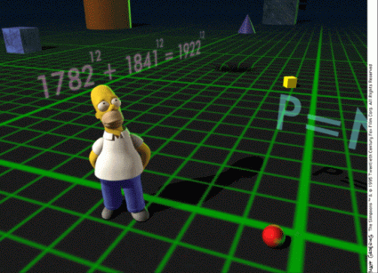
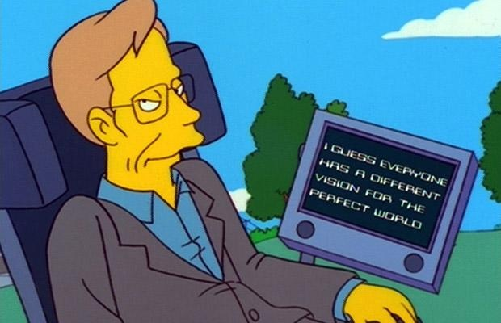
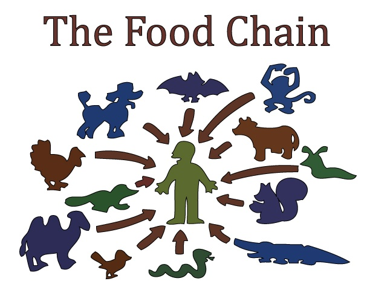
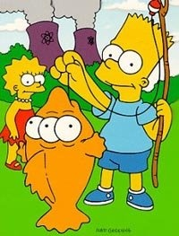

Pour les 20 ans des [Simpson](w:Les_Simpson) , [Marge pose dans Playboy](http://www.freshnessmag.com/2009/10/20/playboy-magazine-marge-simpson-issue-detailed-images/) alors que le sexe n'est qu'un thème très secondaire dans la meilleure série animée du monde. Par contre la science y est très présente, ce qui justifie amplement un article sur Dr. Goulu, en plus des livres existant déjà sur le sujet \[1,2,3\]

### Maths

Il faut dire que [beaucoup d'auteurs d'épisodes ont des formations scientifiques](http://mathsci2.appstate.edu/~sjg/simpsonsmath/degrees.html), comme [David X. Cohen](w:) diplômé en physique de Harvard et en informatique de Berkeley \[5\].  C'est à lui qu'on doit l'égalité 1782¹² + 1841¹² = 1922¹² devant laquelle Homer passe sans sourciller en entrant dans la 3ème dimension (séquence "Homer³" de l'épisode S07E06)

Mais vous qui savez que le [dernier théorème de Fermat](w:dernier_théorème_de_Fermat) dit qu'il n'existe pas de solution de l'équation an+bn\=cn pour a,b,c,n entiers et n>2, vous bondissez sur votre calculatrice et, ô stupeur, vous croyez l'espace qu'il existe un contre exemple invalidant la démonstration de plusieurs centaines de pages due à [Andrew Wiles](w:) ! En réalité il s'agit d'un hommage à ce résultat impressionnant publié en 1994 quelques semaines avant l'épisode des Simpson, et il faut effectuer le calcul avec beaucoup de chiffres significatifs ou être assez observateur \[5\] pour voir que l'égalité est fausse.

### Médecins, inventeur et vrais scientifiques

Les thèmes liés à la santé sont abondamment traités dans les Simpsons :  les médicaments et leurs effets secondaires, la fécondation assistée , la transplantation d'organes, l'obésité, les dépendances diverses, les épidémies, les OGM et toutes les problématiques possibles liées à l'alimentation. Les deux médecins de Springfield sont le [Dr. Hibbert](http://www.simpsonspark.com/personnages/serie_perso_hibbert.php), qui abuse largement des assurances de santé, et [Nick Riviera](http://www.simpsonspark.com/personnages/serie_perso_hibbert.php), un authentique charlatan qui vit des habitants qui en sont dépourvus.

A part les deux médecins, le [professeur Frink](http://www.simpsonspark.com/personnages/perso_frink1.php) est le seul véritable scientifique de Springfield. Inventeur complètement déjanté, sa productivité est exceptionnelle. On retiendra en particulier

- le Citrobon, un bonbon au citron tellement acidulé qu'il doit être conservé à l'intérieur d'un champ magnétique. (S06E09)
- Une fusée qui doit détruire la comète avant qu’elle ne s’abatte sur Springfield. Ca rate, mais la comète se désintègre avant l'impact grâce à la densité de la couche de pollution sur la ville. (S06E14)
- Il enlève Lisa en la rapetissant à l'aide de son degrandulateur (S07E06)
- Un téléporteur, vendu  à Homer pour 35 cents (S09E04)
- Il a inventé le monstromètre, le glouglouteur, le canularscope, le surgrenouillateur, le délochnessateur.
- Evidemment, une machine à remonter le temps (S06E06, S14E01)
- Il invente le  marteau qui fait tournevis de l'autre côté.
- Il cryogénise son père et le refait revivre en remplaçant de nombreux organes vitaux par de l'électronique.
- Il reçoit le Prix Nobel de Physique des mains de [Dudley Herschbach](w:), prix Nobel de Chimie 1986 (S15E01)

En effet, on trouve dans la série les avatars de véritables scientifiques, et non des moindres, qui ont de plus prêté leur voix à leur personnage. Outre Hershbach il y a le paléontologiste [Stephen Jay Gould](w:) apparait dans l'épisode S09E08 consacré au créationnisme, dont nous reparlerons plus bas.

### Physique

Et surtout il y a [Stephen Hawking](w:), physicien cosmologiste  a dit des Simpson que c'était la  ["meilleure chose sur la télévision américaine"](http://www.youtube.com/watch?v=ei-pKsNiINk). Il a participé à trois épisodes (S10E22, S16E16, S18E20) , notamment en utilisant sa voix synthétique lors d'une discussion avec Homer sur  la topologie en donut de l'Univers.

Dans les Simpson, les références sont souvent très discrètes, à l'intention du public qui peut les percevoir, mais sans frustrer ou ennuyer les autres. Par exemple, la célèbre formule d'Einstein apparait dès le deuxième épisode (S01E02), oùt Maggie, un an écrit MCSQU (MC squared, MC²) avec ses blocs de jeu.

De même lorsque Lisa construit une machine à mouvement perpétuel, c'est de façon très surprenante Homer qui la rappelle à l'ordre (S06E21)

> Lisa, viens voir papa... Dans cette maison, on respecte les lois de la thermodynamique !

### Le créationnisme

L'un des meilleurs épisodes de la série (S09E08) est consacré à cette plaie des USA, et qui s'étend désormais partout. Suite à la découverte d'un étrange fossile que le bigot [Ned Flanders](http://www.simpsonspark.com/personnages/serie_perso_flanders.php) et d'autres Springfildiens considèrent comme celui d'un ange, Lisa souhaite appliquer une approche scientifique. A cela Ned Flanders rétorque cette réplique mémorable:

> "Moi je dis qu'il y a des choses qu'on n'a pas envie de savoir, des choses importantes!"

Lisa se retrouve au tribunal, accusée d'avoir abimé l'ange pour envoyer un échantillon à Stephen Jay Gould. Au moment d'être condamnée, l'ange s'envole... Si vous ne devez voir qu'un seul épisode des Simpsons dans votre vie, voyez celui-là !

### Environnement

Outre le nucléaire dont nous parlerons plus bas, les questions environnementales sont fréquemment abordées dans les Simpson. Souvent Lisa se préoccupe d'un problème grave, mais se retrouve seule contre tous ses concitoyens. Par exemple elle devient végétarienne (S07E05) alors que son cours sur la chaine alimentaire est pourtant clair:

Elle s'oppose aussi au pourtant très populaire et traditionnel massacre des serpents (S04E20), et se montre sceptique sur l'intervention humaine dans les processus naturels (S10E03) :

> **Skinner :** Et bien j’avais tort, les lézards sont une bénédiction ! **Lisa :** Je trouve que c’est prendre des risques. Qu’est ce qu’il se passera quand on sera envahis par les lézards ? **Skinner :** Pas de problème, on lâchera des vagues de serpents aiguilles venus de Chine, ils extermineront les lézards ! **Lisa :** Mais avec des serpents se sera pire ! **Skinner :** Oui mais, on a prévu le coup. On a déniché une étonnante race de gorilles qui se nourrissent de viande de serpent ! **Lisa :** Et on aura les gorilles sur les bras ! **Skinner :** Non, c’est là qu’est l’astuce : quand arrivera l’hiver et le gel, les gorilles mourront de froid !

Lisa se rapproche même d'un mouvement écologiste radical (S12E04) pour sauver une forêt millénaire, avant de militer contre la pollution lumineuse (S14E16) qui l'empêche d'observer les étoiles. Brave petite.

Plusieurs épisodes des Simpson concernent le syndrome "[NIMBY](w:)" ("Not In My Backyard") : la société moderne requiert des infrastructures ou des services ayant des effets secondaires un peu désagréables, mais pourquoi les placer devant chez moi plutôt que chez le voisin ?

### Le nucléaire

La centrale nucléaire de Springfield est le véritable poumon économique de la ville, et la source de la fortune et du pouvoir absolu de [Mr. Burns](http://www.simpsonspark.com/personnages/serie_perso_burns.php). Dès le troisième épisode de la série (S01E03), on constate que le nucléaire influence jusqu'à la prière du soir d'Homer, (ir)responsable de la sécurité de la centrale (S02E07):

> Seigneur, on vous est surtout reconnaissant pour l’énergie nucléaire, la plus sure et la plus propre de toutes les sources d’énergies, mis à part l’énergie solaire, mais ça, c’est du pipeau.

Évidemment, Springfield frôle plusieurs fois la catastrophe. On apprend même que le père de [Smithers](http://www.simpsonspark.com/personnages/serie_perso_smithers.php) avait sacrifié sa vie pour sauver la centrale (S13E05). Homer, quant à lui, évite de justesse un accident majeur que sa fainéantise avait déclenché (S07E07), ce qui lui vaut les félicitations de Mr. Burns: "Homer, vous avez promptement réagit et fait d’un Tchernobyl un petit pétard radioactif foireux, bravo!"

Lorsqu' apparaissent des poissons à trois yeux (S02E04) et que 342 manquements à la sécurité sont constatés, Mr. Burns fait la seule chose raisonnable pour éviter la fermeture de sa centrale : devenir gouverneur de l'Etat afin de changer la loi. Dans ce but il produit un clip électoral remarquable:

> **Burns :** Oh ! Bonjour mes amis. Je suis Montgomery Burns, votre futur gouverneur. Aujourd’hui, j’aimerais vous parler de mon petit copain Noenoeil. Nombreux sont ceux qui le considèrent comme un horrible poisson mutant. Ceux-là sont bien loin de la vérité, mais vous n’êtes pas obligé de me croire. Alors demandons à cet acteur qui campe Charles Darwin, ce qu’il en pense. **Acteur :** Bonjour, M. Burns. **Burns :** Bonjour, Charles. Soyez gentil, expliquez à nos téléspectateurs votre théorie de la sélection naturelle. **Acteur :** Avec joie, M. Burns. Voyez vous, régulièrement, notre Mère Nature transforment ses animaux en leur donnant de plus grandes dents, des griffes acérées, des pattes plus longues, ou dans ce cas, un troisième œil. Et s’il s’avère que ces changements représentent une amélioration, le nouvel animal se développe, se reproduit et se répand bientôt à la surface de la Terre. **Burns :** Ainsi, vous voulez dire que ce poisson pourrait être avantagé par son troisième œil ? Qu’on aurait affaire en quelque sorte à un super poisson ? **Acteur :** J’aurais envie d’avoir un troisième œil. Et vous ? **Burns :** Non. Vous voyez mes amis, si nos adversaires, les antinucléaires et écologistes de tout poil, venaient par hasard à tomber sur un éléphant en train de s’ébattre dans les eaux proches de notre centrale, ils mettraient certainement son pauvre nez ridicule sur le compte de la vilaine énergie nucléaire. Non, la vérité c’est que ce poisson au goût exceptionnel est un miracle de la nature. Alors pour conclure, dîtes tout ce que vous voulez sur moi. Je suis en mesure d’encaisser les coups les plus rudes. Mais, je vous en prie, cessez de vous en prendre à ce pauvre Noenoeil sans défense. Bonsoir. Et Dieu vous garde.

Selon Malaspina \[1\], ce discours est "remarquable" par le fait qu'il est structuré selon les concepts de Peter Sandman, un spécialiste de la communication du risque connu aux USA  \[4\].

### Science, technique et business dans les Simpson

Comme le montre de façon très convaincante Marco Malaspina \[1\] dans son livre, la science et les scientifiques sont souvent caricaturés dans les Simpson, mais l'approche scientifique des problèmes est plutôt valorisées, ou du moins opposée aux croyances et idées toutes faites, souvent ridiculisées.

L'inventivité et le sens pratique sont aussi permanents dans les Simpson. Valeur américaine entre toutes, il y a toujours une solution simple au problème le plus complexe. Et si ça cause des problèmes encore plus graves, d'autres solutions simplistes et absurdes s'imposent. Heureusement pour les Simpson, les problèmes se résolvent souvent tout seuls, d'une manière aussi inattendue qu'hilarante.

Dans les Simpson, les vrais problèmes viennent plutôt des (nombreuses) faiblesses humaines, et en particulier l'attrait de l'argent. Pour M. Burns, mais aussi pour tous la plupart des personnages  jaunes à un moment ou un autre, la fin justifie les moyens du capitalisme le plus sauvage. On peut y voir une critique acerbe de la société états-unienne, mais soyons francs : nous nous retrouvons tous dans les Simspon. Peut-être est-ce ce qui nous fait rire si jaune...

### Episodes:

(la notation SxxEyy dénote l'épisode yy de la saison xx, le code entre parenthèses étant le code de production de l'épisode)

- [S01E02 (7G02) - Bart le génie](http://www.simpsonspark.com/scripts/s1/7g02.php)
- [S01E03 (7G03) - Un atome de bon sens](http://www.simpsonspark.com/scripts/s1/7g03.php)
- [S02E04 (7F01) - Sous le signe du poisson](http://www.simpsonspark.com/scripts/s2/7f01.php)
- [S02E07 (7F07) - La fugue de Bart](http://www.simpsonspark.com/scripts/s2/7f07.php)
- [S04E20 (9F18) - Le jour de la raclée](http://www.simpsonspark.com/scripts/s4/9f18.php)
- [S06E06 (2F03) - Simpson Horror Show V](http://www.simpsonspark.com/scripts/s6/2f03.php)
- [S06E09 (2F06) - Pervers Homer](http://www.simpsonspark.com/scripts/s6/2f06.php)
- [S06E14 (2F11) - La comète de Bart](http://www.simpsonspark.com/scripts/s6/2f11.php)
- [S06E21 (2F19) - Il faut Bart le fer tant qu'il est chaud](http://www.simpsonspark.com/scripts/s6/2f19.php)
- [S07E05 (3F03) - Lisa la végétarienne](http://www.simpsonspark.com/scripts/s7/3f03.php)
- [S07E06 (3F04) - Les Simpson Spécial Halloween VI](http://www.simpsonspark.com/guide/episodes/les_simpson_special_halloween_vi.php)
- [S07E07 (3F05) - Un super Big Homer](http://www.simpsonspark.com/scripts/s7/3f05.php)
- [S09E04 (5F02) - Spécial Halloween VIII](http://www.simpsonspark.com/scripts/s9/5f02.php)
- [S09E08 (5F05) - Les ailes du délire](http://www.simpsonspark.com/scripts/s9/5f05.php)
- [S10E03 (5F22) - Lézards populaires](http://www.simpsonspark.com/scripts/s10/5f22.php)
- [S10E22 (AABF18) - Les gros Q.I.](http://www.simpsonspark.com/scripts/s10/aabf18.php)
- [S12E04 (CABF01) - Touche pas à ma forêt !](http://www.simpsonspark.com/scripts/s12/cabf01.php)
- [S13E05 (CABF21) - La vieille peur d'Homer](http://www.simpsonspark.com/scripts/s13/cabf21.php)
- [S14E01 (DABF19) - Simpson Horror Show XIII](http://www.simpsonspark.com/scripts/s14/dabf19.php)
- [S14E16 (EABF11) - La guerre pour les étoiles](http://www.simpsonspark.com/scripts/s14/eabf11.php)
- [S15E01 (EABF21) - Simpson Horror Show XIV](http://www.simpsonspark.com/scripts/s15/eabf21.php)
- [S16E16 (GABF10) - Une grosse tuile pour un toit](http://www.simpsonspark.com/scripts/s16/gabf10.php)
- [S18E20 (JABF12) - Petit Papa Noël superflic](http://www.simpsonspark.com/scripts/s18/jabf12.php)

### Sources:

1. 
2. 
3. 
4. "[Science on the Simpson](http://simpsonscience.blogspot.com/)" le blog de Paul Halpern
5. [simpsonsmath.com](http://mathsci2.appstate.edu/~sjg/simpsonsmath/)
6. "[Matheux, les Simpson ?](http://www.simpsonspark.com/infos_juin06.php)" sur [Simpsons Park](http://www.simpsonspark.com/), le site de référence en français
7. Peter M. Sandman "[Risk Communication: Facing Public Outrage](http://www.psandman.com/articles/facing.htm)",
    
    EPA Journal (U.S. Environmental Protection Agency), November 1987, pp. 21–22
    
8. Dossier "[Attention, les Simpson s'attaquent aux sciences](http://www.linternaute.com/science/magazine/dossier/attention-les-simpson-s-attaquent-aux-sciences/quand-les-simpson-parlent-de-science.shtml)" sur l'Internaute
    

_(article légèrement édité le 24.10.2014 à l'occasion de la découverte de la référence \[3\] dans [cet article](http://boingboing.net/2014/10/17/homers-last-theorem.html))_
