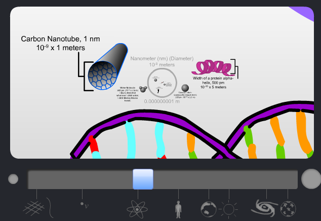

[Bad Astronomy](http://blogs.discovermagazine.com/badastronomy/2010/01/29/the-interactive-scale-of-the-universe/) indique une très jolie réalisation graphique en Flash permettant de zoomer dans les ordres de grandeur de l'Univers, sur le modèle des impérissables "[puissances de dix](/2008/05/16/les-puissances-de-dix/)", mais en interactif :

Il y a décidément encore un trou de plusieurs ordres de grandeur entre le "diamètre" du neutrino et la [longueur de Planck](https://fr.wikipedia.org/wiki/longueur_de_Planck)...
