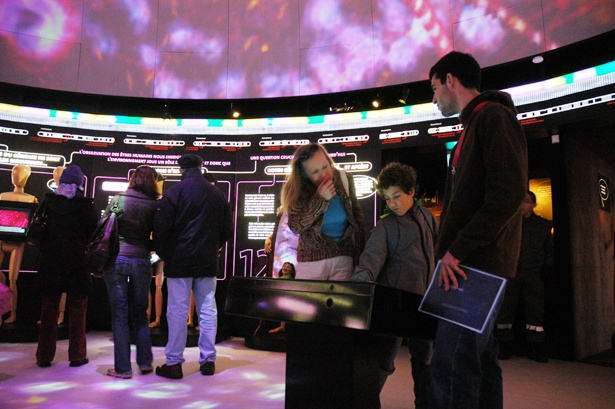

Si j'ai un regret à propos de l'exposition "[Génome-Voyage au coeur du vivant](http://www.unige.ch/450/expositions/genome.html)" , c'est de ne pas l'avoir visitée plus tôt  et de ne pas vous en avoir parlé avant. Visitable encore quelques jours sur l'ile Rousseau, en plein centre de Genève, c'est vraiment une très bonne exposition de vulgarisation scientifique. J'espère vivement que l'Université de Genève aura la bonne idée de la faire voyager et que vous pourrez la voir (ou la faire venir!) à Paris, Bruxelles, Montréal ...

L'exposition tient dans un dôme de 15 m de diamètre et se visite en 30 minutes environ. Elle parvient à expliquer à un public non averti les bases de la génétique (ADN, gènes, chromosomes, génome humain) par des panneaux explicatifs illustrés par des animations lumineuses, notamment une molécule d'ADN géante et un [défilement du génome humain](http://www.myscience.ch/wire/dans_infini_nos_genes_genome_voyage_coeur_vivant_unige_expose_raconte_sequencage_complet_genom-unige) devant une "tête de lecture" comptant les bases.

On y voit aussi des videos, notamment [celle de la réplication de l'ADN](/2008/01/06/replication-de-ladn/) qui m'émerveille à chaque fois que je la revois. Pour ma part, j'ai été surpris d'apprendre que le génôme de la vache est plus proche de celui du dauphin que du cheval. Etonnant, non ? Ah, et j'ai aussi soudain réalisé que [GATTACA](w:Bienvenue_à_Gattaca) pouvait s'écrire en bases d'ADN. M'étais toujours demandé d'où venait cet étrange nom de ce très bon film...

### Liens

- De [nombreux liens sur la génétique](http://www.unige.ch/450/expositions/genome/genome-links.html) depuis le site de l'exposition
- [photos et films officiels](http://www.unige.ch/presse/static/genome/) , [encore des photos](http://www.unige.ch/450/expositions/genome/presentation/genome-photos.html) et encore  [d'autres sur flickr](http://www.flickr.com/photos/galaad_569/4373975574/)
