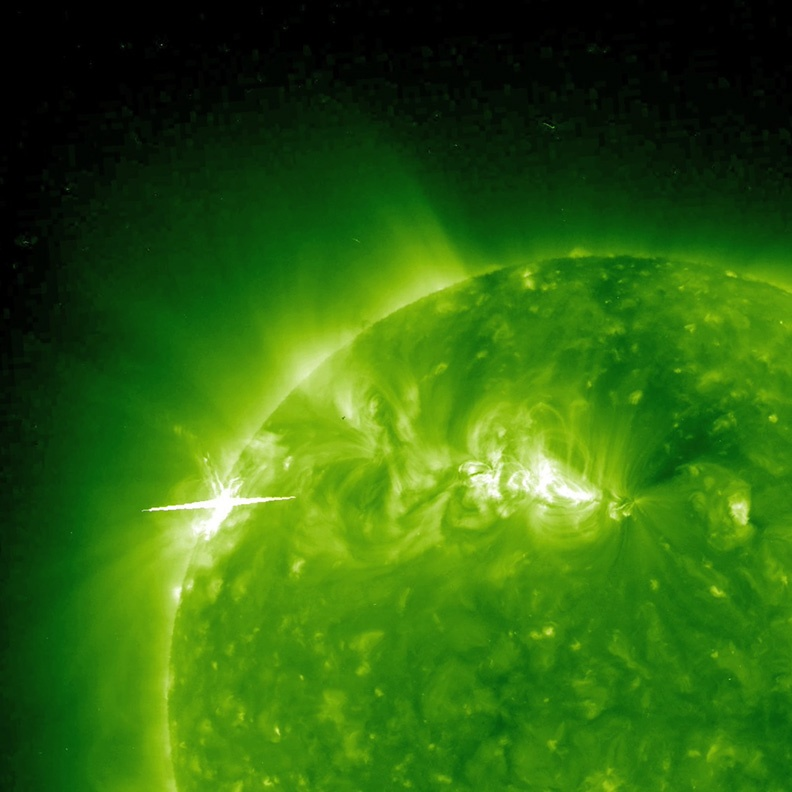

Voici mon nouveau fond d'écran :

Trouvée grâce à [Bad Astronomy](http://blogs.discovermagazine.com/badastronomy/2010/03/26/one-solar-piece-of-flare/?utm_source=feedburner&utm_medium=feed&utm_campaign=Feed%3A+BadAstronomyBlog+%28Bad+Astronomy%29), c'est une photo de notre étoile préférée prise par [Stereo](http://stereo.gsfc.nasa.gov/), deux satellites identiques qui observent le Soleil simultanément et permettent de faire une image en 3D de l'héliosphère. L'image est prise dans les ultraviolets à haute énergie, à la limite des rayons X, et montre des [éruptions solaires](http://fr.wikipedia.org/wiki/%C3%89ruption_solaire). Celle qui produit la tache blanche de gauche est assez violente pour saturer les capteurs CCD de Stereo, dont les électrons débordent sur les pixels voisins. Mais c'est encore une petite éruption comparée à certaines qui ont endommagé des satellites.

Admirez aussi les magnifiques boucles de gaz ionisé qui suivent les lignes du [champ magnétique très complexe et variable](http://www.astrosurf.com/luxorion/sysol-soleil-magnetique.htm) du Soleil. Une énergie colossale est stockée dans ces boucles qui se perturbent mutuellement, fusionnent et parfois s'ouvrent en propulsant le gaz dans l'espace dans ces  éruptions qui peuvent causer momentanément des variations de 10% de la puissance émise par notre étoile.

Pour fixer les idées, à l'échelle, la Terre est grande comme une des petites taches claires à la surface du Soleil. [On est peu de chose](/2008/02/01/on-est-peu-de-chose/), mais on peut faire de sacrément jolies photos des grandes, non ?
