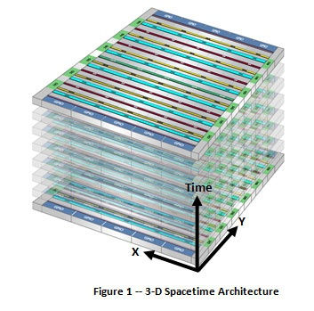

Au début, tout était clair : un ordinateur était un assemblage de circuits électroniques formant le [hardware](http://fr.wikipedia.org/wiki/Mat%C3%A9riel_%28informatique%29), piloté par du [software](http://fr.wikipedia.org/wiki/Logiciel) définissant la séquence d'opérations à effectuer. Et puis tout est devenu compliqué.

D'une part, pour réaliser des opérations plus complexes, il est apparu plus simple de les "[microprogrammer](http://fr.wikipedia.org/wiki/Microprogrammation)" : les puces des processeurs incorporent du logiciel "figé" qui décompose chaque instruction du [langage machine](http://fr.wikipedia.org/wiki/Langage_machine) en opérations encore plus simples.

D'autre part, les [circuits logiques programmables](http://fr.wikipedia.org/wiki/Circuit_logique_programmable) permettent désormais de réaliser des circuits électroniques très complexes par programmation. A l'aide d'un langage spécifique comme [VHDL](http://fr.wikipedia.org/wiki/VHDL), on décrit le fonctionnement du circuit, puis un compilateur génère des données que l'on écrit dans le circuit comme dans une mémoire afin de le configurer comme souhaité. De plus en plus de puces trônant dans vos téléphones portables, appareils photo, voitures ainsi que dans toutes les machines industrielles imaginables sont de ce type. On peut ainsi y implanter des fonctions spécifiques à l'application s'exécutant de façon extrêmement rapide, et au besoin adjoindre sur la même puce, par programmation toujours,  un "[processeur softcore](http://fr.wikipedia.org/wiki/Processeur_softcore)" permettant d'exécuter un logiciel traditionnel. Bref, maintenant on peut programmer un circuit vierge pour qu'il se comporte comme un microprocesseur microprogrammé programmable, vous me suivez ?

Les circuits "PLD" peuvent être programmés une fois pour toutes, éventuellement reprogrammés de temps en temps à l'instar d'une mémoire flash. Les [FPGA](http://fr.wikipedia.org/wiki/FPGA#FPGA), plus récentes, se programment comme des mémoires RAM, et sont donc reprogrammables souvent et rapidement.

L'étape suivante pourrait être de les reprogrammer en fonctionnement. C'est ce que propose l'entreprise [Tabula](http://www.tabula.com/) avec sa technologie "3D Spacetime" incarnée dans ses circuits [ABAX](http://www.tabula.com/products/overview.php) . Ces circuits peuvent être reprogrammés des milliers de fois par seconde et peuvent donc réaliser sur une seule puce des fonctions qui auraient nécessité plusieurs circuits très différents.

En quelque sort, Tabula réalise l'équivalent de puces "multicouches" en empilant des surfaces de silicium selon la dimension du temps.  On peut objecter que ceci réduit d'autant la vitesse des circuits, mais d'autre part, on peut optimiser la surface de silicium réellement utilisée à chaque étape, par exemple pour traiter plus de données en parallèle. Point non négligeable, cette technologie réduit aussi beaucoup le coût de l'interconnexion des puces : on remplace des connecteurs en or et du circuit imprimés multicouches par des bits de données. Bientôt un PC au format d'une boite d'allumette, voire au même prix ?

Plus ça avance, plus la [Loi de Moore](/2008/06/19/moore-toujours/) me semble avoir encore de beaux jours devant elle. Merci à Malcolm pour avoir renforcé mon optimisme en me parlant de Tabula. Et peut-être bien que j'achèterai quelques actions quand ils seront cotés...
