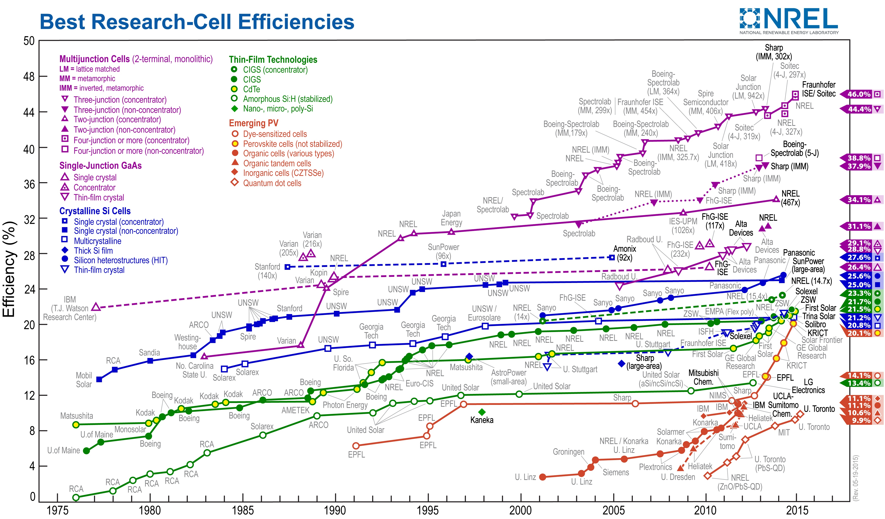
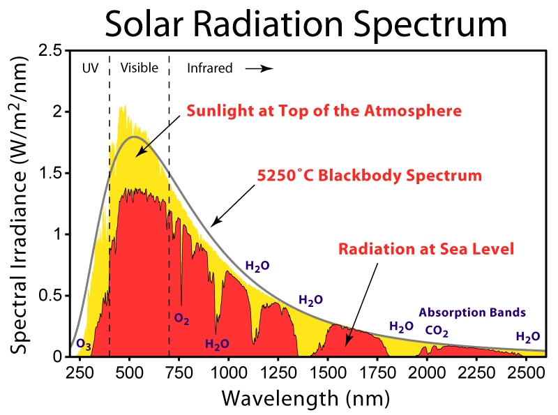

De retour d'une conférence sur les énergies renouvelables, Laurent m'a posé cette question simple en apparence, à laquelle j'ai d'abord répondu naïvement : on mesure la puissance électrique fournie par une cellule photovoltaïque (PV) éclairée par une puissance lumineuse donnée; le rapport des deux, c'est le rendement\*:

 évolution du rendement de différents types de cellules PV (mise à jour le 26.5.2015)Cliquer pour la dernière version en haute résolution

Mais après étude, c'est nettement plus compliqué. Les valeurs de rendement publiées par les constructeurs sont mesurées en laboratoire en "conditions de test standard" (STC en anglais):

- La mesure se fait en maintenant les cellules à 25°C. Le rendement des cellules diminuant de 0.1% à 0.5% par °C, le rendement effectif en plein soleil estival lorsque les cellules atteignent 60°C est nettement inférieur au rendement affiché par les fabricants. A noter que les [cellules "Grätzel"](http://drgoulu.local/2009/09/15/de-graetzel-aux-great-cells/) ont un rendement qui augmente avec la température.
- éclairement  de 1000W/m², soit environ le maximum sous nos latitudes. Plutôt que d'utiliser le vrai soleil, capricieux et qui chaufferait les cellules, on éclaire les cellules par un flash de [lampe au xénon](https://fr.wikipedia.org/wiki/lampe_au_xénon) étalonné par un  [pyranomètre](https://fr.wikipedia.org/wiki/pyranomètre). Une lampe de 1000W de puissance électrique permet de tester une cellule "standard" de 156x156 mm.

- spectre "[Air Mass 1.5](https://en.wikipedia.org/wiki/air_mass_coefficient)", correspondant à celui de la lumière solaire après avoir traversé 1.5 épaisseur de l'atmosphère, soit lorsque le Soleil est à 48.2° du zénith. Le rayonnement du Soleil correspond grosso-modo à celui du [corps noir](https://fr.wikipedia.org/wiki/corps_noir) à 5800°K, mais l'atmosphère filtre certaines longueur d'ondes. Le graphique ci-dessous montre bien l'effet de l'ozone sur les UV, ainsi que celui des gaz à effet de serre dans l'infrarouge : eau, H2O, monoxyde de dihydrogène et un tout petit peu de CO2. Mais ne digressons pas. En laboratoire, on utilise des filtres placés devant la lampe au xénon pour obtenir un véritable simulateur de Soleil.

Les conditions standard de test ne se rencontrent donc jamais dans la réalité, puisqu'il n'existe nulle part sur la planète où on obtient 1000 W/m² lorsque le Soleil est à 48.2° du zénith, à fortiori lorsqu'il ne fait que 0°C, froid nécessaire pour que la température des panneaux ne soit que de 25°C.En réalité, les performances varient beaucoup en fonction des conditions et selon le type de cellules.

De plus, il semblerait que les fabricants de cellules sélectionnent leur plus beau silicium pour les tests, ou publient les meilleurs résultats obtenus, car les productions d'installations réelles sont systématiquement inférieures de quelques pourcents aux valeurs [calculées](http://re.jrc.ec.europa.eu/pvgis/apps4/pvest.php).

En fin de compte, l'information la plus fiable sur le rendement réel provient de bases de données telles que [BDPV](http://www.bdpv.fr/index.php), qui répertorient les données et résultats fournis directement par les propriétaires d'installations solaires.

Note ajoutée le 26.5.2015 :  ou plutôt l'[efficacité énergétique](https://fr.wikipedia.org/wiki/Efficacité_énergétique_(thermodynamique)) si on veut être précis

### Sources :

1. [BFRL Project: Solar Photovoltaic Performance Measurements and Predictions](http://www.nist.gov/el/highperformance_buildings/energy/solar_photovoltaic.cfm), NIST
2. [ASTM E948 - 09](http://www.astm.org/Standards/E948.htm) Standard Test Method for Electrical Performance of Photovoltaic Cells Using Reference Cells Under Simulated Sunlight
3. [PVGIS Solar Irradiation Data](http://re.jrc.ec.europa.eu/pvgis/apps/radmonth.php?lang=fr&map=europe) Calculateur d'énergie solaire de la CE
