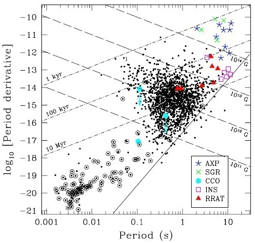

En 1930, Subrahmanyan Chandrasekhar dit "Chandra" montra qu'une "naine blanche" [1.44 fois plus massive que le Soleil](w:Masse_de_Chandrasekhar) s'effondre en formant un corps extrêmement dense. En 1932 James Chadwick découvrit le neutron et Lev Landau pensa immédiatement que lors de l'effondrement, les protons et électrons formant la matière de l'étoile pourraient se retrouver si comprimés que leurs charges s'annuleraient, donnant naissance à une [étoile à neutrons](w:). Les étoiles à neutrons sont des objets défiant l'imagination. Lourds comme une étoile mais petits comme un astéroïde, la gravité y est environ 100 milliards de fois plus élevée que sur Terre : un objet lâché à un mètre au dessus de la surface s'y fracasse 1 millionième de seconde plus tard à la vitesse de 7 millions de km/h.  Il n'y a pas de montagnes sur les étoiles à neutrons. Ce sont les objets les plus lisses qu'on puisse imaginer, l'empilement le plus compact possible des plus petites particules "solides" existantes. En 1934, Baade et [Fritz Zwicky](https://fr.wikipedia.org/wiki/Fritz Zwicky) (un suisse) montrent que l'effondrement provoque une [supernova](w:) bien plus violente que les [novae](w:nova) connues alors.



Quelques années extrêmement prolifiques, et puis presque plus rien pendant des decennies. En astrophysique comme dans les autres sciences, les progrès ne sont pas constants ni même continus, et le hasard joue un rôle important. En 1967, Jocelyn Bell, alors étudiante en thèse sur un sujet bien différent, détecte un signal radio provenant de l'espace avec une régularité de métronome, toutes les 1,337301192269 secondes. Anthony Hewish, son prof,  croit d'abord à un problème d'instrument, puis suspecte un signal des petits hommes verts, avant de publier la découverte \[1\]. Comme il ne parvient pas à identifier la source du rayonnement, il émet timidement  l'éventualité d'un lien avec une "pulsation d'étoile à neutrons". Curieusement, il semblerait qu'on n'ait pensé qu'alors qu'une énorme étoile tournant très lentement se met à pirouetter au moins aussi vite qu'une patineuse aux Jeux Olympiques lorsqu'elle devient une étoile à neutrons de 10 ou 20 km de diamètre seulement, et que son champ magnétique provoquerait une émission de rayonnement dirigée, un peu comme un phare. Ca méritait un nouveau nom : [pulsar](w:). Il ne restait plus qu'à vérifier que la [supernova](w:SN_1054) de l'an 1054 avait bien donné naissance au [pulsar du Crabe](w:) pour valider la théorie énoncée 40 ans plus tôt. La découverte fortuite de Jocelyn Bell vaudra à Hewish (et pas à elle ...) le prix Nobel en 1974.



Après quelques décennies d'observation notamment grâce au [télescope spatial à rayons X Chandra](http://chandra.harvard.edu/), nous connaissons aujourd'hui plus de 2000 pulsars dans la Voie Lactée. Il y en a qui tournent vite, d'autres lentement. Il y en a qui émettent des rayons X, d'autres des ondes radio. Il y en a qui ont une "atmosphère" d'une dizaine de centimètres de fer, pour d'autres c'est du carbone pur, du diamant quoi...\[2\] Il y en a qui [ralentissent](w:ralentissement_des_pulsars), d'autres presque pas. Depuis 1992, on pense que certains pulsars génèrent un champ magnétique si puissant qu'ils méritent un nom à eux tout seuls : [magnétar](w:), ce qui veut dire "effaceur de cartes de crédit galactique" en [langue klingon](w:klingo_(langue)). Le champ magnétique apparait d'ailleurs comme un élément essentiel des pulsars, qui freine leur rotation en fournissant l'énergie du rayonnement selon un processus assez complexe pour que je n'aie pas encore tout bien compris.

Dans un article récent \[3\], Victoria M. Kaspi fait le ménage dans ce zoo avec un diagramme :

Sur ce diagramme dit P-P' montrant la période des pulsars en abscisse et leur ralentissement en ordonnée, on voit 1674 pulsars radio (points noirs) dont ceux formant un système double avec une étoile normale sont cerclés , 9 [AXP](w:Pulsar_X_anormal) et 5 [SGR](w:Sursauteur_gamma_mou) qui sont des variétés de magnétars et qui sont bien ceux qui ralentissent le plus, ainsi que quelques autres pulsars atypiques.

Les lignes en traitillés indiquent l'intensité du champ magnétique en surface en [Gauss](w:Gauss_(unité)), les lignes en traits mixtes indiquent la "demi-vie de rotation", le temps après lequel la rotation sera deux fois plus lente. En haut à gauche, il n'y a pas de points car il n'y a pas eu beaucoup de supernova dans notre galaxie ces derniers siècles. En bas à droite, il y a probablement beaucoup d'étoiles à neutrons anciennes, qui  ont trop ralenti ou dont le champ magnétique est trop faible pour alimenter une émission de signaux radio. Combien y'en a-t-il ? Mystère. Pourrons-nous les détecter un jour ? Surement !

### Référence

1. A. Hewish, S. J. Bell, J. D. H. Pilkington, P. F. Scott& R. A. Collins, "[Observation of a Rapidly Pulsating Radio Source](http://www.nature.com/physics/looking-back/hewish/index.html)", 1968, Nature 217, p 709 - 713
2. Wynn C. G. Ho, Craig O. Heinke, "[A neutron star with a carbon atmosphere in the Cassiopeia A supernova remnant](http://fr.arxiv.org/PS_cache/arxiv/pdf/0911/0911.0672v1.pdf)", 2009, Nature, Vol. 462, p. 71–73
3. Victoria M. Kaspi, "[Grand Unification of Neutron Stars](http://arxiv.org/PS_cache/arxiv/pdf/1005/1005.0876v1.pdf)", 2010, Submitted to Proceedings of the National Academy of Sciences of the United States of America
