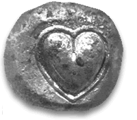

Enfin une explication rationnelle de la forme du cœur. Pas celle de l'organe mais celle du symbole de l'amour, celle que les filles aiment en bijou, les  garçons en gâteau et qui ne ressemble que très vaguement à une [illustration anatomique](https://fr.wikipedia.org/wiki/coeur)

Une des représentations les plus anciennes de ce symbole figure sur les pièces  en argent de [Cyrène](https://fr.wikipedia.org/wiki/Cyrène) datant de 700 av JC et représente des graines de [silphium](https://fr.wikipedia.org/wiki/silphium). Cette plante de la famille de la [férule](https://fr.wikipedia.org/wiki/férule_commune) aujourd'hui disparue ne poussait que dans cette région de la Libye actuelle et était l'un de ses principaux produits, cité dans plusieurs textes anciens. Certains historiens vont jusqu'à penser que cette plante a justifié à elle seule la colonisation et la fondation de Cyrène par les Grecs.

Et à quoi donc servait cette plante si recherchée ? A beaucoup de choses assez habituelles pour des plantes "médicinales", mais surtout au contrôle des naissances. Ses vertus contraceptives étaient reconnues dans tout le monde antique et semblent bien avoir été réelles puisque dès la domination romaine sur Cyrène en 96 av JC, la natalité de la Rome antique pourtant à son apogée a baissé. A cette époque le médecin Soranus écrivit:

> "les femmes doivent boire le jus de silphium avec de l'eau une fois par mois car il empêche non seulement la conception, mais détruit aussi tout ce qui existe."

Récemment, des parents de la silphium été soumis à des tests de laboratoire. [Asa foetida](https://fr.wikipedia.org/wiki/Asa_foetida) a réduit d'environ 50% la fécondité des rats et Jaeschikaena Ferula a été efficace à près de 100% lorsqu' administrée dans les trois jours suivant la copulation.

Durant le premier siècle av JC, la silphium était un produit très recherché, mais les tentatives de la cultiver ou la replanter ailleurs qu'en Cyrénaïque ont échoué. Selon Pline, les derniers plants de silphium ont été offerts à l'empereur Néron, donc vers l'an 60 de notre ère. Il n'est pas certain que la surexploitation soit la cause unique de la disparition de silphium, mais les fabricants de pilules contraceptives peuvent remercier les Romains de ne pas nous en avoir laissé quelques graines bien au sec...

### Références

1. Pline l'Ancien " [Histoire naturelle Livre XIX, 15](http://www.mediterranees.net/geographie/libye/silphium1.html)"
2. [The Cyrenaica Archaeological Project](http://www.cyrenaica.org/)
3. Alan Bellows "[The Birth Control of Yesteryear](http://www.damninteresting.com/the-birth-control-of-yesteryear "The Birth Control of Yesteryear")", 2007, damninteresting.com
