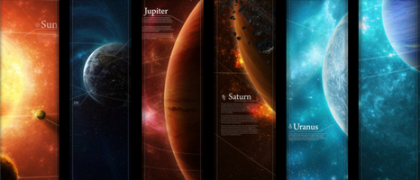

[Licoti](http://licoti.deviantart.com/#/d2ly610) est un graphiste passionné d'astronomie qui vient de réaliser une oeuvre étonnante : un panorama du système solaire sous forme d'une image de 30'000 x 1'000 pixels téléchargeable [ici](http://licoti.deviantart.com/art/The-Solar-System-FULL-Version-157790647), mais pas facile à visualiser à moins de disposer de [WPanorama](http://wpanorama.com/wpanorama.php?r=1307260269) ou équivalent.

Mais Sylvafilm en a tiré une vidéo disponible désormais sur YouTube grâce à l'aimable autorisation de Licoti, ce qui vous permet d'admirer ce travail ici même:



C'est du travail d'artiste : les échelles ne sont pas respectées et il y a un peu de remplissage pour éviter la répétition et le noir de l'espace (sinon ça aurait ressemblé à [cette fameuse page](http://www.phrenopolis.com/perspective/solarsystem/)), mais c'est très beau et bien documenté selon des infos récentes, comme les aurores boréales de Saturne par exemple.

On peut aussi admirer l'oeuvre sous forme de [fonds d'écran](http://licoti.deviantart.com/#/d2ly610) de diverses résolution. Par contre, j'ignore sous quelle forme existe le document dans lequel les textes explicatifs seraient lisibles. Une fresque de 30m de long?
