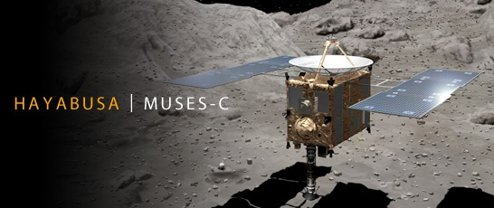
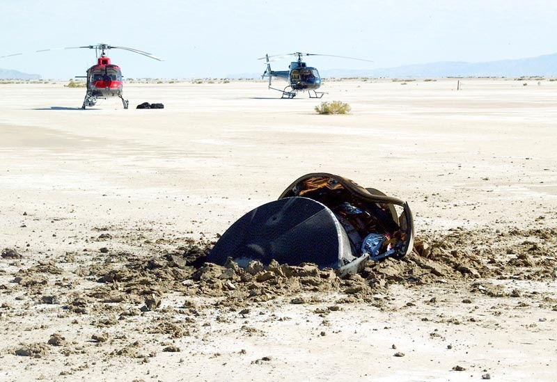

> Perdu dans le ciel,
> 
> le faucon est de retour,
> 
> le bec poussiéreux.

Le premier [haïku](w:)\* de Dr. Goulu a été inspiré par la [sonde Hayabusa](w:Hayabusa_(sonde_spatiale)) ("faucon pèlerin" en japonais)  dont j'ai appris l'histoire mouvementée à la radio [[1]](#ref-1) l'autre jour.

Les japonais ont lancé très discrètement cette sonde en 2003, parlant de "démonstrateur technologique". Hayabusa a souffert de nombreux incidents qui la font rentrer 3 ans plus tard que prévu. Demain pourtant, elle devrait se poser en Australie après un exploit remarquable : ramener sur Terre de la matière prélevée sur un astéroïde de 600 m seulement, [Itokawa](w:Astéroïde_Itokawa).

vue de la sonde Hayabusa sur l'astéroïde Itokawa

Hayabusa a utilisé les fameux moteurs ioniques dont j'ai [déjà causé ici](/2007/09/28/qui-veut-voyager-loin-ionise-sa-sonde/) pour rejoindre sa cible, puis s'est posée sur le caillou dont l'attraction est si faible qu'il n'est pas possible d'y creuser. En tirant un petit projectile sur la surface, Hayabusa devait récupérer les poussières éjectées lors de l'impact, mais on ne saura que dans quelques jours si ça a marché.

Si oui, Hayabusa rejoindra le club très fermé des missions ayant ramené de la matière extraterrestre :

- En 2004, "[Genesis](w:Genesis_(sonde_spatiale))" a ramené de la poussière du vent solaire collectée au [Point de Lagrange](w:) L1, mais au retour sur Terre, ses parachutes n'ont pas fonctionné et elle s'est bien plantée... Mais les échantillons ont survécu et les [premiers résultats d'analyse](http://www.techno-science.net/?onglet=news&news=7546) viennent d'être publiés.

)

Genesis après son "atterrissage"...

- En 2006, "[Stardust](w:Stardust_(sonde_spatiale))" a ramené des poussières cométaires prélevées près de la comète Wild 2. Mieux : elle n'a fait que larguer sur Terre un container avec les échantillons et poursuit sa route vers la comète Tempel-1 (qui a été percutée par [Deep Impact](w:Deep_Impact_(sonde_spatiale)) en 2005) qu'elle rencontrera à moins de 200 km le 14 février 2011. Grâce à  [Stardust@home](w:), vous pouvez aider la science en repérant les quelques poussières interstellaires collées dans les m2 de capteurs de la sonde.
- Sans oublier  les astronautes des missions Apollo qui ont ramené 382 kg de [roche\_lunaire](w:Roche_lunaire) entre 1969 et 1972, ni les 3 sondes Luna soviétiques qui en ont ramené 326 g entre 1970 et 1976.

A ce sujet, j'ai lu cette semaine "Poussière de Lune" [[2]](#ref-2), prêté par Stefano. Un épais roman de S-F avec beaucoup de références à toutes sortes de choses intéressantes et réussissant notamment à promouvoir la géologie au rang des sciences dignes de la science-fiction. Cependant, je n'ai pas adhéré à l'intrigue principale, un peu trop visiblement destinée aux scénaristes d'Hollywood. Mais un bon bouquin de vacances tout de même.

Note\* : j'en suis assez fier, car même [traduit en japonais](http://translate.google.ch/translate_t?hl=&ie=UTF-8&text=Perdu+dans+le+ciel,%0D%0Ale+faucon+est+de+retour,%0D%0Ale+bec+poussi%C3%A9reux.&sl=fr&tl=ja#fr|ja|Perdu%20dans%20le%20ciel%0Ale%20faucon%20est%20de%20retour%0Ale%20bec%20poussi%C3%A9reux) ça reste un haïku. Mais bizarrement, le mot "hayabusa" n'apparait pas...

### Références :

1. Frédéric Castel "[L'incroyable odyssée d'Hayabusa s'achève](http://medias.rsr.ch/la-1ere/programmes/le-12h30/2010/le-12h30_20100606_standard_developpement-5_20100606-1245_5b9a6443-a18b-4048-bb60-ae4b7e284fb9-128k.mp3)" (MP3) Radio Suisse Romande, 12:30, 6 juin 2010
2. 
