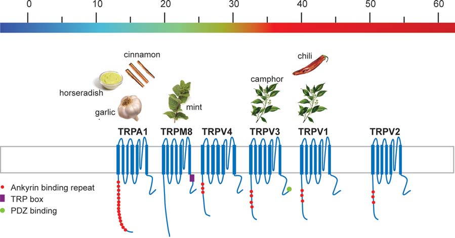



Il fait chaud et vous appréciez le goût rafraîchissant de la menthe ? Dites merci au [menthol](w:), la molécule contenue dans ces plantes, et désormais également synthétisée par l'industrie chimico-alimentaire. Le menthol a la propriété d'agir chimiquement sur les récepteurs de notre bouche normalement sensibles à la température des aliments, en particulier via un [canal ionique TRP](w:en:Transient_receptor_potential) [[1]](#ref-1), le TRPM8 qui nous signale qu'un aliment est agréablement frais.

Il y a quelque temps on nous annonçait l'arrivée d'un "super menthol" 200 fois plus rafraîchissant : l'[iciline](w:en:icilin).  En attendant l'apparition de crèmes glacées chaudes un de ces jours, l'iciline est utilisée dans la recherche sur les canaux TRP [[2]](#ref-2).

 les 6 TRP thermo sensibles

A l'inverse, la [capsaïcine](w:) contenue dans les piments excite TRPV1, un canal sensible au chaud, voire [nociceptif](w:nociception) : il provoque la douleur et des réactions physiologiques associées à la brûlure comme la transpiration. Evidemment, tout dépend de la concentration de capsaïcine dans les piments consommés, mesurée par l'[échelle de Scoville](w:) qui s'applique aussi au poivre et au gingembre. Par contre, la cannelle, l'ail et le raifort de la moutarde japonaise agissent sur TRPA1, le canal du "trop froid". Etonnant non ? Pourtant on apprécie ces condiments l'été et les picotements qu'ils provoquent ne nous font pas transpirer.

En passant, la capsaïcine est une molécule vraiment étonnante: elle provoque de l'euphorie en stimulant la production d'endorphines, en réaction à la sensation de brûlure  j'imagine. Elle est utilisée dans les armes non létales comme les sprays d'autodéfense "au poivre", mais est pourtant assez toxique pour vous tuer si vous avez la mauvaise idée de vous en injecter quelques dizaines de milligrammes. A part ça, certains utilisent la capsaïcine pour le dopage des chevaux !

Vous pouvez admirer la [capsaïcine en 3D ici](http://www.edinformatics.com/interactive_molecules/3D/capsaicin_molecule.htm) et en profiter pour découvrir [JMOL](http://jmol.sourceforge.net/) et [Qutemol](http://qutemol.sourceforge.net/), ce qui ouvre le chapitre "divers".

Aimez-vous les asperges ? Si oui, vous avez _peut-être_ remarqué que vous en "profitiez" une deuxième fois en urinant après en avoir consommé. L'odeur caractéristique est du [méthyl-mercaptan](w:Méthanethiol#Asperges) produit par la digestion de l'[asparagine](w:), un acide aminé soufré abondant dans les asperges. Ce qui est surprenant, c'est le "_peut-être_", car  il est très  possible que vous n'ayez jamais remarqué cette odeur particulière, alors que d'autres personnes  y sont extrêmement sensibles [[3]](#ref-3) car c'est un gène qui confère cette faculté particulière de l'odorat.

Enfin, si vous avez une processeur à plus de 2 coeurs, vous n'avez plus aucune excuse pour ne pas [participer à BOINC](/2007/01/20/calcul-distribue-avec-boinc/), et au projet [Rosetta@home](http://boinc.bakerlab.org/rosetta/) en particulier, qui étudie la structure en 3D de protéines. Avec un peu de chance, vous aussi vous deviendrez célèbre pendant 24 heures :

Bon, et maintenant : vacances !

### Références

1. Daniel Abegg, "les thermo TRP - des canaux ioniques sensibles à la température", 2009, Université de Genève ([pdf](https://perso.univ-rennes1.fr/francois.tiaho/L3-physio.%20G-tiaho/Bibliographie/thermorecepteurs/2009-Abegg-revue%20francaise%20TRP.pdf))
2. David D McKemy, "How cold is it? TRPM8 and TRPA1 in the molecular logic of cold sensation", Molecular Pain 2005, 1:16 [PMID=15847696](https://www.ncbi.nlm.nih.gov/pubmed/15847696)
3. M Lison, S H Blondheim, and R N Melmed "A polymorphism of the ability to smell urinary metabolites of asparagus.",Br Med J. 1980 December 20; 281(6256): 1676–1678 [PMID=7448566](https://www.ncbi.nlm.nih.gov/pubmed/7448566)
