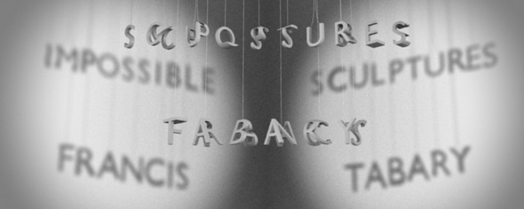

Art et sciences peuvent faire bon ménage, comme le montrent trois sculpteurs repérés sur le web ces derniers temps.

[Bathsheba](http://www.bathsheba.com/) est une artiste américaine qui produit de nombreux objets directement inspirés d'objets [mathématiques](http://www.bathsheba.com/math/), [astronomiques](http://www.bathsheba.com/crystal/index.html#Astronomy) ou [biologiques](http://www.bathsheba.com/crystal/index.html#Biology). Il utilise l'[impression 3D](http://www.bathsheba.com/sculpt/process/index.html#3dprint) en métal ou en [plastique](http://www.shapeways.com/shops/bathsheba), ce qui lui permet de vendre ses œuvres à des prix très abordables. Mais je crois que je vais craquer plutôt pour un cristal gravé au laser comme celui-ci, qui représente le champ magnétique terrestre :



A noter aussi ses "[sculptures du domaine public](http://www.bathsheba.com/downloads/)" dont on peut télécharger les modèles 3D.

Dans un autre style, Francis Tabary est un illusionniste français qui réalise d'étonnantes "[sculptures impossibles](http://www.francistabary.com/index.php?menu=sculptures_impossibles)" comme celle-ci:



Cest la photo d'un objet bien réel, vous pouvez le mettre dans votre salon, mais peut-être qu'il faut le regarder sous un certain angle pour que l'impossibilité apparaisse dans toute sa splendeur...

Dans cette autre oeuvre, il faut que l'éclairage soit bien dirigé et qu'il n'y ait pas de courant d'air, mais le résultat est saisissant :

Enfin, [Nathalie Miebach](http://www.nathaliemiebach.com/), qui fait des choses très colorées en bois,  dont le lien avec la science ne saute pas forcément aux yeux :



Son idée est de représenter des données numériques par des perles de couleur et des vecteurs matérialisés par des bâtonnets. Dans la sculpture ci-dessus, elle a pris les données météo mesurées pendant un mois par les bouées de Herring Cove, dans le golfe du Maine. Il y a les températures de l'air, du sol et de l'eau, la direction et la vitesse du vent ainsi que les marées et la phase de la Lune.

Ca change des plots x-y, et je trouve que Nathalie arrive bien à traduire à la fois le rythme et le chaos de la nature dans son œuvre. Il faut aller jusqu'à  New-York pour voir ses œuvres, pour l'instant.
