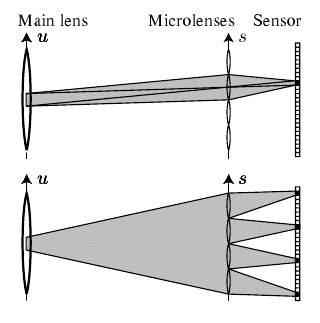
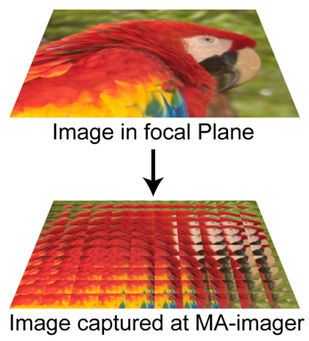

Avez-vous vu ça ?

youtube 

L'entreprise "Refocus Imaging" a mis au point une technologie qui permet de ne plus mettre au point\* les photos! Concrètement, on peut rendre nette une photo floue, en réglant la focale après que la photo ait été prise, comme dans "les Experts" ... [Essayez vous-mêmes !](http://www.refocusimaging.com/about/index.html)

A un détail près : le logiciel ne suffit pas, il faut un [appareil photographique plénoptique](w:), équipé d'une matrice de micro-lentilles avant le capteur CCD. L'optique fonctionne comme illustré ci-contre:

1. tous les rayons arrivant sur un pixel donné passent par une seule micro-lentille, et proviennent d'une zone donnée appelée "sous-ouverture" de la lentille principale
2. tous les rayons passant par une "sous ouverture" sont focalisés par les différentes micro-lentilles sur des pixels distincts.

L'image ainsi capturée ressemble à une mosaïque de petites images partielles prises de points légèrement différents (en réalité, il y a plus de micro-lentilles : l'équipe de Stanford qui a mis au point la technologie de "Refocus Imaging" utilise une matrice de 296 x 296 micro-lentilles [[1]](#ref-1) ) :

Le principe d'un appareil plénoptique est similaire à celui d'un [appareil stéréoscopique](w:) produisant des "images 3D" ou du "[bullet time](w:)" célèbre depuis Matrix : en prenant plusieurs images simultanément, on capture le "[champ de lumière](w:en:light_field)" en 4D. Quatre dimensions parce qu'on reconstitue non seulement le point d'arrivée (x,y) des rayons sur l'image, mais aussi leur direction  (définie par deux angles).

C'est cette information supplémentaire qui permet de recalculer la photo comme si elle était prise avec une focale différente, parmi beaucoup d'autres effets possibles. Ca parait un peu compliqué [[1]](#ref-1), mais en fait il s'agit d'utiliser de [barbares transformées de Fourier](/2010/03/06/succes-hollywoodiens-et-transformee-de-fourier/) en 2D ou en 4D [[2]](#ref-2), des choses que les processeurs actuels savent faire à toute vitesse  ([Joseph](w:Joseph_Fourier), tu étais décidément génial).

Un appareil "plenoptique" n'est pas plus gros qu'un appareil normal, n'a pas besoin de mise au point, et présente un autre avantage inattendu : on peut ouvrir le diaphragme beaucoup plus qu'avec un appareil classique pour une même profondeur de champ. Donc on peut obtenir des profondeurs de champ exceptionnelles, ou alors réduire le temps de pose... Le prix à payer, car il y en a quand même un, est une diminution assez nette \*\* de la résolution. Ca tombe bien, on ne trouvait pas vraiment d'utilité pratique aux capteurs de plus de 10 Megapixels au moment où [Canon en annonce un de 120 Megapixels](http://www.pcpro.co.uk/news/360568/canon-unveils-120-megapixel-camera-sensor)... Mais il y a peut être des [solutions plus élégantes](http://www.youtube.com/watch?v=Z7SN7808ANI).

Jusqu'ici le numérique a surtout remplacé le film, mais quand le "plénoptique" supprimera les réglages dans quelques années, la révolution numérique prendra tout son sens.

Notes: \* sic \*\* et re-sic :-)

### Références

(merci à P.-F. pour les links)

1. Ren Ng et al, "[Light Field Photography with a Hand-Held Plenoptic Camera](http://graphics.stanford.edu/papers/lfcamera/lfcamera-150dpi.pdf)", April 2005, Stanford University Computer Science Tech Report CSTR 2005-02
2. Ren Ng, "[Fourier Slice Photography](http://graphics.stanford.edu/papers/fourierphoto/fourierphoto-600dpi.pdf)",  July 2005, ACM Transactions on Graphics, 
3. Sri Rama Prasanna Pavani "[Plenoptic camera and its Applications](http://prashub.com/prasanna/files/Plenoptic_Prasanna_Pavani_2005.pdf)", 2005, présentation MO-ISL, CU Boulder
