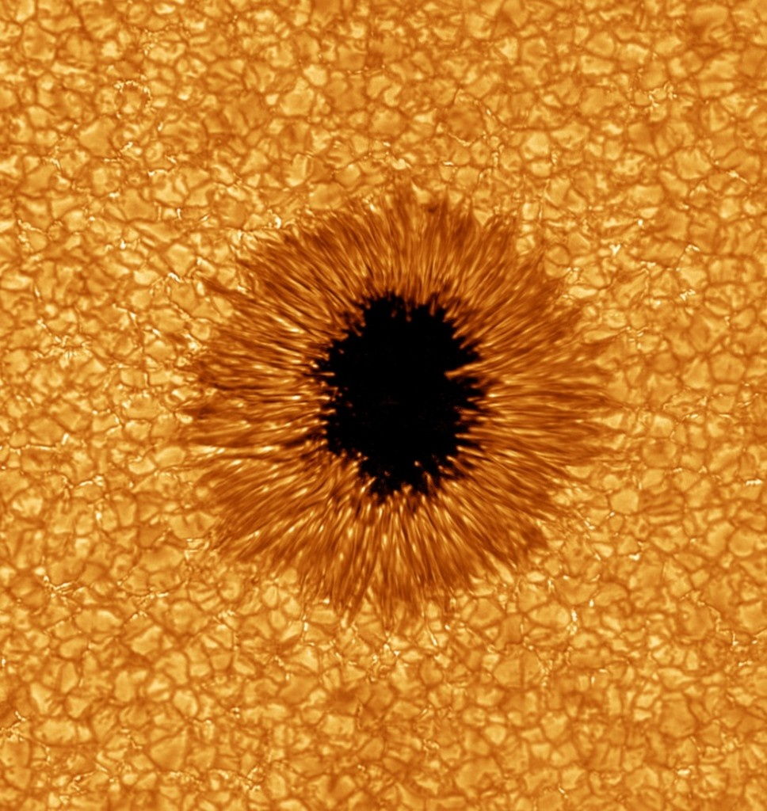

2010 restera une année importante pour l'observation et la compréhension de notre étoile. Deux nouveaux instruments sont venus compléter "Stereo", qui nous fournit de [magnifiques images 3D](/2010/03/28/pets-solaires/) du Soleil depuis 2007 et le fidèle [SOHO](http://sohowww.nascom.nasa.gov/) lancé au siècle passé.

D'une part, le satellite du [Solar Dynamics Observatory](http://sdo.gsfc.nasa.gov/) (SDO) embarque un ensemble d'[instruments](http://sdo.gsfc.nasa.gov/mission/instruments.php) qui fournissent chaque seconde des images à haute résolution dans plusieurs longueurs d'onde ainsi que des mesures des champs magnétiques et des vitesses des gaz. Après vous être dilatés les pupilles sur ces gigantesques cyclones de plasma filmés récemment, ne manquez pas d'essayer la consultation interactive des dernières images de SDO directement sur [le site SDO](http://sdo.gsfc.nasa.gov/)



D'autre part, le télescope du [Big Bear Solar Observatory](http://www.bbso.njit.edu/) a également commencé à fournir [les images les plus détaillées](http://www.bbso.njit.edu/nst_gallery.html) jamais obtenues de la surface du Soleil, et ce depuis le sol de notre bonne vieille Terre grâce à l'utilisation de l'[optique adaptative](http://fr.wikipedia.org/wiki/Optique_adaptative).

Une petite [tache solaire](http://fr.wikipedia.org/wiki/Tache_solaire) photographiée par le Big Bear Solar Observatory en juillet. La résolution de l'image originale est de 100 km, les petites bulles font environ 1000 km de diamètre, et la Terre tiendrait dans la tache "noire", où la température n'est que de 3600°K, soit bien moins que les ~5800°K environnants.

Avec ces instruments, on devrait pouvoir observer en détail le 24ème [cycle solaire](http://fr.wikipedia.org/wiki/Cycle_solaire), débuté en 2008, et mieux comprendre le magnifique diagramme "butterfly" qui représente le nombre de taches solaires repérées à chaque latitude du Soleil en fonction du temps. Admirez cette régularité encore mal comprise :

Avec ces mesures de qualité, nul doute que [nos connaissances de la physique du Soleil](http://solarscience.msfc.nasa.gov/) vont progresser à pas de géant, ce d'autant que les liens avec la climatologie sont politiquement porteurs...
