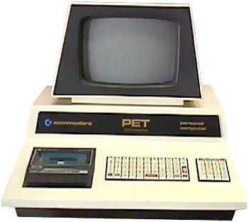

Je programme des ordinateurs depuis 30 ans, et tous les 5 ans environ je me demande pourquoi je continue à aimer ça. Et à chaque fois je découvre quelque chose qui provoque un "éclair haha", une de ces illuminations cérébrales où l'on entrevoit le Génie dans toute sa Pureté avant de retomber sur sa chaise motivé pour les 5 ans suivants.

Le dernier a été provoqué cette semaine par les "décorateurs" de Python, dont je vous parlerai plus bas.

Ma première extase informatique date donc de 1980 environ, je m'en souviens comme si c'était hier. Mon [Commodore PET](w:) 2001 se programmait en BASIC, un langage qu'on a bien fait d'oublier. Mais une astuce (ou plutôt une horreur) sur le PET permettait de faire en sorte que le programme s'ajoute des lignes de programme à lui-même ! J'avais ainsi modifié le jeu "[animals](http://www.moorecad.com/classicbasic/basic/creative/animal.bas)" de [Creative Computing](http://www.atariarchives.org/bcc1/showpage.php?page=197) pour qu'il "apprenne" de nouveaux animaux de façon permanente. Un programme qui s'améliore lui-même, ça me fait encore rêver, 30 ans après...

Le second flash date de 1985, la grande époque de [Turbo Pascal](w:). Un jour j'ai vu quelque chose comme ça:

\[pascal\]function factorielle(n: integer): integer; begin if n <= 1 then result := 1 else result := n\*factorielle(n-1); end;\[/pascal\]

Une fonction qui s'appelle elle même ! Merveilleuse [récursivité](w:fonction_récursive), chaque fois que je te revois, je me rappelle mon émoi à notre première rencontre.

Les années 1990 sont riches en "haha"s plus rapprochés mais moins intenses pendant mes études à l'EPFL : la [programmation fonctionnelle](w:) en LISP, le moteur d'inférence de [Prolog](w:),  la [généricité](w:) en d'ADA, qui semblait à l'époque bien plus importante que la programmation orientée objet, juste entrevue.  Et [Occam](w:Occam_(langage)), précurseur de la programmation parallèle trop tôt disparu.

Un peu avant 1995, je découvre [LabView](w:) et le flash se produit lorsque je comprends que c'est un véritable langage de programmation complet... sans code ! Ou plus exactement que le langage graphique de LabView permet de programmer directement au niveau sémantique. Adieu "syntax error" ! Quel dommage que [NI](http://www.ni.com/) vende cette merveille si cher et l'aie blindé de brevets défendus avec vigueur : un des concepts les plus innovants en programmation reste confiné à un cercle d'initiés alors qu'il aurait pu révolutionner l'informatique.



Vers 2000, je constate qu'on m'avait menti : C++ est beaucoup plus qu'un C amélioré. C'est un grand festival de "haha" en quelques jours : les [références](w:en:Reference_(C++)), la [const-correctness](w:en), l'[héritage multiple](w:), la [surcharge des opérateurs](w:), les [exceptions](http://fr.wikibooks.org/wiki/Programmation_C%2B%2B/Exceptions) , le [RTTI](w:Run-time_type_information), mais surtout la [Standard Template Library](w:) (STL). Java et .NET ont des librairies de classes et fonctions à tout faire, mais C++ a une "méta-librairie", un système qui produit du code très optimisé pour chaque opération spécifique, en utilisant notamment le concept d'[itérateur](w:).

En 2005, je lis . Flash d'illumination : c'est génial, mais j'ai pas tout compris. Je le relis: re-flash: c'est encore plus génial que je pensais. Je le lis une troisième fois (à part "Les Robots" d'Asimov je n'ai jamais lu un livre 3 fois) : ça y'est je suis converti au "[policy based design](w:en:Policy-based_design)", une approche révolutionnaire de la programmation autorisée par une exploitation transcendantale de la combinaison C++, STL, et #macros. Les C++istes trouveront un petit [tutoriel ici](http://alp.developpez.com/tutoriels/traitspolicies/) qui les convaincra à la fois de la puissance de cette approche, et de sa lourdeur d'écriture...

Et nous voici donc en 2010 où, poursuivant [ma découverte de Python](/tags/python/), je tombe sur ça:

\[python\]@cache() def fib(n): if n < 2: return 1 return fib(n-1) + fib(n-2)\[/python\]

Même ceux qui ne parlent pas Python reconnaîtront une fonction récursive calculant le n-ième terme de la suite de Fibonacci, mais il y a une astuce : le @cache().

Ca s'appelle un "décorateur" et en l’occurrence, le @cache() ajoute un comportement de [mémoization](w:) (déjà mentionné [ici](/2008/11/22/tri/)) à la fonction : si on appelle la fonction fib pour un n déjà calculé précédemment, le @cache() va renvoyer le résultat mémorisé avec un gain de vitesse appréciable plutôt que de recalculer la fonction, et ceci sans rien changer à la fonction elle-même!

Et bien sur, le décorateur est lui-même écrit en Python : c'est [là](http://code.activestate.com/recipes/577479-simple-caching-decorator/), et c'est une version simplifiée d'un [cache plus sophistiqué fourni](http://docs.python.org/dev/library/functools.html) avec la librairie Python. Une [librairie de décorateurs](http://wiki.python.org/moin/PythonDecoratorLibrary) très variés est en train de naître (voyez par exemple les [machines d'états](http://wiki.python.org/moin/PythonDecoratorLibrary?highlight=\(\(State+Machine+via+Decorators\)\)#StateMachineImplementaion), chers collègues...), mais il me semble que les décorateurs permettent surtout de réaliser des choses ressemblant beaucoup aux "politiques" d'Alexandrescu avec une syntaxe plus simple qu'en C++. (Pythonistes, voyez [ce tutoriel](http://progmod.org/tutoriel/8/le-pattern-decorator-en-python/))

C'est pour cela que j'aime toujours la programmation : les langages gagnent en pouvoir d'abstraction en même temps que moi, et vice-versa. Chaque fois que je programme dans un nouveau langage, tout est plus simple, plus clair et plus vite juste que dans le précédent, et, luxe suprême,  je dois presser moins de touches. Les ordinateurs sont restés des esclaves qui camouflent leur stupidité derrière une vitesse stupéfiante, mais les concepteurs de langages, eux sont devenus vraiment malins. Merci [Guido](w:en:Guido_van_Rossum), grâce à toi j'en reprends pour 5 ans.
