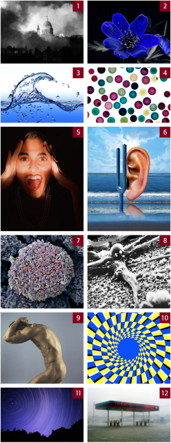

[SCIENCEphotoLIBRARY](http://www.sciencephoto.com/) dont je vous ai déjà parlé [ici](/2008/06/28/photos-de-science/) est une référence en matière d'illustrations scientifiques en tout genre. A part des myriades de photos hélas trop chères pour un modeste blog, on y trouve aussi de spectaculaires [vidéos](http://www.sciencephoto.com/bRKqslmVE8U=aO926yj4wSQ/level/regular/motionindex.html) à visionner sur place.

Pour cette fin d'année, ils ont organisé un [petit Quiz sympa](http://www.sciencephoto.com/quiz) : il s'agit de reconnaître les peintres célèbres dont les oeuvres ressemblent à la douzaine de photos ci-contre.

Envoyez vos réponses à [marketing@sciencephoto.com](mailto:marketing@sciencephoto.com) jusqu'au 14 janvier 2011. Avec un peu de chance vous gagnerez un abonnement d'une année aux [Tate Galleries](http://fr.wikipedia.org/wiki/Tate_\(galerie\)) de Londres.

Moi je cherche toujours les 7, 8 et 12 ...

