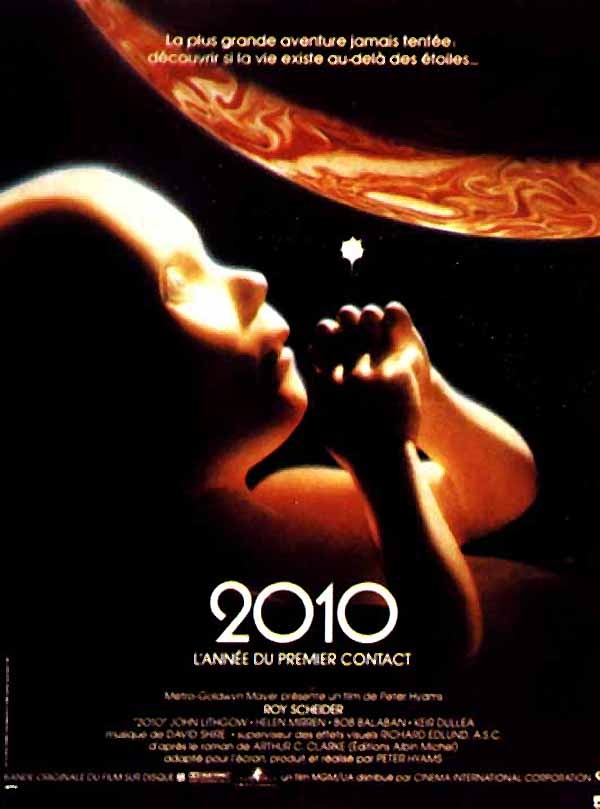

Une année de plus en moins... C'est l'heure d'adresser mes **meilleurs vœux de succès et de bonheur** à mes fidèles lecteurs-trices, et aussi à vous, nombreux visiteurs-teuses de passage. Que la réflexion critique basée sur les faits, et les rêves qu'apportent notre insondable Univers et notre merveilleuse Nature vous aident à affronter la dure réalité des chiffres en 2010...



88 articles plus tard, vous êtes encore un peu plus nombreux qu' [il y a un an](/2009/01/03/2009-2/) à lire ce blog. Merci ! Continuez à me forcer à continuer!

Parmi les articles de 2009, ceux qui ont été les plus lus (ou vus) m'ont surpris: [Comment marche Shazam](/2009/07/11/comment-marche-shazam/) (4985 lecteurs) [1,2,6,42,1806, Combien ?](/2009/06/10/126421806-combien/) (4883) et [Pourquoi les bébés sont plus jeunes que leurs parents](/2009/03/21/pourquoi-les-bebes-sont-plus-jeunes-que-leurs-parents/) (2828). Des articles "faciles" comme [Un festival de galaxies](/2008/04/25/un-festival-de-galaxies/) on eu plus de 2000 visites alors que d'autres comme [MIROIR | ЯIOЯIM](/2009/04/04/miroir/ "Permalien") sur lesquels j'ai vraiment planché (déjà pour le titre...) et que je voyais déjà percer la barre des 5000 lectures ont eu beaucoup moins de succès (755). Ceci confirme deux choses:

1. Pour faire de l'audience, il faut vraiment faire (trop) simple et bien coller à l'actualité. Ok, je vous promets un article sur les Simpson très bientôt, avec le mot "sexe" à la première ligne. Car ça permet peut-être d'attirer l'attention des lecteurs sur des sujets plus sérieux comme la démographie, autre sujet qui sera abordé cette année.
2. La prévision est un art difficile et dangereux.

A ce sujet, en cherchant une illustration pour cet article, je suis tombé sur ça :

Peut-être vous souvenez-vous de [ce film](w:2010_:_L'Année_du_premier_contact) assez moyen sorti en 1984, 2 ans après le roman d'Arthur C. Clarke pondu comme suite au génial [2001 L'Odyssée de l'Espace](w:2001_:_L'Odyssée_de_l'espace) de 1968. 40 ans après, on n'est même [pas retournés sur la Lune](/2009/07/18/pour-quoi-retourner-sur-la-lune/). Les projets de visiter Mars à pied sont repoussés, on est bien loin d'une mission habitée vers Jupiter (bon, aucun parallélépipède noir ne nous a dit d'y aller non plus), et pourtant il est bien possible que 2010 devienne quand même l' "année du premier contact". Non je ne crois toujours pas aux OVNI, mais au rythme ou vont les découvertes sur les [exoplanètes](/2009/11/15/combien-dexoplanetes-3/), je ne serais pas surpris  qu'on en trouve une avec de l'eau liquide et une atmosphère d'azote et d'oxygène très bientôt.

Aucun roman de science-fiction dont je me souvienne n'avait prévu qu'on puisse découvrir et analyser des planètes sans y envoyer des sondes ou des vaisseaux. On pensait "fusées", on a trouvé avec des miroirs. D'ailleurs, il y a 40 ans, on avait peur d'un ennemi colossal dont les fusées pouvaient nous réduire en poussière radioactive et déclencher un hiver nucléaire, voire une glaciation. Maintenant on se déshabille de peur devant des bricoleurs d'explosifs du dimanche vendredi, et on craint que [Paris-Plages](https://web.archive.org/web/20110324043420/http://www.paris.fr/ete2009/Portal.lut?page_id=9281) ne devienne permanent, ou de ne pas avoir de neige la semaine prochaine (et là je flippe vraiment).

Si j'ai un petit message pour cette année, c'est : "N'ayez pas peur : sur 40 ans, la grande majorité des prévisions se sont révélées fausses." (© Dr. Goulu et Jean-Paul II)

Je croyais vous avoir [trouvé un petit cadeau sympa](http://www.flickr.com/photos/8733765@N04/sets/72157623000125408/detail/) pour 2010, mais il n'est [hélas pas gratuit](https://web.archive.org/web/20100117092859/http://www.cuboctaedro.eu/work/graphics/science-fiction-calendar-2010).

A part ça [2010 a 154 propriétés](http://oeis.org/search?q=seq%3A2010) seulement. C'est un [nombre beaucoup moins intéressant](/2009/04/18/nombres-mineralises/) que [2009](http://oeis.org/search?q=2009) qui en avait 32933. Mais parmi elles, une me semble mériter un futur article : 2010 est une solution du [problèmes des timbres](https://web.archive.org/web/20090214070411/http://www2.stetson.edu/~efriedma/mathmagic/0403.html). En éditant 3 timbres de valeurs entières positives a, b et c judicieusement choisies, on peut affranchir un envoi à n'importe quelle valeur entière entre 1 et 2010 € en utilisant au maximum 30 timbres. Si vous vous vous ennuyez sous la pluie, cherchez a, b et c...
