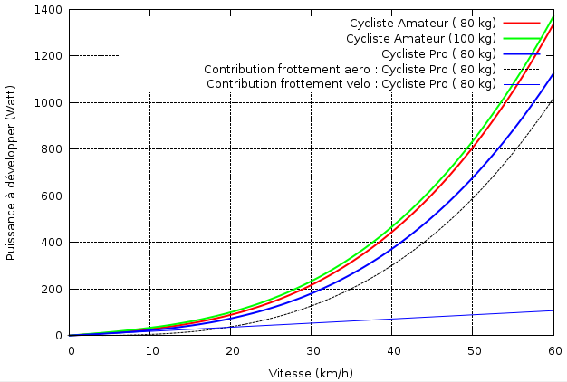

Pourriez-vous remporter le Tour de France avec un vélo "amélioré" par rapport à ceux des autres concurrents ?  Que diriez-vous d'un petit moteur électrique caché dans le cadre ?

Un cycliste amateur peut développer pendant quelques heures une puissance moyenne de 150 watts, un pro autour de 190 watts. Différence : 40 watts. Pas de problème pour le moteur, nos amis modélistes  disposent de [moteurs de 20 mm de diamètre produisant 200 W](https://web.archive.org/web/20100202031401/http://www.exceedrc.com/eliteseries.html) pour leurs engins volants. Pour la batterie, c'est plus compliqué en raison du volume réduit à l'intérieur du cadre. On dispose d'environ 0.25 l si on utilise qu'un seul tube rond de 25 mm, et de près d'1 litre si on remplit un cadre profilé dans les règles de l'Union Cycliste Internationale (UCI) , ce qui permet de disposer des batteries lithium-ion d'une capacité de 100 à 400 Wattheures.



Donc oui, une assistance électrique discrète peut vous propulser au niveau des pros du peloton pendant plusieurs heures.

Pour grimper un col, ça passe encore : les mutants sont capables de développer 400 W pendant une ascension ! [[2]](#ref-2) Pour les suivre, voire les dépasser, il vous faudra les 200 W du moteur en plus d'un pédalage intensif, mais la batterie vous lâchera grosso-modo au bout d'une heure.

Mais vous pourriez aussi devenir un redoutable routier sans l'assistance d'un moteur, mais en violant plus visiblement les règles de l'UCI. En effet, à plat, la puissance développée sert essentiellement à compenser le frottement dans l'air :

On voit tout l'intérêt de réduire le [Cx](w:coefficient_de_traînée), confirmé par le fait que les records de vitesse de [véhicules à propulsion humaine](w:) sont détenus par des "vélos couché":

- record de l'heure : 90.6 km en 2009 par Sam Whittingham (contre 49.7 km pour un vélo "normal")
- record sur 200m : 133.28 km/h en 2009 par Sam Whittingham



Même sans carénage, un [vélo couché](w:) offre un meilleur Cx qu'un vélo normal, et en plus il permet de s'appuyer sur un dossier pour exercer plus de force sur les pédales, sans la fatigue de la "montée en danseuse".

Mais en 1934, l'UCI a interdit les vélos couchés, et elle a ensuite beaucoup limité l'amélioration aérodynamique des vélos. En fait, le carbone, le titane et les combinaisons moulantes des coureurs survitaminés cachent un gros gaspillage d'énergie : tous ces sportifs transpirent et brassent de l'air sur des machines qui devraient rejoindre les vélocipèdes au musée...

### Références

1. "[Batteries lithium-ion : la société Matsushita donne un coup d'accélérateur](https://web.archive.org/web/20100612021047/http://www.caradisiac.com/Batteries-lithium-ion-la-societe-Matsushita-donne-un-coup-d-accelerateur-4290.htm)" sur Caradisiac (2008)
2. "[Les calculs de puissance dans les cols du Tour de France](https://web.archive.org/web/20100104111802/http://www.cyclismag.com/article.php?sid=2523)" sur Cyclismag (2006)
3. "[Puissance musculaire humaine et bicyclette](w:)" sur Wikipédia
4. "[Règles techniques de la bicyclette](https://web.archive.org/web/20100618085125/http://www.uci.ch/Modules/BUILTIN/getObject.asp?MenuId=MTk3Nw&ObjTypeCode=FILE&type=FILE&id=NTI0MDU&La%20ngId=2)", UCI
5. [Quoi attendre de l'énergie humaine?](http://velomobile.free.fr/quoi_attendre_de_l-energie_humaine.html)
