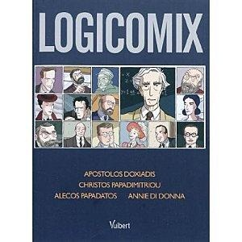

Sous le sapin j'ai eu le plaisir de trouver "[Logicomix](http://www.logicomix.com/fr/)", un livre assez particulier. Ce "roman graphique" de [trois grecs et une française](http://www.logicomix.com/fr/indexf76f.html?option=com_content&view=category&layout=blog&id=37&Itemid=18) relève un défi très ambitieux : vulgariser en BD la révolution de la Logique survenue au début du XXème siècle à travers la biographie de l'un de ses principaux artisans, [Bertrand Russel](https://fr.wikipedia.org/wiki/Bertrand_Russel).

Les 300 pages soigneusement illustrées parviennent à ce but en permettant plusieurs niveaux de lecture : les plus jeunes y trouveront un lot de savants rendus fous par leurs travaux ([Georg Cantor](https://fr.wikipedia.org/wiki/Georg Cantor), [Gottlob Frege](https://fr.wikipedia.org/wiki/Gottlob Frege), [Ludwig Wittgenstein](https://fr.wikipedia.org/wiki/Ludwig Wittgenstein) ); les non matheux s'initieront peut-être les joies de l’auto-référence dans les passages où les auteurs se représentent dans leurs propres séances de discussion sur "Logicomix"; les amateurs de casse-tête s'arracheront les cheveux sur le fameux [paradoxe du barbier](https://fr.wikipedia.org/wiki/paradoxe_du_barbier), version simplifiée du [Paradoxe de Russell](https://fr.wikipedia.org/wiki/Paradoxe_de_Russell) qui ébranla la [théorie des ensembles](https://fr.wikipedia.org/wiki/théorie_des_ensembles). Enfin, les curieux de science comme vous et moi comprendront mieux l’enchaînement d'idées et de difficultés qui ont conduit ce domaine des mathématiques touchant à la philosophie à une remise en question du même ordre que celle qui a touché la physique à la même époque. "Logicomix" s'achève avec [Kurt Gödel](https://fr.wikipedia.org/wiki/Kurt_Gödel), l'Heisenberg de la Logique dont le [théorème d'incomplétude](https://fr.wikipedia.org/wiki/théorème_d'incomplétude) n'a pas encore frappé les foules, mais ça viendra. Peut-être sous la forme d'une suite de Logicomix ?

Ce que j'ai le plus apprécié dans "Logicomix" est le traitement de l'échec en sciences. Non, la recherche ne progresse pas de succès en succès via publications réputées et prix Nobel. Ceux qui butent sur les obstacles, les analysent, cherchent à les contourner pendant des années, effectuent un travail de fourmi pour prouver que 1+1=2 :

> 

ceux-là posent les bases indispensables pour permettre de futures avancées. Avec quelques jours de recul, c'est même ce que je retiendrai de ce livre : une excellente illustration de la démarche scientifique à mettre entre toutes les mains.

### Ref et liens

1. 
2.   _p. 379 \*54.43 : [1+1=2](http://quod.lib.umich.edu/cgi/t/text/pageviewer-idx?c=umhistmath&cc=umhistmath&idno=aat3201.0001.001&frm=frameset&view=image&seq=401)_

- une autre [critique sur mathéphysique](http://math-et-physique.over-blog.com/article-logicomix-53204287.html)
- [Logicomix sur Wikipedia](http://fr.wikipedia.org/wiki/Logicomix)
