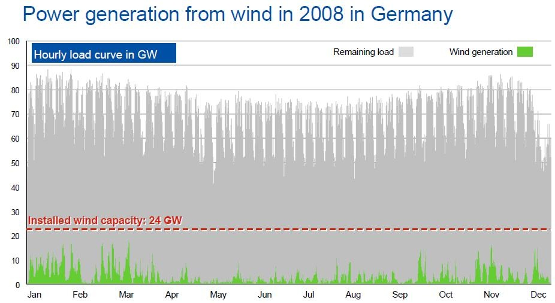



La machine à [mouvement perpétuel](w:) permettant de produire de l'énergie à un prix nul est un vieux rêve de l'humanité. Mais aujourd'hui on sait faire mieux : il arrive de plus en plus souvent que l'électricité ait un prix négatif pendant quelques heures ! On vous paie pour consommer de l'électricité ! Qui en veut ?

J'ai entendu parler de cette aberration il y a quelques temps, voici ce que j'ai trouvé sur le sujet : c'est grâce aux éoliennes allemandes. [[1]](#ref-1), [[2]](#ref-2), [[3]](#ref-3)

Il y en a beaucoup, et elles tournent toutes en même temps pendant certaines tempêtes nocturnes, produisant des pointes dont on ne sait que faire à ce moment là. On le voit sur le graphique ci-dessous : l'Allemagne dispose de plus de 20'000 éoliennes représentant 24 GW de puissance installée, mais malgré leur [emplacement favorable](/2007/08/26/energie-eolienne-et-solaire-a-prix-coutant/) elles produisent de manière très irrégulière, par pics au gré des vents.

La consommation, est très variable aussi, mais assez prévisible. Elle suit 3 cycles : un grand cycle saisonnier (au nord, on consomme plus pendant l'hiver), un cycle hebdomadaire du à la consommation de l'industrie et services (responsable également de "trous" bien visibles à Noël et à Pâques), et un cycle quotidien.

Le 2 octobre 2009 était un vendredi normal en Allemagne : consommation de 12 GW tôt le matin, les centrales à charbon et lignite suffisent, le prix du MWh est autour de 25€. Les gens vont au boulot, mangent etc : vers midi la consommation à augmenté à 18 GWh, il a fallu mettre en marche des centrales à gaz et faire turbiner les quelques barrages. Ces installations sont plus chères, aussi parce qu'elles apportent la flexibilité au réseau, donc leurs exploitants ne les mettent en marche que lorsque le prix du MWh passe au dessus d'un prix qui leur permet de ne pas perdre d'argent, soit environ 70€. Vers 17h il y a une petite baisse de consommation, mais comme tout le monde sait que le soir elle va ré-augmenter, on n’arrête pas les installations malgré une baisse du prix à 40€. Et effectivement le soir quand Herr Schmidt allume sa télé et sa lumière, la consommation augmente encore un peu avec le prix, jusqu'à ce qu'il aille se coucher.



Le lendemain, samedi 3 octobre 2009, Herr Schmidt ne va pas travailler, il ne se lève que pour manger, ce qui crée un pic de consommation et de prix moins élevé que la veille, mais le soir il y a le foot à la télé, donc la consommation maximale à lieu vers 21h à 19 GWh. Ensuite les exploitants arrêtent les centrales à gaz, ferment les vannes des barrages, baissent un peu la puissance des centrales thermiques car demain c'est dimanche et là ça sera vraiment calme... Mais que se passe-t-il ??? La production diminue trop peu ... et en deux heures les prix s'effondrent. Un peu avant minuit, les producteurs ne savent plus quoi faire de leurs megawatts et les donnent...



Peu de producteurs d'électricité allemands doivent avoir oublié le dimanche 4 octobre 2009. Une jolie tempête atteint toute l'Allemagne avec des vents juste à la bonne vitesse pour faire tourner les éoliennes au max de leur rendement. Mais à 3h du matin, personne ne sait que faire de leur jus. Donc il vont jusqu'à payer 500€ par MWh pour qu'on les débarrasse de ce truc qui fait monter la tension sur le réseau et va faire tout péter ! 500 €, c'est dix fois le prix "normal" de l'électricité, mais en négatif !!!



Tout ceci démontre un aspect très important de l'électricité mais trop souvent ignoré:

> ## Votre prise électrique ne fournit pas de l'énergie mais de la puissance.

Ce que je veux dire, c'est que lorsque vous allumez la lumière, vous la voulez tout de suite. Et ça implique que quelque part une installation de production va devoir "faire quelque chose" pour fournir cette puissance (en Watts) au moment même où vous la consommez. Ensuite si vous laissez votre ampoule allumée et consommez de l'énergie (rappel : l'énergie est une [puissance multipliée par un temps](/2009/08/26/le-groupe-e-promet-2000-francs-par-kwh-de-puissance-installes/)), la production continue au même niveau.

Les variations de prix de l'électricité n'ont pas grand chose à voir avec l'énergie, mais tout avec la puissance. Si la consommation augmente, il faut mettre en marche des installations qui étaient à l'arrêt, et si elle diminue il faut arrêter des turbines, et ces changements prennent du temps, demandent du travail et ont un prix fondamentalement plus élevé que de laisser tourner une centrale (nucléaire...) toute l'année à une puissance quasi-constante.

C'est ce qui a piégé les producteurs d'électricité dans la nuit du 3 au 4 octobre 2009, et encore plusieurs fois depuis mais dans une proportion moindre : ça leur coûtait moins cher de payer pour se débarasser de leur surproduction que d'arrêter des turbines pendant le coup de vent. Une preuve de plus que le problème des éoliennes, c'est qu'elles produisant quand elles veulent, pas quand on a besoin d'elles.

Mais alors, pourquoi les producteurs n'ont-ils pas arrêté les éoliennes ? Peut-être parce qu' ils touchent des [subventions](/2008/08/30/rentabilite-des-eoliennes/) de l'ordre de 100€ par MWh (j'ignore le chiffre exact, si vous l'avez...) Ô surprise, la moyenne du prix négatif payé pendant les 6 heures de cata était de 100€ par MWh... Donc ils n'ont rien perdu, et ont fait payer au consommateur qui les subventionne le coût de l'exportation de leur surproduction vers les [barrages alpins](/2008/09/06/potentiel-hydroelectrique/), qui la leur ont revendu quelques heures plus tard avec une marge énorme.

Je viens de changer d'avis : je suis pour les éoliennes dans l'UE, et pour que la Suisse ne s'occupe que du stockage d'énergie...

### Références

1. "[Allemagne : quand l’électricité vaut moins que rien](http://www.lesoir.be/actualite/monde/2010-08-18/allemagne-quand-l-electricite-vaut-moins-que-rien-787892.php)", lesoir.be, 18 août 2010
2. "[Allemagne : un prix parfois négatif pour l'électricité](http://www.ecoco2.com/blog/?p=1551)" sur EcoCO2, 2 septembre 2010
3. Jeremy van Loo "[Windmill Boom Cuts Electricity Prices in Europe](http://www.bloomberg.com/news/2010-04-22/windmill-boom-curbs-electric-power-prices.html)", Bloomberg, 23 avril 2010
4. "[Prix négatifs : Questions - Réponses](https://www.epexspot.com/fr/epex_spot_se/fondamentaux_du_marche_de_l_electricite/Prix_n%C3%A9gatifs)" sur le site EPEX SPOT (ajouté le 2.9.2015)
