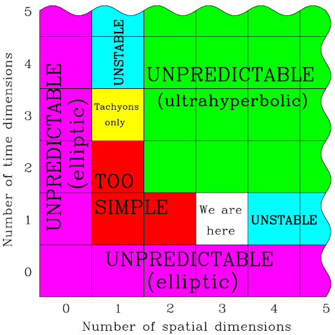

Dans "[Why are past, present, and future our only options?](https://gizmodo.com/why-are-past-present-and-future-our-only-options-5655307)", [Dave Goldberg](http://www.physics.drexel.edu/~goldberg/) traite de la "question bête" d'un lecteur de son livre[[1]](#ref-1) qui se demande à quoi ressemblerait l'univers si le temps avait plus d'une dimension, et plus généralement, si la vie serait imaginable dans un univers à N≠3 dimensions. Voici quelques idées qu'il y développe, additionnées des miennes sur ce sujet.

La vie dans un espace à 2 dimensions (+1 temps)  a été imaginée dès 1884 dans "[Flatland](https://fr.wikipedia.org/wiki/Flatland)" [[2]](#ref-2), une allégorie purement géométrique dont a été tiré [un film](http://www.flatlandthemovie.com/) en 2007 :



Un siècle plus tard, A.K. Dewdney a traité de manière beaucoup plus "scientifique" la physique, la chimie et la biologie dans "[Le Planivers](https://fr.wikipedia.org/wiki/Le_Planivers)" [[3]](#ref-3), répondant au passage à une objection de Dave Goldberg : oui, il est possible de croiser deux fils dans le Planivers, [comme indiqué ici](http://www-cs-faculty.stanford.edu/~eroberts/courses/soco/projects/2005-06/planiverse/designs.html), donc de réaliser des ordinateurs en 2D, comme le montre également le "[Jeu de la Vie](http://drgoulu.local/2009/03/29/la-resurrection-du-jeu-de-la-vie/)" qui est une machine "[Turing complète](https://fr.wikipedia.org/wiki/Turing_complète)"

Un univers à N=1 dimension (+1 temps) n'est pas imaginable en physique, mais du point de vue artistique j'aime beaucoup "la Linea" de mon enfance, un dessin animé minimaliste en "1½ D" avec interventions ponctuelles d'un Créateur tridimensionnel :



A propos d'un univers à [N=4 dimensions spatiales](http://drgoulu.local/2007/02/06/voir-en-4-dimensions/) (+1 temps toujours), Dave Goldberg mentionne un fait que je n'avais pas réalisé : l'action des forces n'y diminue pas comme l'inverse du carré de la distance comme dans notre univers, mais comme l'inverse du cube de la distance. Ceci fait notamment qu'aucune planète à 4 dimensions ne peut décrire une orbite stable autour de son soleil hypersphérique. Le problème ne s'arrangeant pas en augmentant les dimensions il faut se rendre à l'évidence : un univers "fertile", où la complexité peut se développer jusqu'à permettre des formes de vie ne peut avoir que N=3 dimensions, ou à la rigueur 2.

Plus une seule dimension de temps, toujours. Quelle que soit la "[nature du temps](http://drgoulu.local/2008/12/24/la-nature-du-temps-2/)" on n'y coupe pas : au niveau macroscopique bien décrit par la relativité d'Albert, le [temps est décrit par une dimension imaginaire](http://drgoulu.local/2007/02/07/le-temps-une-4eme-dimension-imaginaire/), au sens mathématique des nombres complexes. Evidemment, sans temps un univers serait désespérément statique et sans intérêt.

Mais peut-on imaginer un temps à plus d'une dimension ? Mathématiquement ça ne pose pas trop de problèmes et les caractéristiques de tels univers ont été étudiées, notamment par [Max Tegmark](https://fr.wikipedia.org/wiki/Max_Tegmark). Son très intéressant article [[4]](#ref-4) soulève la difficulté majeure posée par un univers à plusieurs dimensions de temps :

> Si un observateur est capable d'utiliser sa conscience de soi et des capacités de traitement de l'information, les lois de la physique doivent être telles qu'il puisse faire au moins certaines prédictions. Plus précisément, au sein du cadre d'une théorie des champs, en mesurant diverses valeurs de champ à proximité, il faut qu'il ait la possibilité de calculer les valeurs de champ à certains points plus éloignés de l'espace-temps (ceux se trouvant le long de la ligne de son monde à venir sont particulièrement utiles) avec une marge d'erreur finie. Si ce type de causalité bien définie était absente, alors non seulement il n'y aurait aucune raison pour que cet observateur ait une conscience de soi, mais il semble très peu probable que des systèmes de traitement de l'information tels que les ordinateurs ou le cerveau puisse exister.

Or justement cette prédictibilité n’apparaît que si les équations de champ suivent des [équations différentielles partielles "hyperboliques"](https://en.wikipedia.org/wiki/Hyperbolic_partial_differential_equation). Et Tegmark montre que ceci n'est le cas que dans les univers à une seule dimension de temps ou une seule dimension d'espace. S'il y en a plus, l'univers devient totalement imprévisible. Avec un temps à deux dimensions, il est par exemple impossible de donner un rendez-vous à quelqu'un, car si nous contrôlons nos déplacements dans l'espace et pouvons éventuellement les moduler de façon à nous retrouver à un certain moment t1 selon le "temps1" à l'endroit convenu, nous n'aurions pas le moyen de gérer simultanément le "temps2" : l'autre personne suivant une trajectoire dans l'espace-temps différente n'aurait aucun moyen d'arriver au rendez-vous à la fois à la même position spatiale et au au même temps (t1,t2)

Le tableau suivant résume les caractéristiques des univers selon leurs dimensions spatiales et temporelles selon Tegmark:

Notre univers n'est donc pas le résultat d'une expérience menée par des êtres à 4 dimensions, ou de dieux pour lesquels notre temps ne serait qu'une dimension parmi beaucoup d'autres. Nous ne sommes pas manipulés comme "La Linea", ça soulage...

Le tableau exhibe aussi une jolie symétrie entre entre dimensions spatiales et dimensions temporelles, ce qui laisse espérer un autres univers intéressant, notre "symétrique" à une dimension spatiale et "temps cubique". Dans cet univers, la physique des particules n'autorise que l'existence de [tachyons](https://fr.wikipedia.org/wiki/tachyons), des particules très hypothétiques dans notre univers mais liées à la théorie des cordes, laquelle postule l'existence de dimensions "bouclées" à très petite échelle en plus des dimensions spatiales. Dès qu'on vérifie leur existence expérimentalement j'écris un article là dessus, promis.

## Références:

1. \[openbook booknumber="ISBN:9780470496510" templatenumber="5"\]
2. \[openbook booknumber="OLID:OL20431791M" templatenumber="5"\] (texte intégral en [français en pdf](http://www.ebooksgratuits.com/pdf/abbot_flatland.pdf))
3. \[openbook booknumber="ISBN:2904184201" templatenumber="5"\]
4. Max Tegmark, "[On the dimensionality of spacetime](http://arxiv.org/PS_cache/gr-qc/pdf/9702/9702052v2.pdf)", 1997, [arXiv:gr-qc/9702052v2](http://arxiv.org/abs/gr-qc/9702052v2), DOI [10.1088/0264-9381/14/4/002](http://arxiv.org/ct?url=http%3A%2F%2Fdx.doi.org%2F10%252E1088%2F0264-9381%2F14%2F4%2F002&v=6f2319a0)
