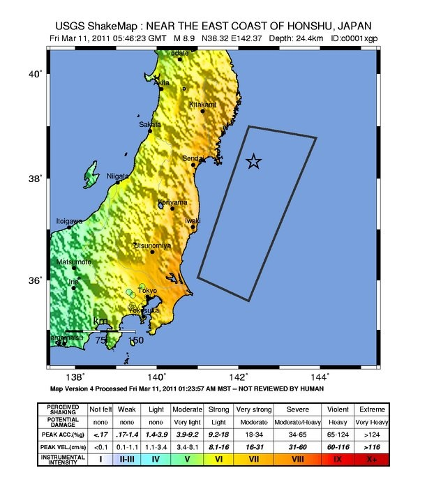

L'[échelle de Richter](https://fr.wikipedia.org/wiki/échelle_de_Richter) est tellement démodée que seuls les journalistes l'utilisent encore. Datant de 1935, c'est une mesure de l'amplitude du mouvement provoqué par un tremblement de terre tel que mesuré par un sismographe. Mais elle survit car elle a pu être rebaptisée [échelle de magnitude du moment](https://fr.wikipedia.org/wiki/échelle_de_magnitude_du_moment) en 1979 en la reliant d'une part au [moment sismique](https://fr.wikipedia.org/wiki/moment_sismique), une notion liée à un modèle de rupture des roches, et d'autre part à l'énergie dégagée par le phénomène :

| Description : | Magnitude : | Energie \[J\]: | Fréquence : |
| --- | --- | --- | --- |
| Très mineur | **2** | 6,31.107 | 1000 par jour |
| Mineur | **3** | 1,99.109 | 49000 par an |
| Léger | **4** | 6,31.1010 | 6200 par an |
| Modéré | **5** | 1,99.1012 | 800 par an |
| Fort | **6** | 6,31.1013 | 120 par an |
| Majeur | **7** | 1,99.1015 | 18 par an |
| Important | **8** | 6,31.1016 | 1 par an |
| Exceptionnel | **9** | 1,99.1018 | 1 tous les 20 ans |

L'échelle est logarithmique : une augmentation de 1 de la magnitude correspond à une multiplication par 10 de l'amplitude du mouvement, et par environ 30 (√1000 pour être précis) de l'énergie dégagée.

Le séisme de magnitude 9 [qui vient de frapper le Japon](https://fr.wikipedia.org/wiki/Séisme_et_tsunami_de_Sendai_(2011)) a dégagé au moins [l'équivalent](https://fr.wikipedia.org/wiki/Ordre_de_grandeur_(énergie)) d'une bonne dizaine de [Tsar Bomba](https://fr.wikipedia.org/wiki/Tsar_Bomba), soit environ 600 mégatonnes de TNT, ou encore de la consommation annuelle d'électricité de la France, mais peut être beaucoup plus car sa durée a été exceptionnellement longue.

Mieux vaut donc se trouver le plus loin possible de l'épicentre d'un tel phénomène car l'intensité (à ne pas confondre avec la magnitude définie ci-dessus) décroit rapidement avec la distance, et dépend donc de l'endroit où on se trouve. L'intensité se mesure avec l'[échelle Medvedev-Sponheuer-Karnik](https://fr.wikipedia.org/wiki/échelle Medvedev-Sponheuer-Karnik) (MSK), qui décrit le niveau des destructions provoqué, et que l'on note en chiffres romains pour la distinguer de l'échelle de magnitude à laquelle elle ressemble trop.

Comme on le voit sur cette carte, le terrible séisme au large du Japon n'a causé "que" une intensité de VII à VIII dans la région de Sendai, peut-être de IX localement sur l'avancée de terre la plus proche de l'épicentre, zone où Murphy avait précisément construit des centrales nucléaires...

)

Je me permets d'écrire "que VII à VIII" car Kobe avait été détruite par une [intensité de IX à XI](http://pwar.info/seismes/Partie1b.htm) par un [séisme d'une magnitude de "seulement" 7.2](https://fr.wikipedia.org/wiki/séisme_de_Kobe) épicentré directement sous la ville, une [situation qui s'est répétée à Haïti](https://fr.wikipedia.org/wiki/Séisme_de_2010_à_Haïti). Dans la région de Sendai, le tremblement de terre n'a pas causé directement les destructions, les morts et la catastrophe nucléaire en cours. C'est bien le tsunami qui en est très largement responsable.

Les destructions lors d'un séisme sont essentiellement dues à l'accélération du sol a en cm/s², qui est liée à l'intensité Imsk par la relation  log a = 0.26 Imsk + 0.19 [[1]](#ref-1). Une intensité supérieure à IX provoque des accélérations supérieures à 1 G dans n'importe quelle direction, ce qui est certainement spectaculaire mais ne génère en définitive que des forces doubles de celles causées par la gravité dans l'axe vertical, et des forces horizontales du même ordre de grandeur. Il ne me semble pas trop difficile de construire une grosse cuve d'acier maintenue dans un cube de béton capable de supporter ça, et c'est très probablement ce qu'on fait les japonais pour leurs réacteurs nucléaires, et il n'y a pas de raison de se priver de faire la même chose partout ailleurs.

Par contre pour un barrage, c'est plus compliqué car les grandes structures peuvent vibrer et se mettre en résonance avec les (basses) fréquences des mouvements du sol, en plus de phénomènes hydrologiques et géologiques propres au site de l'ouvrage. Et qui dit barrage plus costaud dit plus de béton (souvent barrage poids plutôt que voûte), et donc barrage plus cher...

En Suisse, un document [[1]](#ref-1) spécifie que les grands barrages doivent supporter un séisme dont la probabilité d'apparition est de 1/10'000 par an, donnée par la carte suivante :



Comme le voient ceux qui connaissent la géographie helvétique, les barrages alpins sont tous situés dans la zone pouvant subir une intensité VIII ou plus, et quelques très grands barrages comme la [Grande-Dixence](https://fr.wikipedia.org/wiki/barrage_de_la Grande-Dixence) ou [Mauvoisin](https://fr.wikipedia.org/wiki/lac_de Mauvoisin) sont en zone IX. Ces ouvrages auraient donc résisté de justesse à la récente secousse japonaise, mais pas à Kobe ou Haïti.

Une risque de 1/10'000 par an peut paraître faible, mais ça signifie que la probabilité d'en subir un plus élevé est inférieure à 1% par siècle, donc non négligeable quand on a plusieurs barrages qui vont durer plus d'un siècle. Que se passerait-il si lorsque l'un d'eux cédaitera ?

Le barrage du [lac de Mauvoisin](https://fr.wikipedia.org/wiki/lac_de_Mauvoisin) étant un barrage voûte, il céderait très rapidement en cas de défaillance structurelle, libérant jusqu'à 200 millions de m3 d'eau dans la vallée du Rhône située 1500 m plus bas. Energie potentielle dégagée par une telle catastrophe : 3.1015 Joules, soit environ 1 mégatonne de TNT sous la forme d'une vague de plus de 10m qui balaierait une zone habitée par environ 100'000 personnes. Un tsunami artificiel...

### Références

1. Georges R. Darbre, et al. "Sécurité des ouvrages d’accumulation. Documentation de base pour la vérification des ouvrages d’accumulation aux séismes", 2003, BFE (BWG) ([pdf](https://www.bfe.admin.ch/bfe/fr/home/approvisionnement/surveillance-et-securite/barrages/directives-et-moyens-auxiliaires/_jcr_content/par/tabs/items/dokumente/tabpar/externalcontent.external.exturl.pdf/aHR0cHM6Ly9wdWJkYi5iZmUuYWRtaW4uY2gvZnIvcHVibGljYX/Rpb24vZG93bmxvYWQvOTMwLnBkZg==.pdf))
