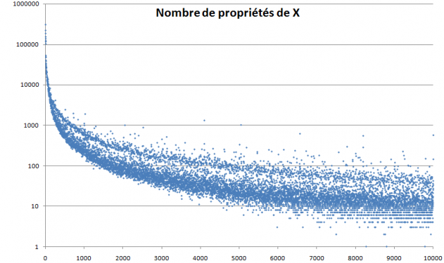
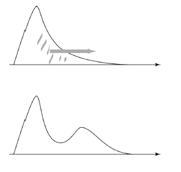

Les chemins de la science sont souvent inattendus et tortueux, comme le montre de plus en plus une jolie histoire dans laquelle je suis impliqué.

Rappel des épisodes précédents. Pour Zinzin, mon prof de maths un peu fou, 1548 était le nombre entier le plus quelconque qu'on puisse trouver. En 2008 j'ai eu l'idée d'utiliser l'[encyclopédie en ligne des suites de nombres entiers](https://fr.wikipedia.org/wiki/encyclopédie_en_ligne_des_suites_de_nombres_entiers) de Neil Sloane pour le vérifier et chercher les "[nombres acratopèges](/2008/08/24/nombres-acratopeges/)", des nombres sans propriétés particulières. J'ai contacté [Jean-Paul Delahaye](https://fr.wikipedia.org/wiki/Jean-Paul_Delahaye) pour lui demander s'il avait connaissance de travaux similaires. Il m'a répondu que non, et m'a suggéré de faire une représentation graphique de l' "intérêt" de chaque nombre, mesuré par le nombre des suites l'incluant dans l'encyclopédie de Sloane, et j'ai obtenu ceci :

Intrigué par ce résultat, Jean-Paul Delahaye y a consacré sa rubrique dans de Pour la Science de mai 2009 [[1]](#ref-1), qui s'achève par un appel à expliquer le "fossé de Sloane", cette bande blanche qui sépare les nombres en deux classes assez distinctes. Dans mon article "[la minéralisation des nombres](/2009/04/18/nombres-mineralises/)" écrit en parallèle, j'ai constaté que les nombres fortement composites, les puissances entières et les nombres premiers représentent une forte majorité des nombres "intéressants" situés au dessus du fossé de Sloane, mais sans pouvoir réellement expliquer le fossé.

Delahaye a poursuivi les recherches sur ce sujet avec Hector Zenil et Nicolas Gauvrit, mathématicien et psychologue [[2]](#ref-2) à l'Université d'Artois et ils viennent de publier ensemble un article en francais [[3]](#ref-3) et d'en soumettre une version anglaise [[4]](#ref-4) expliquant le fossé de Sloane.

Les auteurs commencent par expliquer la forme générale du nuage en utilisant la [complexité de Kolmogorov](https://fr.wikipedia.org/wiki/complexité_de_Kolmogorov). Ils montrent d'une part que les nombreuses propriétés "simples", pouvant être exprimée en peu de mots comme "être pair", "être un carré" ou "avoir beaucoup de facteurs" se combinent pour produire beaucoup de propriétés pour les petits nombres (comme 36), produisant la décroissance exponentielle bien visible sur le graphique.

D'autre part, les propriétés plus complexes comme "[mot de Lukasiewicz qui est aussi une séquence siteswap de jonglerie asynchrone valide](/2011/01/12/2011-siteswap-et-jonglerie/)" impliquent d'avoir des propriétés plus simples, ce qui explique la dispersion verticale du nuage : les nombres qui ont des propriétés simples en ont probablement de plus complexes.

A l'aide de ces deux résultats, Gauvrit, Delahaye et Zenil parviennent à reproduire un "nuage du nombre de propriétés" simulé sans tenir compte des propriétés effectivement répertoriées dans la base de Sloane. La Figure 5 de leur article [[3]](#ref-3) ressemble effectivement beaucoup à "mon" nuage, mais sans le fossé...

Le fossé de Sloane ne serait donc pas un effet mathématique, mais plutôt "social" : les mathématiciens s'intéresseraient plus à certaines propriétés qu'à d'autres de même complexité par des effets de mode, ou simplement en poursuivant des recherches antérieures, ce qui provoquerait un glissement de la distribution :_Fig. 6 de [[3]](#ref-3) : La Figure du haut représente la distribution locale de N attendue sans tenir compte du facteur social. La communauté mathématique s'intéresse massivement à certains nombres de complexité moyenne ou faible (dans la zone centrale ou droite de la distribution) et, par cet intérêt, crée un décalage vers la droite d'une partie de la distribution (schématisée par une flèche grise). La nouvelle distribution qui en découle, représentée en bas, présente un fossé._

Comment ? Qu'entend-je ? Il existerait donc une discrimination entre les nombres opérées par les mathématiciens, qui opéreraient une forme de ségrégation parmi les propriétés mathématiques, en favorisant certaines par rapport à d'autres ? Si cela s'avère, il faut corriger cette injustice et lutter pour la défense des nombres acratopèges !

Plus sérieusement, j'en reviens à mes interrogations initiales : les nombres qui n'ont que peu de propriétés sont ils réellement inintéressants ? Les nombres qui ne sont pas encore répertoriés dans la base de Sloane ne pourrait-ils pas donner lieu à de nouvelles découvertes numériques ?

A suivre...

### Références

1. Jean-Paul Delahaye, "[Mille collections de nombres](http://www.pourlascience.fr/ewb_pages/f/fiche-article-mille-collections-de-nombres-21524.php)", Pour la Science N°379 - mai 2009, p 88-93
2. "[Psychologie, mathématiques et choses connexes](http://psymath.blogspot.com/)", blog de Nicolas Gauvrit
3. Nicolas Gauvrit, Jean-Paul Delahaye et Hector Zenil, « [Le fossé de Sloane](http://www.mathrix.org/zenil/sloane_03.pdf) », [Mathématiques et sciences humaines](http://msh.revues.org/12014), 194 | Eté 2011
4. Nicolas Gauvrit, Jean-Paul Delahaye, Hector Zenil, "[Sloane’s Gap. Mathematical and Social Factors Explain the Distribution of Numbers in the OEIS](http://arxiv.org/abs/1101.4470)", 2011, [arXiv:1101.4470](https://arxiv.org/abs/1101.4470) \[math.PR\]
5.  Nicolas J.-P. Gauvrit, Jean-Paul Delahaye, & Hector Zenil (2013). Sloane’s Gap: Do Mathematical and Social Factors Explain the Distribution of Numbers in the OEIS? Journal of Humanistic Mathematics, 3 (1), 3-16 DOI: [10.5642/jhummath.201301.03](http://dx.doi.org/10.5642/jhummath.201301.03) _(ajouté le 19.10.2013)_
