_A la fin de l'article "[La Vie à bas Reynolds](/2011/03/13/la-vie-a-bas-reynold/)", j'avais lancé un appel à l'aide pour traduire la référence principale_

_E.M. Purcell. "[Life at Low Reynolds Number](http://jila.colorado.edu/perkinsgroup/Purcell_life_at_low_reynolds_number.pdf)", 1977, American Journal of Physics vol 45, pages 3-11\*_

_L'appel a été entendu par Christopher Couchman, qui m'a donné un très sérieux coup de main pour traduire en français cet article surprenant et passionnant. Le voici,_ _également au [format .pdf](/wp-content/uploads/2011/04/La-vie-à-faible-nombre-de-Reynolds.pdf) si vous préférez:_

NDLR d'époque: Il s'agit d'une réimpression d'un document (légèrement modifié) portant le même titre paru dans le livre . Le ton personnel de l'exposé d'origine a été conservé dans le document, qui est lui-même une transcription légèrement modifiée d'un enregistrement. Les figures reproduisent les transparents utilisés dans la présentation. La démonstration utilisait un grand réservoir rectangulaire transparent rempli de sirop de maïs, éclairé par un rétroprojecteur tourné sur le côté. Certains mouvements de mains essentiels n'ont pas pu être reproduits.

En toute autre circonstance, je crains que je n'aurais pas eu le culot de vous tenir ce discours. C'est une histoire que je gardais pour la raconter à Viki. Comme beaucoup d'entre vous, j'ai apprécié de temps en temps l'expérience merveilleuse d'explorer avec Viki certains domaines de la physique, ou quelque chose auquel nous pouvons appliquer la physique. Nous errons comme de stricts amateurs, équipés seulement de quelques notions de physique élémentaire, même si nous n'apportons pas beaucoup de lumière sur les autres sujets. Voici un de ces sujets; mais j'ai encore une autre raison de vouloir, pour ainsi dire, harceler Viki, parce que je vais vous parler pendant quelque temps de la viscosité. La viscosité dans un liquide sera le thème dominant et vous connaissez le programme de Viki de tout expliquer, y compris la hauteur des montagnes, avec les constantes élémentaires. La viscosité d'un liquide est un de ces sujets difficiles, comme il le sait bien, parce que quand la substance est refroidie de seulement 40 degrés, sa viscosité peut varier d'un facteur d'un million. J'ai été vraiment surpris par la viscosité des fluides dans les premiers jours de la RMN, quand il s'est avéré que la glycérine était exactement ce dont nous avions besoin pour explorer le comportement de la relaxation de spin. Et pourtant, si vous étiez un petit être vivant à l'intérieur de la glycérine en regardant autour de vous, vous ne verriez pas beaucoup de changement dans votre glycérine lorsqu'elle se refroidit. Viki dira qu'il peut au moins prévoir le logarithme de la viscosité. Et cela, bien sûr, est correct parce que la raison pour laquelle la viscosité change est qu'elle dépend d'une énergie d'activation et que ce qu'il peut prédire c'est l'ordre de grandeur de l'exposant. Mais c'est encore plus mystérieux que cela, Viki, parce que si vous regardez dans le tableau du [Chemical Rubber Handbook](w:en:CRC_Handbook_of_Chemistry_and_Physics), vous trouverez qu'il n'y a pratiquement pas de liquide avec une viscosité beaucoup plus faible que celle de l'eau. Les viscosités balayent un grand domaine, mais elles s'arrêtent au même endroit. Je ne comprends pas cela. Je lui laisse cette question.

Maintenant, je vais parler d'un monde auquel, en tant que physiciens, nous ne pensons presque jamais. Le physicien entend parler de la viscosité à l'école secondaire quand il reproduit l'expérience de la goutte d'huile de Millikan et il n'en entend jamais plus parler, du moins pas dans ce que j'enseigne. Et le nombre de Reynolds, bien sûr, est pour les ingénieurs. Et la plupart des ingénieurs ne s'intéressent pas au domaine des bas nombres de Reynolds - sauf peut-être les ingénieurs chimistes, dans le cadre de [lits fluidisés](w:Lit_fluidisé), un sujet fascinant dont j'ai entendu parler par ami de génie chimique au MIT. Mais je veux vous emmener dans le monde du très faible nombre de Reynolds - un monde qui est habité par l'écrasante majorité des organismes dans cette salle. Ce monde est assez différent de celui dans lequel nous avons développé nos intuitions.

[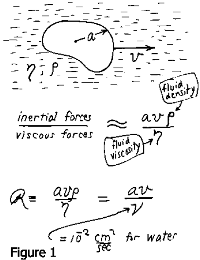](images/01f6d18a14143e63d51d8e1b9c8a8d25.png)Je devrais dire ce qui m'a fait aborder ce sujet. Pour introduire quelque chose qui viendra plus tard, je vais parler en partie sur la façon dont les micro-organismes nagent. Ce ne se révèlera pas, cependant, être la seule question importante à leur sujet. J'ai abordé ce sujet grâce au travail d'un de mes anciens collègues à Harvard, Howard Berg. Berg a fait sa thèse avec Norman Ramsey, en travaillant sur un Maser à hydrogène, puis il retourna à la biologie, qui avait été son premier amour, et à la physiologie cellulaire. Il travaille maintenant à l'Université du Colorado à Boulder, et a récemment participé à ce qui me semble être l'une des découvertes les plus étonnantes sur les questions dont nous allons parler. Ainsi, ça a été en partie le travail de Howard, étudiant E. Coli et découvrant cette chose étrange à leur sujet, qui a commencé à me faire penser à ce genre de physique élémentaire.

[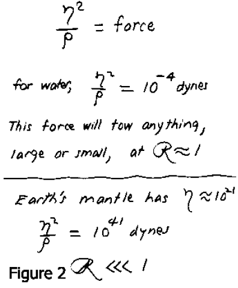](images/b374e37ed29476a5ef6451376728f06e.png)Eh bien voilà. Dans la figure. 1., Vous voyez un objet qui se déplace dans un fluide à une vitesse v. Il est de dimension a. Dans la loi de Stoke, l'objet est une sphère, mais ici, c'est de n'importe quelle forme; η et ρ sont la viscosité et la densité du fluide. Le rapport des forces d'inertie aux forces visqueuses, comme l'a montré [Osborne Reynolds](w:) il y a un peu moins de 100 ans, est donné par a.v.ρ / η ou a.v/ν, où ν est ma viscosité cinématique. Il est plus facile de se rappeler de sa grandeur pour l'eau : ν ≈ 10\-2cm2/s. Ce ratio s'appelle le [nombre de Reynolds](w:) et quand il est petit, les forces visqueuses dominent. Maintenant il y a un moyen simple auquel je n'avais pas initialement pensé, de savoir qui devrait être concerné par le petit nombres de Reynolds. Si vous prenez la viscosité η au carré et que vous le divisez par la densité, vous obtenez une force (Fig. 2). Il n'y a aucune autre grandeur qui intervient, η2/ρ est une force. Pour l'eau, considérant que ν ≈ 10\-2 et que ρ ≈ 1, η2/ρ ≈ 10\-9 Newtons. Ça c'est la force qui tirera n'importe quoi de petit ou grand, avec un nombre de Reynolds de l'ordre de 1. En d'autres mots, si vous voulez remorquer un sous-marin avec un nombre de Reynolds de 1 (ou plus précisément de pi/6 s'il s'agit d'un sous-marin sphérique) remorquez le avec10\-9 Newtons dans l'eau. Alors il est clair dans ce cas que vous êtes intéressés par les petits nombres de Reynolds si vous êtes intéressés par les faibles forces au sens absolu. Les seules autres personnes intéressés dans les petits nombres de Reynolds, bien qu'ils n'ont pas habituellement besoin de l'invoquer, sont les géophysiciens. La croûte terrestre est supposée avoir une viscosité de 1021[Poises](w:Poise). Si vous calculez η2/ρ, la force est de 1036N. Ceci représente plus que 109 fois la force d'attraction gravitationnelle que la moitié de la terre exerce sur l'autre ! La conclusion est donc, bien entendu, que dans l'écoulement de la croûte terrestre, le nombre de Reynolds est en effet très petit.

[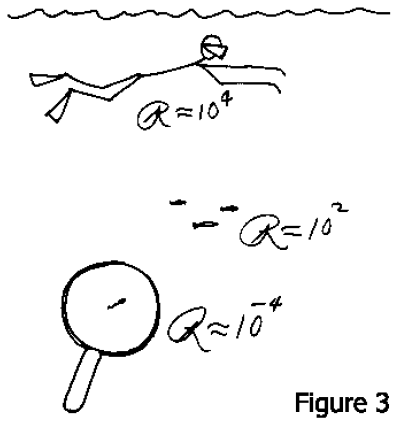](images/f4894f0ec7b428a45b52630d140aeed0.png)Maintenant, considérons les choses qui se déplacent dans un liquide (Fig. 3). Le nombre de Reynolds pour un homme nageant dans un liquide pourrait être 104, si l'on prend en compte des dimensions raisonnables, pour un poisson rouge ou un petit guppy il pourrait descendre à 102. Pour les animaux dont nous allons parler, comme nous le verrons dans un instant, il est d'environ 10\-4ou 10\-5. Pour ces animaux l'inertie est totalement hors de propos. Nous savons que F = m.a, mais ils s'en fichent comme de leur première chemise. Je vais vous montrer une photo de l'animal réel un peu plus tard, mais nous allons parler d'objets qui ont une taille de l'ordre du micron (Fig. 4). Ceci est une échelle d'un micron, pas un fil de suture, chez l'animal dans la Fig. 4. Dans l'eau où la viscosité cinématique est de 10\-2 cm/s ces choses se déplacent avec une vitesse d'environ 30 microns/s. Si je dois pousser l'animal pour le faire avancer, et soudain j'arrête de pousser, quelle distance parcourra-t-il avant de ralentir? La réponse est: environ 0,1 angström. Et il met environ 0,6 microsecondes à ralentir. Je pense que cela montre clairement ce que “faible nombre de Reynolds” signifie. L’inertie ne joue aucun rôle. Si vous êtes à un très faible nombre de Reynolds très faible, ce que vous faites en ce moment est entièrement déterminé par les forces qui s'exercent sur vous en ce moment, et par rien dans le passé.

[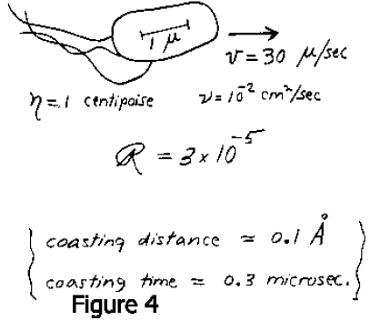](images/7d9a8e33f20bce4a964671a19b1f0107.png)Cela aide d'imaginer dans quelles conditions un homme nagerait, par exemple, au même nombre de Reynolds qu’un spermatozoïde. Eh bien vous le mettez dans une piscine pleine de mélasse, et vous lui interdisez de déplacer quelque partie de son corps à plus de 1 cm / min. Maintenant, imaginez-vous dans cet état, vous êtes dans la piscine dans la mélasse, et vous ne pouvez vous déplacer que comme les aiguilles d'une horloge. Si en vertu de ces règles de base vous êtes en mesure de vous déplacer de quelques mètres en quelques semaines, vous pourriez vous qualifier comme nageur à faible nombre de Reynolds.

[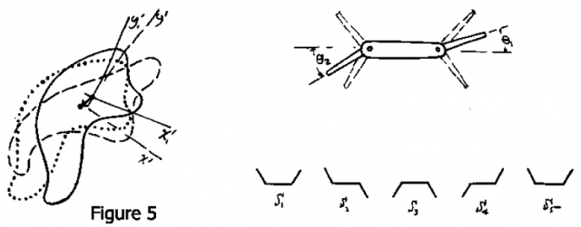](images/3cead5a7ccf9517bc4a5695aee23881a.png)

Je veux parler de la natation aux faibles nombres de Reynolds d'une manière très générale. Qu'est-ce que nager veut dire? Eh bien, cela signifie simplement que vous êtes dans un liquide et que vous êtes autorisés à déformer votre corps d'une manière ou d'une autre. C'est tout ce que vous pouvez faire. Déplacer le liquide et le pousser derrière vous. Bien sûr, vous choisissez une sorte de déformation cyclique parce que vous voulez continuer à nager, et il ne sert à rien d'utiliser un mouvement qui tend asymptotiquement vers zéro. Vous devez continuer à avancer. Donc, de manière générale, nous nous intéressons aux déformations cycliques d'un corps sur lequel il n'y a pas de couples ou de forces extérieures, sauf celles exercées par le fluide environnant. La figure 5 montre un objet qui a une forme représentée par la ligne continue, il change sa forme pour prendre celle du contour en pointillé, puis il reviens à la forme initiale. Quand il est enfin de retour à sa forme initiale, le contour formé des petits points, elle s'est déplacée et réorientée un peu. Il a nagé. Un déplacement à résulté du cycle exécuté. S'il répète le cycle, il sera, bien sûr, affecté du même déplacement, et en 2 dimensions, nous le verrions progresser en cercle. En trois dimensions la trajectoire la plus générale est une hélice composée de petits entortillements, chacun d'entre eux est le résultat d'un cycle de changement de forme.

[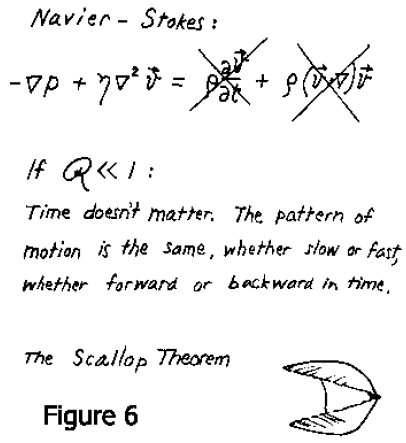](images/5b1dcda97bdd29bddbfd1d236f1afa18.png)Il y a une chose très étonnante sur le mouvement à bas nombre de Reynolds. Un type particulier de mouvement de nage est ce que j'appelle un mouvement réciproque. C'est-à-dire, je change mon corps en une certaine forme et puis je retourne à la forme originale en passant par la séquence dans le sens inverse. A bas nombre de Reynolds, tout s'inverse très bien. Le temps, en fait, importe peu --- seule la configuration compte. Si je change rapidement ou lentement, le type de mouvement est exactement le même. Si vous prenez l'équation de Navier-Stokes et vous jetez les termes d'inertie, tout ce que vous avez à gauche est $s.nabla^2.v = p/ eta$, où p est la pression (Fig. 6). Donc, si l'animal essaie de nager par un mouvement réciproque, il ne peut aller nulle part. Rapide ou lent, il retrace exactement sa trajectoire et il est de retour au point de départ. Un bon exemple de cela est une coquille Saint Jacques. Vous savez, une coquille Saint Jacques ouvre sa coquille lentement et la referme rapidement, éjectant de l'eau. La morale de ceci est que la coquilles Saint Jacques n’est pas bonne à faible nombre de Reynolds.

[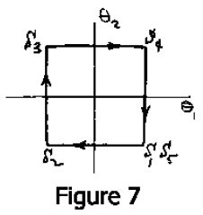](images/324ec59a5632d2d88585725523ee781a.png)Elle ne peut pas nager, car elle n'a qu'une seule articulation, et si vous avez un seul degré de liberté dans l'espace de configuration, vous êtes tenu de faire un mouvement réciproque. Il n'y a rien d'autre que vous pouvez faire. L'animal le plus simple qui peut nager de cette façon est un animal à deux charnières. Je ne sais pas si un tel animal existe, mais la figure 7 en montre un hypothétique. Cet animal est comme un bateau avec un gouvernail à la fois avant et arrière, et rien d'autre. Cet animal peut nager. Tout ce qu'il a à faire est de passer par la séquence de configurations présentées, et de retourner à l'original une fois à S5. Son espace de configuration, bien sûr, est à deux dimensions avec des coordonnées θ1,θ2. L'animal décrit un cycle dans cet espace de configuration, et cela lui permet de nager. En fait, j'ai cet exemple juste pour le plaisir et vous pouvez prouver à partir de la symétrie que l'animal se déplace dans le sens indiqué sur la figure. En guise d'exercice pour un étudiant, quel est l'élément qui permet de déterminer cette direction ?

[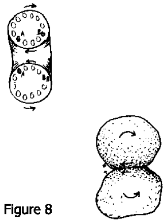](images/ac5e876e6b239437f9aa2f9ad32a7edd.png)Vous pouvez inventer d'autres animaux qui n'ont pas de problèmes pour nager. Nous ferions mieux d'être en mesure de les inventer, car nous savons qu'ils existent. Celui auquel on pense d'abord en tant que physicien, est un tore. Je ne sais pas si il y a un animal torique, mais quelque soient les autres problèmes physiologiques auxquels il devrait faire face, il pourrait sûrement nager à bas nombre de Reynolds (Fig. 8). Un autre animal pourrait se composer de deux cellules collées et qui seraient capables de rouler l'une sur l'autre en ayant une sorte d'attraction en un point tout en libérant une attraction ailleurs. Cette chose nagerait en roulant. Je l'ai décrite une fois comme une combinaison d'un tracteur à chenilles et d'un vélo tandem, mais ce n'est pas la façon dont il fonctionne vraiment Dans le règne animal, il y a au moins deux autres solutions plus communes au problème de la nage aux faibles nombres de Reynolds (Fig. 9). L'une pourrait être appelée la rame flexible. Voyez-vous, vous ne pouvez pas ramer à bas nombre de Reynolds dans la mélasse, si vous êtes submergé, parce que les rames rigides ne font qu'un mouvement réciproque.

[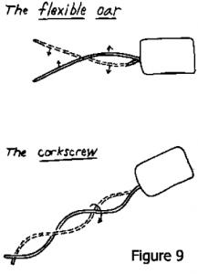](/wp-content/uploads/2011/04/image41.png)Mais si la rame est flexible, ce n'est pas vrai, car alors elle se tord dans un sens pendant la première moitié de la course et dans l'autre au cours de la seconde moitié. C'est assez pour résoudre le théorème de la coquille Saint Jacques. Une autre solution, celle dont nous allons surtout parler, est ce que j'appelle un tire-bouchon. Si vous continuez à le tourner, ce qui, bien sûr, n'est pas un changement réciproque dans l'espace de configuration et ceci vous propulsera. À ce stade, je voudrais pouvoir vous persuader que la direction dans laquelle cette hélice se déplacera n'est pas évident. Remettez-vous dans cette piscine de mélasse et bougez très, très lentement. Votre intuition d'essayer de pousser l'eau vers l'arrière ne sont pas pertinents. Ce n'est pas ce qui compte. Maintenant, malheureusement, il s'avère que la chose se déplace effectivement comme votre argument naïf, inculte, et en fait incorrect semble indiquer, mais c'est juste une malchance pédagogique que nous rencontrons régulièrement.

[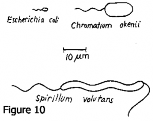](/wp-content/uploads/2011/04/image29.png)Bien, étudions des animaux réels (Fig. 10). J'ai tiré cette figure d'un article de Howard Berg qu'il m'a envoyé. Voici trois vrais nageurs. Celui dont nous allons parler le plus est le célèbre animal, [Escherichia coli](w:), en A, qui est une très petite chose. Ensuite, il y a deux animaux plus grands. J'ai noté leurs noms latins et il se pourrait qu'ils soient de vieux amis pour certains d'entre vous ici. Cette chose (volutans S.) nage en agitant son corps ainsi que sa queue et grosso modo, une onde en spirale descend le long de la queue. La bactérie E. coli sur la gauche mesure environ 2 microns de long. La queue est la partie qui nous intéresse. C'est le flagelle. Certaines cellules de E. coli ont le leur qui sort par les côtés, et ils peuvent en avoir plusieurs, mais quand ils en ont plusieurs, ils ont tendance à se regrouper. Certaines cellules sont immobiles et n'ont pas de flagelles.

Ils vivent très bien, donc la nage n'est pas une nécessité absolue pour cet animal, mais celui de la figure nage. Le flagelle est seulement d'environ 130 angströms de diamètre. Il est beaucoup plus mince que le cil qui est un autre type très important de machine de propulsion. Il y a un bel article sur les cils dans le numéro d'Octobre 1974 de Scientific American. Les cils ont un diamètre d'environ 2000 angströms, avec un appareil assez complexe à l'intérieur. Il n'y a pas assez de place pour un tel appareil au cœur de ce flagelle.

Pendant longtemps, on s'est intéressé à la façon dont les flagelles fonctionnent. La recherche classique dans ce domaine a été faite autour de 1951, comme je suis sûr que certains d'entre vous se souviendront, par [Sir Geoffrey Taylor](w:Geoffrey_Ingram_Taylor), le célèbre dynamicien des fluides de Cambridge. Une fois, je l'ai entendu donner une conférence passionnante à l'Académie Nationale. Pendant la conférence, il a tiré de sa poche son modèle de travail, un corps cylindrique avec une queue hélicoïdale entraîné par un moteur à élastique situé à l'intérieur du corps. Il l'avait testé dans de la glycérine. Pour confectionner la queue, il n'avait pas simplement fait un tire-bouchon tournant, car à cette époque presque tout le monde s'était persuadé que la queue ne tournait pas, mais ondulait. Parce qu'après tout, pour tourner vous devriez avoir un joint rotatif à l'arrière de l'animal. Alors il avait gainé l'hélice tournante avec un tuyau en caoutchouc attachée au corps. Le corps avait une quille. Je me souviens de Sir Geoffrey Taylor disant dans sa conférence qu'il avait été gêné de ne pas avoir prévu la quille au début et il avait dû découvrir qu'il en avait besoin. Il y a eu depuis une vaste littérature sur ce sujet, mais il n'y a qu'une petite partie avec laquelle je suis familier. Mais ce papier de G.I. Taylor dans les Proceedings of the Royal Society ne pouvait conclure qu'avec seulement trois références: H. Lamb, Hydrodynamics; G.I. Taylor (son précédent papier); G.N. Watson, Les fonctions de Bessel. C'est ce qu'on appelle rentrer par le rez de chaussée.

[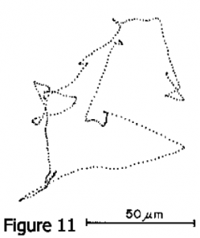](/wp-content/uploads/2011/04/image38.png)Pour en venir maintenant aux temps modernes, je veux vous montrer une image de ces animaux nageant ou de leur trajectoire. C'est le travail d'Howard Berg, et je vais d'abord décrire ce qu'il a fait. Il a commencé à construire l'appareil quand il était à Harvard. Il s'intéressait non pas à l'étude de la mécanique même de la nage, mais à une question beaucoup plus intéressante, à savoir pourquoi ces choses nagent et où ils nagent. En particulier, il voulait étudier la chimiotaxie chez E. coli - observer comment ils se comportent dans des gradients de nutriments et des choses comme ça. Donc, il a construit un "traqueur", une petite machine qui permettrait de suivre une seule bactérie en x, y, z - juste se verrouiller sur elle optiquement et la suivre. Il était alors en mesure de suivre l'une de ces bactéries alors qu'elle se comportait de façon normale, peut-être soumis à l'influence des gradients d'une chose ou une autre. Un grand avantage de travailler avec une chose comme E. coli, c'est qu'il y a tellement de souches mutantes qui ont été bien étudiés que vous pouvez utiliser différents mutants pour des choses différentes. L'image suivante (Fig. 11) est l'une de ses trajectoires. Elle montre une projection sur un plan de la trajectoire d'une bactérie. Les petits points sont distants de 0,1 s de sorte qu'elle courrait effectivement sur l'une des étapes pendant une ou deux secondes et la vitesse est typiquement de 20 à 40 microns/s. Notez qu'elle nage pendant un certain temps, puis s'arrête et repart dans une autre direction. Nous verrons plus tard ce que cela pourrait suggérer. Il y a un an, Howard Berg a pris une position courageuse et a écrit un article dans Nature dans lequel il a fait valoir que, sur la base des preuves disponibles, E. coli doit nager en tournant leurs flagelles, et non pas en les agitant.

[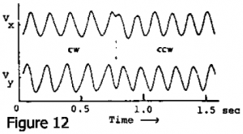](/wp-content/uploads/2011/04/image33.png)Dans la même année, une expérience très élégante et cruciale par Silverman et Simon à UC-San Diego a montré que ce fait était avéré. Leur expérience a utilisé une souche mutante de la bactérie E. coli qui ne fait pas de flagelles, mais seulement ce qu'on appelle le crochet proximal auquel les flagelles aurait été attachées. Ils ont constaté qu'avec des anticorps anticrochet ils pouvaient faire coller ces choses ensemble. Et de temps en temps l'une des bactéries collait son crochet à la lame de microscope, auquel cas l'ensemble du corps entrait en rotation à vitesse angulaire constante. Et quand les deux crochets se collent ensemble, les deux corps entraient en contre-rotation, comme vous vous y attendez. C'est une belle technique. Howard était prêt avec son traqueur et l'image suivante (Fig. 12) montre son l'enregistrement du bout d'un de ces E. coli collé sur la lame de microscope par les anticorps à l'endroit où le flagelle aurait dû être. Les deux composantes de la vitesse Vx,Vy sont représentées. Les deux composantes de vitesse sont déphasées de 90°. Le point suivi se déplace selon un cercle. Au milieu de la figure, vous voyez un changement de phase de 90° d'une composante qui indique une inversion du sens de rotation. Ils peuvent faire des centaines de tours à vitesse constante, puis faire demi-tour et tourner dans l'autre sens. l'autre sens. De toute évidence, l'animal a un joint tournant et un moteur à l'intérieur quiun flagelle dans un sens ou dans l'autre, une machinerie remarquable.

[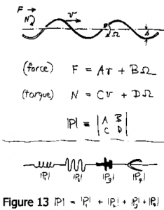](/wp-content/uploads/2011/04/image26.png)Je me suis intéressé à la façon dont un tire-bouchon rotatif peut propulser quelque chose. Examinons la propulsion dans une seule direction, parallèle à l'axe de l'hélice. L'hélice peut se translater et tourner, vous pouvez y appliquer une force et un couple. Il a une vitesse v et une vitesse angulaire Ω. Et maintenant, rappelez-vous, à faible nombre de Reynolds tout est linéaire. Quand tout est linéaire, vous vous attendez à voir des matrices. Force et couple doivent être liés par des matrices à coefficients constants, à la vitesse linéaire et angulaire. J'appelle cette petite matrice 2x2 la matrice de propulsion (Fig. 13). Si je connaissais ses éléments A, B, C, D, je pourrais alors savoir a quel point cette hélice rotative est efficace pour propulser quelque chose.

Et bien, essayons de progresser en faisant quelques hypothèses. Si deux tire-bouchons ou autres dispositifs sur le même arbre sont assez loin les uns des autres de sorte que leurs champs de vitesse n'interagissent pas, leurs matrices de propulsion s'ajoutent. Si vous me permettez cette hypothèse, alors il y a une très belle manière, que je n'ai pas le temps d'expliquer, de prouver que la matrice de propulsion doit être symétrique (Fig. 14). Donc en fait le mouvement est décrit par trois constantes, et non quatre, et elles sont très faciles à mesurer. Tout ce que vous avez à faire est de faire un modèle de cette chose et de l'immerger dans un fluide qui vous intéresse ou non, parce que ces constantes sont indépendantes du fluide. Et donc je l'ai fait et c'est ma seule démonstration. Je pensais que cette série de présentations devrait avoir une expérience et la voici. Nous regardons à travers un réservoir, non pas de glycérine, mais pas de sirop de maïs, qui est moins cher, assez uniforme, et a une viscosité d'environ 50 P ou 5000 fois la viscosité de l'eau. La coté sympathique de ceci est que vous pouvez simplement lécher le fluide expérimental de vos doigts.

[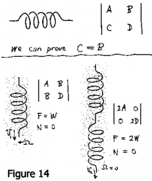](/wp-content/uploads/2011/04/image35.png)Les mouvements à faible nombre de Reynolds sont très majestueux, lents et réguliers. Vous remarquerez que le modèle tourne sur lui même, mais assez peu. Si c'était un tire-bouchon se déplaçant à travers un bouchon de liège, bien sûr, le motif en projection ne changerait pas. Il est très très loin de cela, il glisse, de sorte qu'il coule de plusieurs longueurs d'onde pendant qu'il fait un tour sur lui même. Si la matrice était diagonale, la chose ne tournerait pas du tout. Donc tout ce que vous avez à faire est de voir de combien il tourne quand il coule et vous aurez une idée de l'élément hors diagonale. Une façon simple de déterminer les autres éléments est de fabriquer deux de ces animaux, l'une avec une spirale et l'autre avec deux spirales, en série, vissant en sens contraire l'une de l'autre. Les matrices s'ajoutent et avec deux spirales vissant en sens contraire, les matrices de propulsions doivent être diagonales (Fig. 14). Cela ne tournera pas, il vaudrait mieux.

L'efficience de la propulsion est plus ou moins proportionnelle au carré de l'élément hors diagonale de la matrice. L'élément hors diagonale dépend de la différence entre la trainée d'un fil se déplaçant perpendiculairement à sa longueur et la trainée d'un fil se déplaçant parallèlement à sa longueur (Fig. 15). Ils sont censés différer dans une certaine limite d'un facteur 2. Mais pour les modèles que j'ai testé ce facteur est plus proche de 1.5. Puisque c'est ce facteur moins 1 qui compte, c'est très mauvais pour l'efficience. Nous avons pensé que si vous voulez quelque chose qui tourne plus pendant qu'il coule, il serait préférable de ne pas utiliser un fil rond. Quelque chose comme un ressort Ondomania (de section rectangulaire) devrait être mieux. J'en ai fait un j'ai mesuré ses éléments non diagonaux. Surprise, surprise, il n'était pas meilleur du tout ! Je ne comprends pas vraiment ce résultat, parce que la mécanique des fluides de ces deux situations n'est pas simple du tout.

[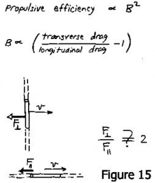](/wp-content/uploads/2011/04/image34.png)Dans chaque cas, il y a une divergence logarithmique que vous devez prendre en compte, et les deux ont un comportement un peu différent. Alors le ratio théorique de 2 dont j'ai parlé est sans doute faux.

Lorsque vous prenez tout en compte et calculez l'efficience, vous trouvez qu'elle est vraiment assez faible, même lorsque les différents paramètres du modèle sont optimisés. Pour une sphère qui est entraînée par une de ces hélices hélicoïdales (Fig. 16), je vais définir l'efficience comme le rapport entre le travail que j'aurais à fournir juste pour faire avancer cette chose et le travail que l'homme à l'intérieur doit fournir en tournant la manivelle. Et cette efficience s'avère être d'environ 1%. Je me suis inquiété de ce résultat pendant un certain temps et j'ai essayé d'intéresser Howard à ce problème. Il n'y a pas fait beaucoup attention, et il a eu raison parce qu'il s'avère que l'efficience n'est pas vraiment le problème principal du déplacement de l'animal. Nous verrons pourquoi lorsque nous regarderons les besoins en énergie.

[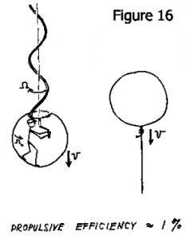](/wp-content/uploads/2011/04/image24.png)Combien de puissance faut-il pour faire avancer l'une de ces choses avec un système de propulsion à 1% d'efficience, à cette vitesse et dans ces conditions ? Nous pouvons trouver cela très facilement. Avancer à 30 micron /s, à 1% d'efficience nous coûtera environ 2 fois 10\-8 ergs / s au moteur. Réduit à le masse, cela représente 0.5 W/kg, ce qui n'est vraiment pas beaucoup. Nous consommons 30 ou 40 fois plus d'énergie juste à déplacer des choses dans nos moyens de transport. Cet animal fonctionne 24 heures par jour et n'utilise que 0.5 W / kg. C'est une petite proportion de son métabolisme et de sa réserve énergétique. Contrairement à nous, ils ne gaspillent pas leur énergie pour se déplacer. Donc, ils ne se soucient pas de savoir si elles ont un flagelle 1% d'efficience ou un flagelle 2% d'efficience. Cela ne fait pas vraiment une grande différence. Ils conduisent une Datsun en Arabie Saoudite.

[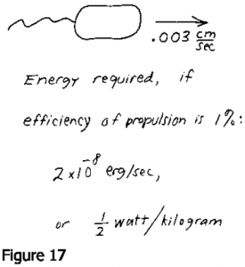](/wp-content/uploads/2011/04/image32.png)Donc, la question intéressante n'est pas comment ils nagent. Faites tourner n'importe quoi - si ce n'est pas parfaitement symétrique, vous nagerez. Si l'efficience n'est que de 1%, qui s'en soucie. Une meilleure façon de le dire, c'est que l'animal peut recueillir, par diffusion à travers le milieu environnant, suffisamment de molécules énergétiques pour continuer à avancer lorsque la concentration de ces molécules est de 10\-9 M. J'ai maintenant introduit le mot diffusion. La diffusion est importante à cause d'une autre caractéristique très particulière du monde à faible nombre de Reynolds, et qui est que remuer ne sert pas à grand chose. Le problème de l'animal n'est pas son approvisionnement énergétique, son problème est son environnement. A faible nombre de Reynolds vous ne pouvez pas vous débarrasser de votre environnement. Si vous vous déplacez, vous l'emmenez avec vous, ce n'est que peu à peu qu'il reste dans votre sillage. Nous pouvons utiliser des notions élémentaires de physique pour étudier ceci d'une manière très simple. Le temps nécessaire à transporter quelque chose d'une distance l par agitation, est d'environ l divisé par la vitesse d'agitation v. Alors que, pour le transport par diffusion, il est de l² divisé par D, la constante de diffusion. Le rapport de ces deux temps est une mesure de l'efficience de l'agitation par rapport à celle de la diffusion pour une distance et constante de diffusion donnée.

[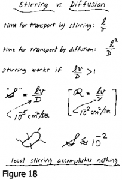](/wp-content/uploads/2011/04/image28.png)Je suis sûr que ce ratio porte le nom de quelqu'un mais je ne connais pas la littérature et je ne sais pas quel nom il porte. Appelons le S pour "nombre d'agitation", c'est juste lv/D. Vous noterez par la même occasion que le nombre de Reynolds est lv/ η, η est la viscosité cinématique en cm²/s, et D est la constante de diffusion dans cm²/sec, pour ce qui nous intéresse de suivre - disons une molécule d'éléments nutritifs dans l'eau. Dans toutes les molécules de taille raisonnable, quelque chose comme 10\-5 cm²/s. dans l'ordre de grandeur de distances qui nous intéresse, le micron, nous constatons que le nombre d'agitation S est de 10\-2, pour les vitesses dont nous parlons (Fig. 18).

En d'autres termes, cet animal n'arrivera à rien en agitant son environnement local. Il pourrait simplement attendre que les choses diffusent, vers lui ou vers l'extérieur. Le transport des déchets loin de l'animal et de la nourriture vers l'animal est entièrement contrôlé localement par la diffusion. Vous pouvez vous agiter beaucoup, mais celui qui attend tranquillement que la diffusion agisse pourra en recueillera tout autant.

[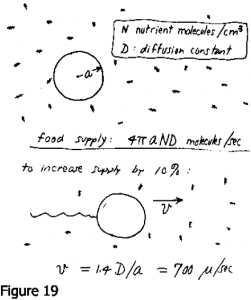](/wp-content/uploads/2011/04/image30.png)A un moment j'ai pensé que la raison pour laquelle la chose nage, c'est que si elle nage elle peut avoir plus de choses, parce que l'environnement est plein de molécules que l'animal aimerait avoir. Tous mes instincts en tant que physicien disent que vous devriez bouger si vous voulez récolter toutes ces choses. Vous pouvez facilement résoudre le problème de la diffusion dans le champ de vitesse représentée par l'écoulement de Stokes autour d'une sphère --- par exemple, par une méthode de relaxation. Je l'ai fait et j'ai découvert à quelle vitesse la cellule devrait avancer pour accroître - son approvisionnement alimentaire. L'approvisionnement alimentaire si elle ne bouge pas est de 4πaND, où a est le rayon de la cellule (Fig. 19) et N est la concentration en molécules de nutriments. Pour augmenter son approvisionnement alimentaire de 10%, elle devrait se déplacer à une vitesse de 700 microns/sec, ce qui est 20 fois plus rapide qu'elle ne peut nager. L'augmentation de l'approvisionnement varie comme la racine carrée de la vitesse de la cellule de sorte que nager ne sert pas à grand chose à cet égard. Mais ce qu'elle peut faire est de trouver des endroits où la nourriture est meilleure ou plus abondante. Donc, elle ne se déplace pas comme une vache qui broute un pâturage - elle se déplace pour trouver des pâturages plus verts. Et de quelle distance doit-elle se déplacer? Eh bien, il doit se déplacer assez loin pour devancer la diffusion. Nous avons déjà dit que l'agitation ne ferait pas grand chose d'utile localement, par rapport à la diffusion. Mais supposons qu'elle veuille aller voir là-bas pour voir si il y en a plus. Alors il doit devancer la diffusion, et comment faire ça ? Eh bien, il suffit de parcourir cette distance magique, D/v. Donc la règle est alors que pour distancer la diffusion vous devez parcourir une distance supérieure ou égale à ce nombre que nous avions dans notre constante S. Pour des D et v typiques, vous devez vous déplacer de plus de 30 microns et c'est exactement ce que les bactéries faisaient. Si vous ne nagez pas aussi loin, vous n'avez rien changé du tout, parce que c'est seulement à cette distance que vous trouverez une différence dans votre environnement eu égard aux molécules d'une constante de diffusion D (Fig. 20).

[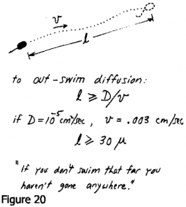](/wp-content/uploads/2011/04/image31.png)Retournons voir une des sections des traces de Berg (Fig 11.) Vous remarquerez qu’il y a de petits déplacements linéaires, mais vous pourriez vous demander pourquoi s’est elle arrêtée après un trajet donné. Pourquoi est-elle repartie en arrière ? Mes suggestions sont, et j’avance ceci en pure hypothèse, que la raison pour laquelle elle fait ceci est pour distancer la diffusion. Autrement, elle aurait tou intérêt à ne rien faire, comme les mutants dépourvus de flagelle. Maintenant, il y a une autre hypothèse encore plus risquée, dans la mesure ou je n’ai pas encore essayé ceci expérimentalement avec Howard. Quand il a fait ses expériences de chimiotaxie, il a découvert un comportement très intéressant. Si ces créatures sont placées dans un environnement ou il y a un gradient d’une substance qu’elles apprécient, elles progressent graduellement vers l’amont. Mais si vous observez comment elles y parviennent et vous demandez quelles règles elles utilisent, quelle est l’algorithme pour utiliser le langage courant, pour trouver leur chemin vers l’amont, il se trouve que c’est très simple. L’algorithme est : Si les choses s’améliorent, ne vous arrêtez pas encore. Si, en d’autres mots, vous tracez, comme Berg l’a fait dans certaines de ses publications, la distribution des longueurs de trajet entre les runs et les petits arrêts qu’il appelle « twiddles », la distribution des longueurs de trajet si elles remontent le gradient rallonge. C’est une règle très simple pour trouver votre chemin vers des environnements meilleurs. Si elles progressent vers l’aval cependant, elles ne raccourcissent pas. Et ceci semble un peu étrange. Pourquoi est-ce que si les choses s’empirent ne changent-elles pas plus tôt ? Ma suggestion est qu’il n’y a aucun intérêt à s’arrêter plus tôt, il y a une sorte de longueur plancher qui distance la diffusion et est utile pour échantillonner un environnement. Des distances plus courtes seraient une manière ridicule d’échantillonner. Il se peut que cela soit quelque chose comme cela, mais comme je l’ai dit, je ne le sais pas. Le résidu d’éducation que j’ai tiré de ceci est pour une partie ces notions sur la mécanique des fluides, pour une autre partie le fait de comprendre que le mécanisme de propulsion n’est vraiment pas important mis à part, bien sur, pour la physiologie très mystérieuse de ce moteur, ce dont des physiciens ne sont même pas compétents pour en conjecturer.

Je reviens un instant à Osborne Reynolds. Il était un très grand homme. Il était en fait un professeur en sciences mécaniques. Il était non seulement celui qui à inventé le nombre de Reynolds, mais il aussi été celui qui à montré ce que signifiait la turbulence et qu’il y avait une instabilité dans les écoulements et tout le reste. Il est aussi celui qui a résolu le problème de la lubrification des roulements, qui est un problème vraiment subtil que je recommande à tous ceux qui ne s’y sont pas encore penchés. Mais j’ai découvert récemment en lisant un recueil de ses travaux que vers la fin de sa vie, en 1903, il a publié un très long article sur [_l’univers sub mécanique_](http://openlibrary.org/books/OL7086027M/The_sub-mechanics_of_the_universe.), et qu’il avait toute une théorie qui faisait intervenir des petites particules d’un diamètre de 10\-18 cm. Cela devient assez farfelu à partir de là. C’est un modèle mécanique, les particules interagissent les unes avec les autres et remplissent tout l’espace. Mais je pensais que, aussi incongru que cela puisse paraitre de mettre ce genre de sujets parmi nos travaux sur l’univers sub mécanique aujourd’hui, Je pense qu’Osborne Reynolds n’aurait pas trouvé cela incongru, et je suis certain que Viki non plus.
