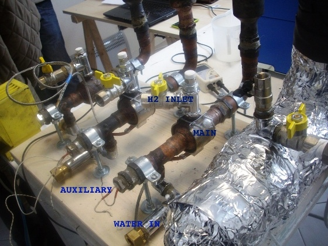

Après avoir mis au point la [bombe H](w:) soviétique, le futur Prix Nobel de la Paix [Andreï Sakharov](w:) inventa le [Tokamak](w:) dans les années 1950 dans l'espoir de dompter la [fusion thermonucléaire](w:). Ca fait bientôt 60 ans qu'on essaie de faire marcher ce truc. Dans le meilleur des cas, [ITER](w:) produira 500 MW de temps en temps dès 2020, après avoir coûté très cher. A moins que ce ne soit [HIPER](w:) ou un descendant de la [Z machine](w:), d'autres projets colossaux. Ensuite il faudra encore quelques décennies pour industrialiser tout ça...



Mais dans tous les cas, comme [je l'avais déjà expliqué ici](/2005/12/11/la-fusion-thermonucleaire/), la réaction de fusion [D+T → He4 + n](w:Fusion_nucléaire#Analyse_de_la_réaction_deutérium_+_tritium) exploitée dans ces réacteurs est bien différente de [celle qui a lieu dans le Soleil](w:Chaîne_proton-proton). D'abord, elle produit des [neutrons très rapides](w:Température_des_neutrons#Neutrons_rapides) qui transformeront peu à peu la machine en déchets radioactifs. Ensuite, on n'obtient pas le tritium "simplement" en l'extrayant de l'eau. C'est [plus compliqué](w:Tritium#Production_industrielle)...

La fusion D+T n'étant pas pour demain ni idéale, on pense déjà aux réactions de [fusion aneutronique](w:) d'après-demain. Certaines réactions éjectent des protons qui pourraient théoriquement [produire directement de l'électricité](w:Fusion_aneutronique#Conversion_directe_de_l'énergie) sans passer par la case thermique. D'autres, celles qui me font le plus rêver nécessitent de l'[Helium-3](w:), inexistant sur Terre ou l'[Helium est déjà rare](/2010/07/04/combien-dhelium/), mais présent sur la Lune ([une vraie bonne raison d'y retourner](/2009/07/18/pour-quoi-retourner-sur-la-lune/)) et 10'000 fois plus abondant dans l’atmosphère d'Uranus, composée à 15% d'Helium. L'He3 est même [déjà utilisé par plusieurs races intelligentes](http://wiki.eveonline.com/en/wiki/Helium_Isotopes), alors...



En revenant sur Terre, la réaction aneutronique la plus "simple" à réaliser et donc la plus étudiée consiste à bombarder du Bore-11 avec des protons, ce qui produit 3 Helium-4. La réaction se produit à une "température" encore 10x plus élevée que pour la réaction D+T, mais elle a été obtenue en 2005 [[1]](#ref-1) avec un laser picoseconde. "pico" c'est 10 -12, et ça donne la durée de l'impulsion laser, longue de moins d'un millimètre... Le temps que le plasma chauffe, la réaction est donc plus courte que ça, et ensuite il faut probablement quelques heures avant de recommencer.

Donc la fusion aneutronique industrielle n'est probablement pas pour ce siècle. A moins que...

A moins que le [catalyseur d'énergie de Rossi et Focardi](w:) marche vraiment.

Ces deux italiens de l'Université de Bologne ont effectué plusieurs [démonstrations publiques](http://www.youtube.com/watch?v=u-Ru1eAymvE) d'un bidule nettement moins photogénique qu'une Z-machine, mais qui produit apparemment 10 kW de chaleur pour une consommation électrique de 600 W, en fusionnant de l'Hydrogène avec du Nickel, produisant ainsi du Cuivre !

Oui, mesdames et messieurs, la [fusion froide](w:) est de retour, ou plutôt la fusion tiède car le système est tout de même sous pression et plus chaud que la fumeuse expérience de Fleischmann et Pons de 1989. En théorie, ça ne peut pas marcher. Mais en pratique il y a eu des observations de transmutations sur des électrodes de nickel [[2]](#ref-2) avant le papier de Rossi et Focardi [[3]](#ref-3), Rossi a déposé un brevet [[4]](#ref-4) en 2008 pour commercialiser son système dès la fin de cette année 2011, et une partie de la communauté scientifique qui ne craint pas de se re-brûler les ailes analyse les explications possibles du phénomène, et en trouve [[5]](#ref-5).

Si le catalyseur d'énergie de Rossi et Focardi marche vraiment, ce serait un tsunami dans le domaine de la physique nucléaire, dans ses frontières avec la chimie, dans la production d'énergie et dans le paysage de Cadarache. Et Rossi et Focardi pourraient embaucher le roi d'Arabie Saoudite pour cirer leur pompes. A quelque part, ça serait trop beau. Ca ne se peut pas. Impossible.

Ma! Impossibile non è italiano, no ? Allora, vediamo ...

### Références

1. V. S. Belyaev, A. P. Matafonov, and V. I. Vinogradov, "[Observation of neutronless fusion reactions in picosecond laser plasmas](http://fire.pppl.gov/fusion_pb11_belyaev_082605.pdf)", 2005, Physical Review, E 72, 026406
2. Miley, G.H. and J.A. Patterson, "[Nuclear transmutations in thin-film nickel coatings undergoing electrolysis](http://newenergytimes.com/v2/library/1996/1996MileyG-NuclearTransmutations.pdf)". J. New Energy, 1996. 1(3): p. 5.
3. S. Focardi, A. Rossi "[A new energy source from nuclear fusion](http://www.scribd.com/doc/46920826/Rossi-Focardi-Paper)", 2010, Journal of Nuclear Physics
4. Rossi Andrea, "[METHOD AND APPARATUS FOR CARRYING OUT NICKEL AND HYDROGEN EXOTHERMAL REACTIONS](http://www.wipo.int/patentscope/search/en/WO2009125444)" brevet WO/2009/125444
5. Christos Stremmenos, "[A detailed Qualitative Approach to the Cold Fusion Nuclear Reactions of H/Ni](http://www.journal-of-nuclear-physics.com/?p=497)", 2011 [Journal of Nuclear Physics](http://www.journal-of-nuclear-physics.com/) Nuclear experiments blog
