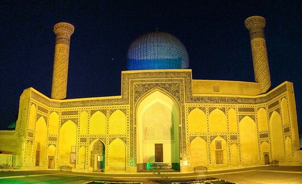

L'Académie Française vient d'élire un auteur dont j'ai dévoré presque tous les livres : [Amin Maalouf](http://fr.wikipedia.org/wiki/Amin_Maalouf). D'après [la liste](http://fr.wikipedia.org/wiki/Liste_des_membres_de_l%27Acad%C3%A9mie_fran%C3%A7aise_par_date_d%27%C3%A9lection), le seul autre dans ce cas est Marcel Pagnol, élu en 1946. Autant dire que je ne suis pas un ventilateur\* de Littérature Française. D'ailleurs Maalouf n'est pas véritablement un auteur français, ne vous déplaise. Il est libanais, et ses racines orientales font de ses oeuvres de magnifiques ponts entre l'Histoire de l'Orient et l'Occident, entre les cultures de l'Islam et du Christianisme.

La carrière de Maalouf a débuté par un essai , "[Les Croisades vues par les Arabes](http://books.google.fr/books?id=XywTAQAAIAAJ)", qui présente les preux chevaliers sous un éclairage peu reluisant et replace leurs conquêtes dans le contexte de l'époque, marqué par la désunion des états et des forces musulmanes, pour ne pas dire décadence de la société.

"[Léon l'Africain](http://books.google.com/books?id=9NyDQgAACAAJ)" est un roman inspirée par l'étonnante destinée d'un [personnage historique](http://fr.wikipedia.org/wiki/L%C3%A9on_l'Africain): un diplomate et érudit musulman du XVIème siècle se retrouve conseiller du pape Léon X et diplomate pour les relations pour le moins tendues entre musulmans et chrétiens à l'époque. Aujourd'hui encore on aurait bien besoin d'un type comme ça...

"[Les jardins de lumière](http://books.google.fr/books?id=3fuPNAAACAAJ)" nous emmène dans la Perse du IIIème siècle, à la découverte du prophète [Mani](http://fr.wikipedia.org/wiki/Mani_\(proph%C3%A8te\)), le fondateur du [manichéisme](http://fr.wikipedia.org/wiki/Manich%C3%A9isme). Car avant d'être synonyme de vision réductrice du bien et du mal, le manichésime a été une religion combinant des notions issues du Christianisme naissant et d'anciennes religions orientales. Comme quoi le "New Age" remonte à loin.

J'ai aussi lu "[Le Périple de Baldassare](http://books.google.fr/books?id=MFyNNQAACAAJ)", "[Les échelles du Levant](http://books.google.fr/books?id=twKXPQAACAAJ)" et "[Le Rocher de Tanios](http://books.google.fr/books?id=rcHmQwAACAAJ)", tous bien aussi, et "[Le premier siècle après Béatrice](http://books.google.fr/books?id=Rda4QgAACAAJ)" dans un registre assez différent, mais  mon préféré reste "[Samarcande](http://books.google.fr/books?id=c5oSHAAACAAJ)".

"Samarcande" nous plonge dans la Perse d'[Omar Khayyam](http://fr.wikipedia.org/wiki/Omar_Khayyam), poète, [mathématicien et astronome](http://fr.wikipedia.org/wiki/Omar_Khayyam#Math.C3.A9maticien_et_astronome) du XIIème siècle, qui aurait certainement des ennuis en Iran de nos jours avec ses poèmes du genre:

> ''Allah est grand !'' . Ce cri du moueddin ressemble à une immense plainte. Cinq fois par jour, est-ce la Terre qui gémit vers son créateur indifférent ?

"Samarcande" est construit sur la légende qui lie Khayyam a [Hassan ibn al-Sabbah](http://fr.wikipedia.org/wiki/Hassan_ibn_al-Sabbah), fondateur de la "[secte des Assassins](http://fr.wikipedia.org/wiki/Niz%C3%A2rites)" basée à [Alamut](http://fr.wikipedia.org/wiki/Alamut). Un excellent roman, avec en arrière plan les divisions et les interprétations mutiples de l'Islam, dont nous autres occidentaux avons une perception bien trop monolithique.

Si vous ne savez pas quoi lire cet été, je vous recommande un Maalouf. Il vous fera voyager dans le temps et peut-être comprendre un peu mieux vos voisins musulmans. Et ses romans sont vraiment passionnants, du genre qui empêche de s'endormir dessus. Un Académicien vraiment pas comme les autres donc. Pourvu qu'ils ne le contaminent pas trop vite.

Note \* Avec la loi Toubon, je n'ai pas osé "fan". Je fais un effort pour la circonstance...

### Vivements conseillés:

1. 
2. 
3. 
4. 
