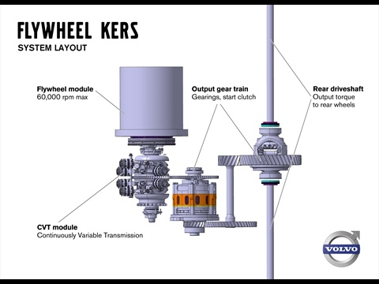

Chaque fois que vous arrêtez votre voiture à un feu rouge, son [énergie cinétique](w:) et la votre sont dissipées sous forme de chaleur dans vos freins. Quand le feu passe au vert, votre moteur régénère cette énergie cinétique en accélérant votre véhicule. Dès les années 50, Richard Feynman ([encore lui](/tags/feynman/)) avait imaginé un [système de récupération de l'énergie cinétique](w:) (SREC, ou KERS en anglais)  pour récupérer l'énergie au freinage, la stocker quelques instants, puis la réinjecter au démarrage. Aujourd'hui, les progrès technologiques permettent de réaliser cette idée.



L'énergie cinétique d'une voiture est étonnamment faible : lorsqu'une voiture de 1300 kg roule à 50 km/h , elle ne vaut que 130 [kilojoules](w:Joule), soit 36 [Wh](w:Kilowatt-heure) seulement en unités électriques, l'équivalent de la charge d'une batterie de laptop. Le problème est que cette énergie est libérée dans les quelques secondes que dure un freinage, donc la puissance à absorber est relativement élevée.

Dans notre exemple, en supposant un freinage bien doux de 5 secondes,  il faudrait une batterie capable d'absorber 26 kW. C'est justement le maximum de la batterie de la [Toyota Prius](w:), dont la capacité est de 1.5 kWh, soit 42x plus grosse (et lourde) que ce qui serait nécessaire pour le SREC. On peut aussi imaginer utiliser des [supercaps](w:Supercondensateur), capables de se charger très vite, mais il en faudrait beaucoup pour stocker les 36 Wh\*. Actuellement, les SREC électriques sont donc limités à une utilisation "conduite tranquille en ville" et ne se justifient que sur des véhicules déjà munis d'une grosse batterie.

Volvo vient d'annoncer [[1]](#ref-1), [[2]](#ref-2) une alternative purement mécanique basée sur un volant d'inertie de 6 kg, mesurant 20 cm de diamètre et tournant jusqu'à 60 000 tours par minute sous vide. Après un petit calcul, on trouve que ce cylindre peut stocker 1.2 megajoules au moins\*\*, ce qui permet d'absorber l'énergie cinétique d'une voiture de 2 tonnes roulant à 90 km/h. Au démarrage, le système peut restituer 80 chevaux de puissance, soit 60 kW pendant 20 secondes, assez pour réduire la consommation d'essence de 20% selon Volvo. De plus, le "flywheel KERS" de Volvo se monte sur l'essieu arrière d'une traction avant et est donc totalement indépendant du bloc moteur :

Encore plus que le volant d'inertie, l'élément clé du système est le "CVT module", un [variateur de vitesse mécanique](w:) couplant le volant d'inertie à l'essieu arrière par un rapport de transmission variable, commandé électroniquement en fonction des vitesses des deux éléments et des actions sur les pédales de frein et de gaz. Selon certaines sources, ce serait l'entreprise [Torotrak](http://www.torotrak.com/) qui produirait le CVT du système Volvo après avoir collaboré à des projets KERS pour la F1



En effet, la Formule 1 autorise les KERS depuis 2009 [[3]](#ref-3), [[4]](#ref-4), mais avec des limitations bizarres comme de n'en tirer que 400 kilojoules par tour de circuit alors qu'un seul freinage de 300 km/h à 100 km/h pour un bolide de 700 kg dégage plus de 4 megajoules. De plus la puissance de restitution du KERS est limitée à 60 kW comme dans la Volvo de demain... En 2009, les écuries ont développé, testé et parfois utilisé en course divers systèmes électriques ou à volant d'inertie, mais aussi pneumatiques ou hydrauliques. En 2010, elles y ont toutes renoncé, et en 2011 la situation n'est pas claire... Dommage que la F1 soit si réglementée, peut-être qu'un peu de liberté dans la conception des KERS pourrait véritablement changer l'automobile de demain.

### Notes:

\* KTM a utilisé des supercaps sur une moto GP de 125cm³ en 2009 [[5]](#ref-5)

\*\* : j'ai fait l'hypothèse d'un cylindre plein, alors que les ingénieurs de Volvo ont certainement réparti la masse le plus possible sur l'extérieur du cylindre, donc je parierais plutôt pour 2 MJ voire plus.

### Références

1. Rémy Devaureix "[Volvo développe un KERS pour ses futurs véhicules](http://www.auto-buzz.com/volvo-flywheel-kers-530884.html)" 30 mai 2011, sur AutoBuzz.com
2. [Volvo FlyWheel KERS : une roue d’inertie capable de réduire de 20% la consommation de carburant](http://www.actinnovation.com/innovation-automobile/volvo-flywheel-kers-une-roue-dinertie-capable-de-reduire-de-20-la-consommation-de-carburant-2376.html) 2 juin 2011 sur actinnovation.com
3. Paul Evans "[Formula One KERS Explained](http://www.gizmag.com/formula-one-kers/11324/)" 26 mars 2009 sur gizmag.com
4. [F1 - Le KERS en six questions](http://news.sportauto.fr/news/1438361/kers-fonctionnement-saison-2011-explications) 24 mars 2011 sur sportauto.fr
5. [KTM beats F1 with secret KERS](http://www.crash.net/motogp/news/142605/1/ktm_beats_f1_with_secret_kers_debut.html) 4 février 2009 sur crash.net
