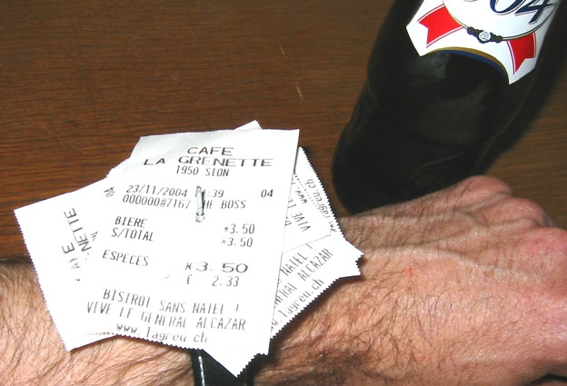

Cette histoire a commencé par le "buzz" de la montre qui n'avance jamais:

Le nom de l'inventeur de ce magnifique [chindogu](http://drgoulu.local/2009/12/24/initiation-au-chindogu/) ayant été perdu, j'ai utilisé [TinEye](http://tineye.com) pour retrouver l'auteur des photos originales, et c'est ainsi que j'ai découvert [Marcel Bétrisey](http://www.betrisey.ch/), mais surtout que sa "[montre valaisanne](http://www.betrisey.ch/lagreu.html)" n'est de loin pas son oeuvre la plus magistrale.

Et après quelques contacts à distance, j'ai eu hier la chance de le rencontrer dans son atelier, où il nous a présenté ses extraordinaires pendules lors de la traditionnelle excursion du [Microclub](http://microclub.ch) du "[Lundi du Jeûne](http://fr.wikipedia.org/wiki/Je%C3%BBne_f%C3%A9d%C3%A9ral)". Pour les autres, le reportage que TF1 lui a consacré permet de se faire une idée de l'étendue des compétences que Marcel met en oeuvre dans ses créations, la modestie n'étant pas la dernière:



Ce qui n’apparaît pas dans le reportage, c'est que les horloges de Marcel sont des merveilles de précision, truffées d'astuces destinées à compenser les variations de température et autres aléas. Ainsi par exemple, la tige du balancier de la pendule "[Harley-Davidson](http://www.betrisey.ch/harley2.html)" est creuse et remplie d'une quantité ad-hoc de mercure : lorsque la tige se dilate, le mercure monte à l'intérieur et maintient le centre de gravité de l'ensemble constant. Depuis qu'un admirateur lui a offert [un appareil de mesure](http://www.bmumford.com/mset/modelwatchpro.html) sophistiqué, Marcel peut observer la régularité de ses mécanismes à la microseconde, et parvient à des performances exceptionnelles pour des systèmes mécaniques.

Entre des pendules d'apparence baroques, Marcel poursuit également une quête de la simplicité :

> "Le plus difficile n'est jamais de faire fonctionner une horloge, mais de la simplifier au maximum jusqu'à ce que chaque élément soit vital et indispensable."

Les deux objectifs sont atteints par exemple avec "[Florence](http://www.betrisey.ch/florence.html)", propulsée une fois par heure par la chute d'une seule bille, et qui ne dévie que d'une seconde par mois !



Le "[Chronolithe](http://www.betrisey.ch/cronolit.html)" et la "[Conti](http://www.betrisey.ch/conti.html)" sont les plus incroyables pendules qu'il m'ait été donné de voir. Leur long balancier n'est propulsé que par la [pression de la lumière](http://fr.wikipedia.org/wiki/Pression_de_radiation), comme le [radiomètre de Crookes](http://fr.wikipedia.org/wiki/Radiom%C3%A8tre_de_Crookes), ces petits moulins de pales argentées d'un côté et noircies de l'autre tourniquant sous vide d'air dans certaines vitrines de l'ère pré-numérique. Bouger un pendule de 4 Kg avec une force de quelques micronewtons : il l'a fait !

> L'instant était crucial: si cet essai prouvait que le système ne pouvait pas marcher, je me retrouvais avec un tube de verre et une grosse pompe à vide sur les bras. Le premier proto? une boule de pétanque suspendue, et un incroyable amas de 30 feuilles de mica (simples isolations de transistors) dont une des face était noircie par de la fumée de bougie. Un capteur fut fixé à l'extérieur du tube de verre, je fis le vide et lançai le pendule vers 16 heures. Comme il faut attendre une bonne heure pour que le balancier se stabilise, je partis boire un verre en attendant les résultats. Quand je revins, le pendule bougeait toujours. Comme je n'étais pas sûr s'il le faisait de sa propre inertie, je suis reparti reboire un verre. A 19 heures, le pendule bougeait toujours et l'amplitude était constante, je suis donc reparti fêter ça. A 22 heures, l'horloge marchait encore, et moi beaucoup moins bien...



Après ça, rien d'étonnant à ce que Marcel ait également réalisé des [pendules de Foucault](http://fr.wikipedia.org/wiki/Pendule_de_Foucault). En réaliser un grand qui fonctionne correctement est déjà difficile, mais ceux de Marcel sont parmi les plus courts du monde : légers, le frottement de l'air impose de les "motoriser" sans les perturber. [Celui de 2m réalisé spécialement pour l'émission de TF1](http://www.betrisey.ch/pendule%20tf1.html) utilise un rubis d'horloger parfaitement ajusté au fil (une corde de guitare...) pour garantir une symétrie axiale parfaite du pivot, un électro-aimant répulsif dont j'ai peine à croire qu'il soit aussi simple que ce que prétend l'inventeur, et aussi un "[anneau de Charron](http://fr.wikipedia.org/wiki/Fernand_Charron)", astuce peu connue permettant d'éviter que le pendule ne décrive une trajectoire elliptique. Concrètement, c'est un disque dur librement posé sur une plaque horizontale, positionné à la hauteur exacte ou le fil touche très légèrement l'intérieur du trou central... J'ignore si son "[Mini Foucault](http://www.betrisey.ch/mini.html)" fonctionne bien, mais si c'est le cas, c'est probablement le plus petit du monde, avec ses 12 cm, mais une chose semble certaine: ce n'est pas Marcel qui le soumettra au Guiness Book.

Si vous avez manqué l'[exposition de ses oeuvres à La Vilette en 2006](http://www.betrisey.ch/villette.html), il ne vous reste qu'à venir à Sion les admirer dans l'atelier du maître, car le réglage des pendules après chaque déménagement prend un temps prohibitif. Sinon vous pouvez espérer une nouvelle exposition en surveillant la [page "pressbook](http://www.betrisey.ch/presbook.html)", truffée de liens intéressants.

Merci Marcel pour cette visite passionnante à un passionné !



[(article aussi paru sur le blog du Microclub)](http://microclub.ch/2011/09/20/les-geniales-pendules-de-marcel-betrisey/)
