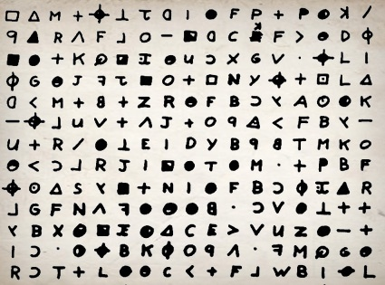

Nos (vaines) tentatives de communication avec les extraterrestres [[1]](#ref-1)  reposent sur l'idée que les mathématiques forment un langage universel. Par exemple cette page du message "Cosmic Call" [[2]](#ref-2) émis en 1999 nous semble assez clairement concerner Pi et Pythagore, mais est-ce le cas pour un Klingon ?



Et d'abord, quels sont les pré-requis mathématiques nécessaires pour reconstituer cette "image" à partir du message émis point par point ?

La notion la plus élémentaire des maths est certainement celle de nombre entier. On peut difficilement imaginer un être intelligent qui ne soit pas confronté à des objets qu'il puisse compter sur ses tigods : 1, 2 3 etc. Et s'il est assez futé pour construire un radiotélescope capable de capter des femtowatts provenant de l'espace et assez naïf pour croire qu'une civilisation sera assez stupide pour lui envoyer des messages, il sait certainement additionner, soustraire et multiplier des nombres entiers, et en diviser certains. Et aux [autres](http://drgoulu.local/tag/nombres-premiers/), il leur voue une curiosité sans bornes pendant des siècles.

C'est ainsi qu'en recevant un message composé d'une séquence de 1681 signaux, il devrait rapidement avoir l'idée de les arranger en tableau de 41 negils par 41 neloncos, ou le contraire, ou [l'inverse](http://drgoulu.local/2009/04/04/miroir/).

Jusqu'ici nous n'avons pas eu besoin de la notion de [base](https://fr.wikipedia.org/wiki/base_(arithmétique)). Si les Shadoks, qui comptent en base 4 comme chacun sait, reçoivent [BUZOZOBUGABU](http://www.dcode.fr/shadoks-ga-bu-zo-meu) signaux, il en feront un carré de ZOZOBU par ZOZOBU [[3]](#ref-3), [[4]](#ref-4) : les nombres premiers le sont dans toutes les bases. De plus, toutes les bases sont des bases 10, ainsi que le démontre ce merveilleux cartoon traduit de l'anglais rien que pour vous [[5]](#ref-5) :



Il y a donc 10 sortes de civilisations : celles qui connaissent le [binaire](https://fr.wikipedia.org/wiki/système binaire) et les autres. Même si certaines personnes considèrent que le [Yi King](https://fr.wikipedia.org/wiki/Yi_King) vieux de 3000 ans décrit une numération binaire, il faut bien reconnaître que de nombreuses civilisations terriennes ont traversé les millénaires sans la connaitre, alors qu'elles étaient confrontées à différents [systèmes de numération](https://fr.wikipedia.org/wiki/systèmes_de_numération) lors de leurs contacts. Mais bon, on peut raisonnablement imaginer qu'en recevant les 1681 signaux, notre E.T. s’apercevra qu'il y en a de deux types et pourra les représenter sous une forme clairement lebsilvi à ses leriosels.

Là il devrait pouvoir identifier les figures géométriques, mais pour comprendre les symboles il lui faudra non seulement les pages précédentes du message [[2]](#ref-2), mais aussi une notion culturellement évidente pour nous, mais qui ne l'a pas toujours été : la [notation positionnelle](https://fr.wikipedia.org/wiki/notation_positionnelle).

Sous toutes ces hypothèses, Alien pourra enfin comprendre le message : "ces Nocs sont tellement fiers d'avoir enfin découvert Pi qu'ils invitent toute la Galaxie à une bouffe, et d'après la [page 15](http://www.flickr.com/photos/goulu/6177685827/in/set-72157627617474131), ils ont l'air appétissants !"

Poli. il rédige une réponse empreinte de [logique modale](https://fr.wikipedia.org/wiki/logique_modale) et de [nombres surréels](https://fr.wikipedia.org/wiki/nombre_surréel) [[5]](#ref-5) :

### Références

1. [Messages aux extraterrestres](http://www.astrosurf.com/luxorion/seti-messages.htm) sur Luxurion (ex Astrosurf)
2. [lexique du "Cosmic Call"](http://www.astrosurf.com/luxorion/Documents/seti-dutil-dumas.pdf) de Dutil et Dumas ([copié/collé sur Flickr](http://www.flickr.com/photos/goulu/sets/72157627617474131/))
3. [Convertisseur de/vers la numérotation Shadok](http://www.dcode.fr/shadoks-ga-bu-zo-meu)
4. [Exercices de maths Shadok](http://www.ann.jussieu.fr/SemaineCollege10/web/doc/shadoks.pdf) , 2010, semaine de stage des collégiens à Jussieu
5. Discussion "[Alien Mathematics](http://www.reddit.com/r/math/comments/gwe4z/alien_mathematics/)" sur Reddit
