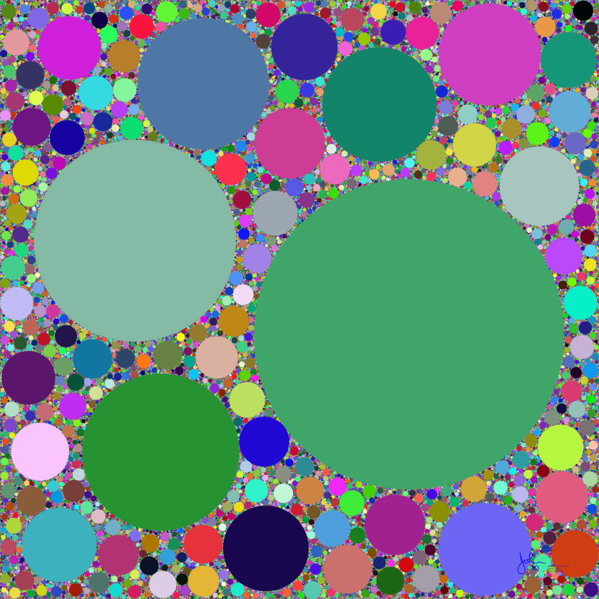
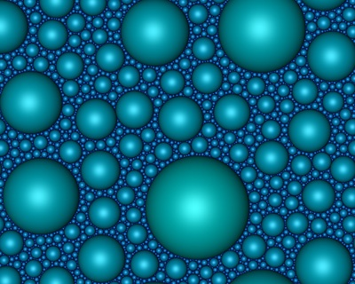
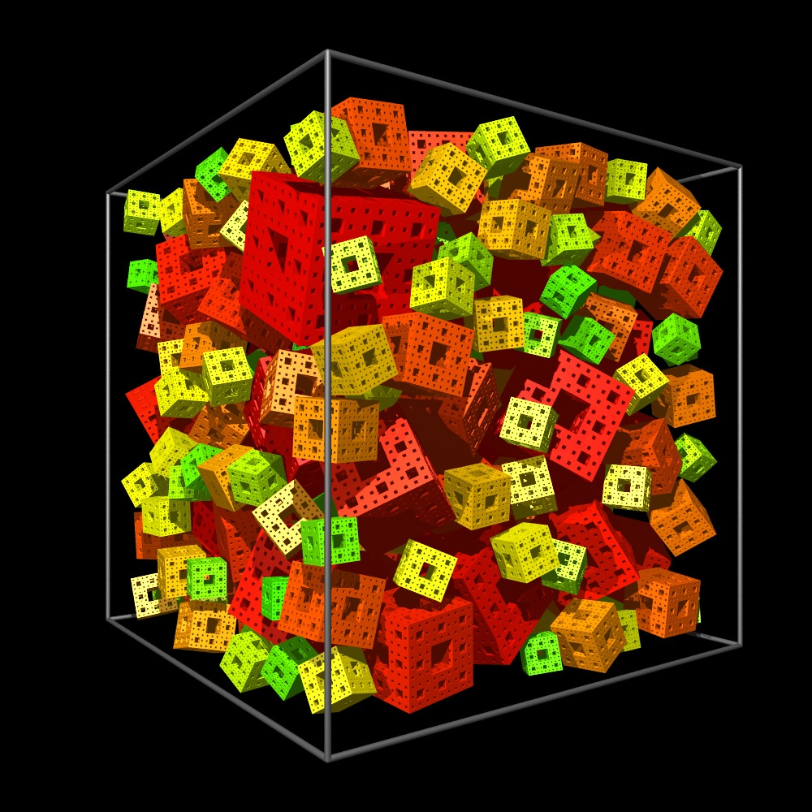
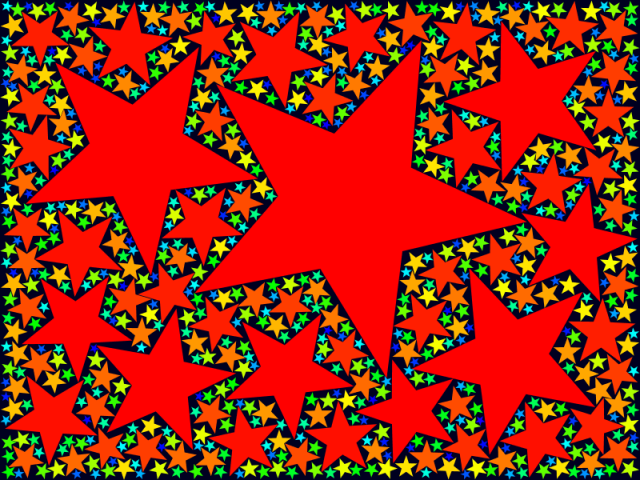

Il devient de plus en plus difficile de choisir un carrelage original pour sa salle de bains.

Depuis le XVème siècle, 17 types de [pavages](https://fr.wikipedia.org/wiki/pavages) réguliers différents sont utilisés dans les décorations de l'[Alhambra](https://fr.wikipedia.org/wiki/Alhambra_(Grenade)). En 1891, le mathématicien russe Evgraf Fedorov démontre que le nombre de pavages réguliers distincts  vaut ... 17 [[1]](#ref-1).  Et ce n'est qu'entre 1968 et 1984 qu'on parvient à classifier toutes les formes de pavés possibles en 19 catégories [[2]](#ref-2). Depuis, les carreleurs ne peuvent se distinguer que par des motifs et des couleurs, plus par la géométrie.

En 1974, le [pavage de Penrose](https://fr.wikipedia.org/wiki/pavage_de_Penrose) crée un choc : il est possible de recouvrir le plan avec des pavés de deux formes différentes arrangés selon des règles rigoureuses, mais ne générant pas de motif périodique. En 1994, Radin et Conway en proposent un autre, le "[Pinwheel tiling](https://en.wikipedia.org/wiki/Pinwheel_tiling)". Voilà pour le XXème siècle.

En 2011, c'est John Shier, un "artiste algorithmique" qui vient d'ouvrir tout grand la porte à une infinité de nouveaux pavages. Sa méthode permettent de couvrir le plan avec des pavés de presque n'importe quelles formes, mais de surface décroissantes [[3]](#ref-3), [[4]](#ref-4). Le principe semble tout simple : on place le plus grand pavé au hasard, puis le suivant en taille au hasard dans une surface libre et ainsi de suite.

Le problème est que si on réduit la taille des pavés trop vite on ne recouvre pas tout le plan, et si on réduit trop lentement, on risque d'être "coincé" à ne pas pouvoir placer un pavé. L'astuce consiste à attribuer au i-ème pavé une surface de A0/ic. Dans ce cas, la surface totale vaut :

 $A_{total}=A_{0}\sum_{i=0}^{\infty}i^{-c}$

On reconnait en passant la [fonction zêta de Riemann](https://fr.wikipedia.org/wiki/fonction_zêta_de_Riemann), qui converge pour c>1. Grâce à cette formule, une fois choisi un c, la formule permet de calculer la surface A0 qui garantit qu'il ne restera plus un seul espace libre après avoir placé une infinité de pavés. En pratique on obtient d'excellent remplissages avec quelques milliers de pavés, un peu de patience et un bon programme. Paul Bourke décrit tout ceci en détail sur une page [[5]](#ref-5) agrémentée de magnifiques exemples:

Il a même étendu la méthode à la 3D :

Pour ma part, j'ai réalisé la petite application ci-dessous en [Processing](http://processing.org) pour expérimenter un peu cet algorithme que je trouve spectaculaire:

<iframe src="https://openprocessing.org/sketch/40422/embed/?plusEmbedHash=e6247168&userID=573&plusEmbedTitle=true&show=sketch" width="640" height="640"></iframe>

*(Applet p5.js disponible sur [OpenProcessing](https://openprocessing.org/@Goulu/40422) ou [GitHub Pages](https://goulu.github.io/processing/src/RandomTiling/) • Code source sur [GitHub](https://github.com/goulu/processing/tree/main/src/RandomTiling/))*  

En pressant sur les touches 0,1,3,4,5,6 vous pouvez changer la forme des pavés à la volée, et la touche espace relance un pavage. Contrairement à Shier et Bourke, je ne pave pas un tore mais un rectangle, en prenant garde à ce que les pavés ne soient pas "coupés" par les bords. En plus je me suis amusé à implémenter les pavés en forme d'étoiles, en prévision d'une carte de Noël. Mignon, n'est-ce pas ? Bon, il reste pas mal de noir car la détection d'intersection entre étoiles est très lente, il faudrait améliorer ça.

_ajout du 8/10/11_ : j'ai présenté hier un [Tutoriel Processing](http://microclub.ch/2011/10/07/tutoriel-processing/) décrivant la conception de ce programme.

_edit du 20/9/13_ : l'applet utilise maintenant Processing.js : drgoulu.com n'a plus besoin de Java !

Il y a encore (ou déjà...) 2 bugs connus, si ça vous dit de vous y mettre :

1. le pavage bloque parfois, surtout avec les triangles ou étoiles, il faut que j'ajoute un moyen d'ajuster la constante c...
2. des intersections entre cercles et polygones subsistent. Normal, j'ai eu la flemme d'implanter ça.

Une autre amélioration intéressante serait de remplir l'intérieur des pavés avec d'autres pavés...

### Références:

1. Thérèse Eveilleau ["Les 17 types de pavage](http://therese.eveilleau.pagesperso-orange.fr/pages/jeux_mat/textes/pavage_17_types.htm)" avec animations flash
2. Xavier Hubaut "[Pavages du plan](http://xavier.hubaut.info/coursmath/doc/pavages.htm)"
3. John Shier "[Filling Space with Random Fractal Non-Overlapping Simple Shapes](http://paulbourke.net/texture_colour/randomtile/paper.pdf)", Hyperseeing, summer 2011 issue, pp. 131-140, published by ISAMA (International Society of the Arts, Mathematics, and Architecture).
4. John Shier "[Statistical Geometry"](http://john-art.com/stat_geom.html)
5. Paul Bourke "[Random space filling tiling of the plane](http://paulbourke.net/texture_colour/randomtile/)", July 2011

