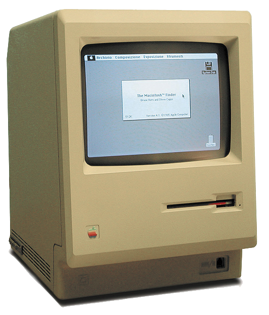
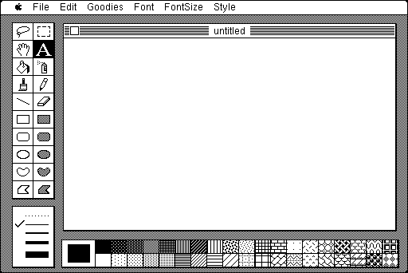

Je dois à Steve Jobs ma découverte du marketing. Je m'en souviens comme si c'était hier, mais c'était en été 1984. Je bossais l'été dans la boutique d'informatique qui m'avait vendu un [Commodore 64](w:) deux ans plus tôt, mais vendait surtout des [Apple II](w:) comme machines "professionnelles". Un matin juste à l''ouverture entre une personne qui, comme beaucoup de clients à l'époque, n'avait pas une idée claire de ce qu'on pouvait faire avec un ordinateur. Mais après quelques questions il apparaît que le monsieur est un commerçant qui cherche plutôt un outil de travail qu'une machine à jeux. Donc je lui montre [WordPerfect](w:), [Visicalc](w:) et un soft de compta au normes suisses, le tout sur l'Apple II, machine éprouvée depuis plusieurs années (1977) pour la modique somme d'environ 5000 Francs suisses de l'époque. Une fortune, mais ce n'est pas ce qui chicane le client.

"Plusieurs années ???" demande-t-il étonné. "Vous n'avez rien de plus récent ? " - "Si Monsieur, nous venons de recevoir le nouvel ordinateur d'Apple ce matin même, ils l'ont appelé "[Macintosh](w:)" Dieu sait pourquoi, nous n'avons pas encore eu le temps de le tester, mais je peux déjà vous dire qu'il faudra plusieurs mois avant qu'existent les logiciels qu'il vous faut..." - "Je peux le voir quand même ?" - "Bien sur Monsieur, nous allons le découvrir ensemble" (en fait j'avais déjà lu pas mal à son sujet, notamment qu'il avait un processeur [68000](w:Motorola_68000), le rêve absolu à côté de mon 6502...) Et me voilà donc en train de sortir "ça" d'un carton :

"Comme je vous disais, il n'y a pas encore beaucoup de programmes pour cette machine, nous n'avons que ces 2 disquettes fournies avec le Macintosh : [MacWrite](w:), d'après le nom ça doit être un traitement de textes, et [MacPaint](w:), dont je n'ai aucune idée de ce que c'est, donc je vous propose de commencer par ça.." La disquette tourne pendant de longues secondes pendant lesquelles je vais chercher la liste de prix "Ah, et je dois vous prévenir : le Macintosh est bien plus cher que l'Apple II. Sans les logiciels, (mais peut-être avec l'imprimante, je me souviens plus) vous en aurez pour Frs 7000 au moins..." Là dessus, l'écran affiche :

La fin de l'histoire est incroyable, mais je vous jure qu'elle est vraie. Ca s'est passé exactement comme ça, quasiment dans le même délai qu'il vous faudra pour le lire. Je clique sur le spray, je clique sur la texture de briques, je spraie des briques sur la fenêtre et le client dit : "je prends celui là" !
