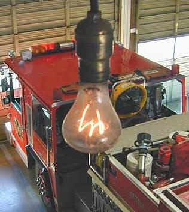
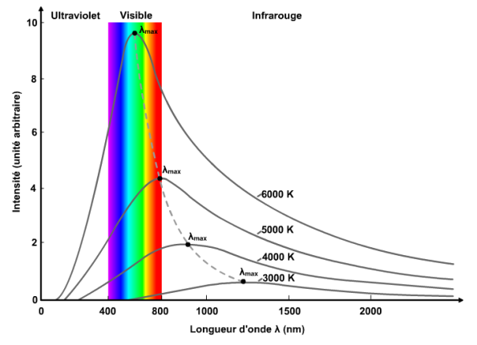
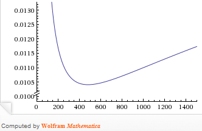

Dans la caserne des pompiers de Livermore, une ampoule à incandescence brille sans (longue) interruption depuis 110 ans. Bon nombre de dénonciateurs de l'[obsolescence programmée](w:) y voient la preuve d'une conspiration organisée par le [Cartel de Phœbus](w:) pour limiter la durée de vie des ampoules à 1000h et forcer ainsi les consommateurs à acheter plus d'ampoules que nécessaire. C'est notamment la thèse développée dans le documentaire "Prêt à jeter" diffusé en mars sur Arte, et à nouveau [visible sur YouTube](http://www.youtube.com/watch?v=J-XGn32vYQU). D'ailleurs le titre de la version anglaise du documentaire est "The Light Bulb Conspiracy".

La cause est entendue, relayée par des centaines de sites. Pourtant, [un commentaire de "Tocquevil"](http://laplumedaliocha.wordpress.com/2011/02/19/les-charmes-de-lindustrie-alimentaire/#comment-16628) cité dans l'excellent article de l'Econoclaste" démontant "[Le mythe de l'obsolescence programmée](http://econoclaste.org.free.fr/econoclaste/?p=7583)" sème le doute. Il apparaît que le "Cartel de Phoebus" a été soumis à une enquête dans les années 1950 par la commission de la concurrence anglaise, qui l'a condamné pour entente (illégale) sur le prix de vente des ampoules, mais pas sur la durée de vie. Comme indiqué au pt.283 du [Chapitre 17](https://www.gov.uk/government/uploads/system/uploads/attachment_data/file/235313/0287.pdf), p.98 de leur rapport [[1]](#ref-1) (traduit par mes soins):

> En ce qui concerne les standards de durée de vie, avant l'Accord Phœbus et jusqu'à ce jour, les ampoules à filament habituelles sont conçues pour avoir, en moyenne, une durée de vie minimum de 1000 heures. Il a souvent été prétendu - cependant sans preuve pour nous - que l'organisation Phoebus avait artificiellement fixé une courte vie aux ampoules dans le but d'augmenter le nombre d'ampoules vendues. Comme nous l'avons indiqué au Chapitre 9, il ne peut pas y avoir de durée de vie parfaitement adaptée aux nombreuses conditions variables que l'on trouve parmi les consommateurs d'un pays donné, de sorte que tout standard de durée de vie doit représenter un compromis entre facteurs contradictoires. Le [B.S.I](w:en:BSI_Group), a toujours adopté un seul standard de durée de vie pour les ampoules a filament, et les représentants du B.S.I, et du [B.E.A.](w:en:British_Electricity_Authority), comme la plupart des fabricants de lampes nous ont dit sous serment qu'ils considèrent 1000 heures comme le meilleur compromis possible actuellement, et aucun élément ne nous a été soumis pour contredire ceci. De ce fait, nous devons rejeter l'allégation fallacieuse mentionnée plus haut.

Quel est donc ce "meilleur compromis possible" qui fixerait la durée de vie d'une ampoule à 1000h ? Il provient de la physique. Une [lampe à incandescence](w:Lampe_à_incandescence_classique) produit de la lumière en chauffant son filament par [effet Joule](w:). La chaleur est évacuée du filament principalement par le [rayonnement](w:Transfert_thermique#Rayonnement) du "[corps noir](w:)", dont une partie peut être de la [lumière visible](w:) si le filament est assez chaud

Pour obtenir une lumière proche du [rayonnement solaire](w:), il faudrait que le filament atteigne 5500 [kelvin](w:) environ, la température de la surface de notre étoile. Mais le [point de fusion](w:) de tous les éléments connus est largement inférieur à cette température : le [tungstène](w:) fond à 3149  K à peine moins que le record du carbone (3327 K), trop fragile pour produire des filaments industriels, et juste un peu plus que l'[osmium](w:) et le [tantale](w:Tantale_(chimie)), qui furent utilisés avant qu'on arrive à maîtriser la production de [filaments](w:en:Incandescent_light_bulb#Filament) en tungstène.

En pratique, un filament d'ampoule atteint une température de l'ordre de 3000 K, ce qui le condamne à émettre plus de chaleur sous forme d'infrarouges que de lumière visible. Pour un bon rendement de la lampe, on a tout intérêt à ce que le filament soit le plus chaud possible.

Un ensemble de relations expérimentales connues sous le nom de "[lamp rerating](w:en)" [[2]](#ref-2) permettent de lier entre elles la tension électrique à la "[température de couleur](w:) du filament et à la durée de vie de l'ampoule. Car lorsque la température se rapproche de la température de fusion, le filament s'évapore par [sublimation](w:Sublimation_(physique)) très vite et claque au bout d'un temps proportionnel à la puissance -12 (environ) de la température. En clair, si on diminuait la température du filament de 6%, la durée de vie de l'ampoule serait multipliée par 2. Mais cette baisse de température baisserait la production de lumière de  20%, pour la même consommation d'électricité.

Considérons une ampoule de 100W qui coûte environ 1 Euro et qui consomme environ 100 KWh d'électricité à 10 cts le KWh soit 10 Euro pendant sa vie de 1000 heures. En tenant compte de ce qui précède, le prix (en Euro sur l'axe vertical) par heure d'une intensité constante de lumière évolue comme ceci en fonction de la durée de vie de l'ampoule (en heures, horizontalement):

Si l'ampoule ne dure pas assez longtemps, le prix augmente lorsqu'on parcourt la courbe vers la gauche parce qu'il faut acheter plus d'ampoules. Par contre si l'ampoule dure longtemps, le prix augmente aussi vers la droite parce qu'il faut consommer plus d'électricité pour la même lumière, le filament étant moins chaud.

_(graphique et paragraphe mis à jour après une bulle de formule, voir commentaires)_ Il y a donc une certaine durée de vie de l'ampoule qui correspond à un prix minimum de la lumière produite, et cette durée est aux alentours de 500 heures seulement, mais on peut la faire durer le double pour un surcoût de 5% seulement. Ou autrement dit, si votre ampoule dure moins que 1000h, vous y gagnez encore un peu !

Des progrès technologiques ont évidemment été réalisés dans la fabrication des filaments pour réduire la vitesse de leur évaporation. Ils sont aujourd'hui doublement spiralés pour augmenter la probabilité qu'un atome évaporé se redépose sur le filament. Et l'ampoule est remplie d'un gaz inerte dont la pression "ramène" le tungstène évaporé vers le filament. Mais il était plus rentable pour le consommateur d'exploiter ces progrès en échauffant le filament un peu plus pour augmenter le rendement de l'ampoule et réduire ainsi sa facture d'électricité que de prolonger la durée de vie de l'ampoule. La compétition entre producteurs d'ampoules a abouti à un optimum pour les consommateurs, pas pour eux !



_(paragraphe édité le 8.5.2016 après le commentaire d'Elladan)_ Alors comment se fait-il que l'[ampoule centenaire](w:) de Livermore fonctionne toujours ? C'est très simple : cette ampoule utilise un filament en carbone dont la résistance a augmenté avec le temps. Conçue pour une puissance de 60W, elle ne consomme plus que 4W aujourd'hui [[4]](#ref-4). Sur toutes les photos de l'ampoule on voit distinctement que son filament est rouge, "froid". D'après les équations du "lamp rerating", tout se passe comme si l'ampoule était désormais alimentée avec une tension de 20.24 Volts au lieu des 110 Volts pour lesquels elle a été conçue ( car (20.24/110)^1.6 = 4/60 ) . La luminosité de l'ampoule est donc désormais (20.24/110)^3.4 = 0.3% de sa luminosité originelle pour  4/60 = 7% de sa puissance électrique originelle. Son rendement a donc chuté d'un facteur 24 : la caserne de pompiers de Livermore paie donc sa lumière 24 fois plus cher que la normale. Et ça risque de durer, parce que cette baisse de rendement correspond à une multiplication de la durée de vie par (20.24/110)^-12 = 700 millions ! Si on admet que l'ampoule de Livermore était conçue pour durer 1000h, elle produira des infrarouges encore 80 millions d'années !

### Références

1. "[Report on the Supply of Electric Lamps](https://www.gov.uk/government/uploads/system/uploads/attachment_data/file/235313/0287.pdf)", 1953, The Monopolies and Restrictives Practice Commission, Report 287
2. 
3. Donald L. Klipstein (Jr), "[The Great Internet Light Bulb Book, Part I:Incandescent including halogen light bulbs](http://donklipstein.com/bulb1.html)"
4. [A Shelby Bulbs, Annapolis Tests](http://www.centennialbulb.org/annapolis-test.htm) sur le site officiel de l'ampoule de Livermore
