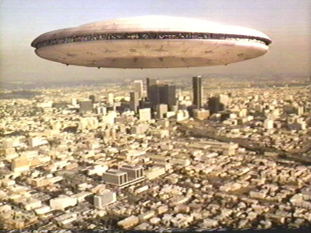

A la base, c'est le titre de l'article "[One weird theory could make anti-gravity and faster-than-light travel possible](http://io9.com/5855461/one-weird-theory-could-make-anti+gravity-and-faster+than+light-travel-possible)" d'io9 qui m'a fait bondir. Aucune théorie ne "permet" ou "rend possible" quelque chose. Les théories décrivent en langage humain les lois de l'Univers, et ce sont elles seules qui fixent les limites. Si la théorie permet quelque chose que l'Univers interdit, ou vice-versa, c'est une mauvaise théorie. Je ne sais pas si la [théorie de Heim](https://fr.wikipedia.org/wiki/théorie_de_Heim) mentionnée dans l'article a été formellement infirmée, mais tant qu'elle n'aura pas été confirmée expérimentalement, elle ne "permet" rien du tout.

Sauf de rêver.

Grâce à un commentaire de l'article, j'ai découvert "The Road Not Taken"\*, une nouvelle de science-fiction d'[Harry Turtledove](https://fr.wikipedia.org/wiki/Harry_Turtledove) écrite en 1985, et que l'on peut trouver dans les ouvrages cités en référence, ou en ligne en cherchant bien... Voici ses 18 pages résumées en quelques lignes.

Un énorme vaisseau extraterrestre Roxolani se pose sur la Terre dans un futur proche. La mission de son capitaine est claire : conquérir cette planète arriérée dont les habitants ne maîtrisent visiblement ni l'antigravité ni le voyage supraluminique. Il envoie rapidement ses soucoupes volantes bombarder les environs du lieu d'atterrissage et ses troupes au sol massacrer les premiers habitants rencontrés afin de terroriser les autres et obtenir une reddition rapide, comme sur les nombreuses autres planètes sous-développées envahies auparavant.

Après quelques minutes de surprise, les humains s'aperçoivent que les bombes des Roxolani sont des tonneaux de poudre noire, et que leurs fantassins sont alignés comme au 19ème siècle, tirant des salves avec des mousquets. Lorsque les Terriens ripostent avec mitrailleuses, chars et missiles à tête chercheuse, ils mettent rapidement en pièces les agresseurs sidérés, et font prisonniers quelques survivants.

Après quelques cours de langue anglaise, les Terriens demandent aux Roxolani pourquoi ils utilisent des armes si primitives alors qu'ils peuvent voyager plus vite que la lumière. Les Roxolani, vexés, expliquent que la poudre noire est une découverte récente et qu'ils maîtrisent également depuis peu la fabrication de l'acier et disposent de lunettes astronomiques, technologies qui leurs manquaient pour voyager dans l’espace. Par contre, ils s'étonnent que les humains disposent d'un armement si puissant alors qu'ils ne connaissent pas les principes pourtant élémentaires de la propulsion hyperspatiale...

Les Terriens s'aperçoivent qu'en manquant une découverte essentielle, ils ont suivi une voie qui les a confinés sur Terre et conduits à développer un armement sophistiqué au cours de conflits fratricides. Les Roxolani se rendent compte que l'épave de leur vaisseau apporte aux Terriens la technologie qui leur manquait pour dominer la Galaxie...

J'aime beaucoup cette histoire pour plusieurs raisons, mais surtout parce qu'elle pose une question intéressante :  est-il possible que nous passions à côté d'un principe physique fondamental ? Ou est-il possible que les découvertes scientifiques et technologiques d'une autre civilisation se fassent dans un ordre très différent de celui que nous avons connu ?

Je pense que non.

D'une part, les expériences réalisables dépendent beaucoup de la maîtrise de l'énergie, or les niveaux d'énergie correspondant aux [4 interactions fondamentales](https://fr.wikipedia.org/wiki/Interaction_fondamentale) sont très différents. A moins d'habiter une planète où on allume un feu en frottant deux morceaux d'Uranium pur, il faut maîtriser l'électromagnétisme avant les forces atomiques.

Une autre raison est le [principe totalitaire](https://fr.wikipedia.org/wiki/principe_totalitaire) de Gell-Mann : "tout ce qui n'est pas interdit est obligatoire" en physique des particules. Selon la mécanique quantique en effet, toute interaction permise a une probabilité non-nulle de se produire, et donc se produit forcément. D'après ce principe, les particules prédites par la théorie de Heim ou l'une de ses consoeurs folkloriques doivent apparaître lors des collisions réalisées au CERN ou ailleurs pour peu que les niveaux d'énergie soient suffisants. Puisque nous n'avons rien vu, c'est comme pour le boson de Higgs : soit la théorie est complètement fausse, soit elle est un peu fausse et il nous faut plus d'énergie pour maîtriser la physique associée à ces particules. S'il est possible, le voyage intersidéral est forcément devant nous, à des énergies plus élevées. Nous n'avons pas pu passer à côté.

\*Note : le titre est celui d'un [joli poème de Robet Frost](http://en.wikipedia.org/wiki/The_Road_Not_Taken_\(poem\))

### Références

Recueils contenant la nouvelle "The road not taken": ([liste complète](http://www.isfdb.org/cgi-bin/title.cgi?48609))

- 
- 
- 
- 
