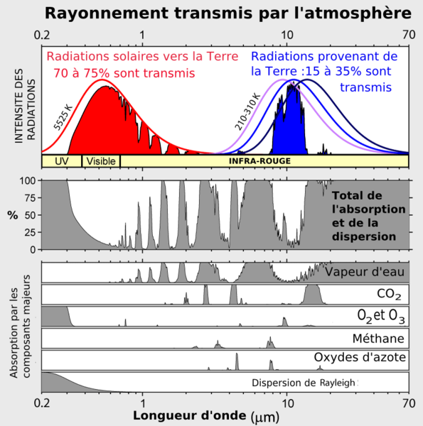

En pondant [ce commentaire](http://www.les-crises.fr/climat-8-analyse-rechauffement/#comment-4676) sur le blog [les-crises.fr](http://www.les-crises.fr/) que j'ai honte de ne découvrir qu'aujourd'hui, une petite recherche sur l'effet de serre m'a conduit à cet excellent graphique, qui remplace au moins 10000 mots :

[Ce graphique](http://www.globalwarmingart.com/wiki/File:Atmospheric_Transmission_png), oeuvre de [Robert A. Rohde](http://www.globalwarmingart.com/wiki/User:Robert_A._Rohde) de [globalwarmingart.com](http://www.globalwarmingart.com/) montre des tas de choses fondamentales, et quelques unes de mes interrogations:

1. le rayonnement "entrant" dans l'atmosphère est la somme de deux "rayonnements du corps noir" : celui du soleil à 5525 K par le haut, et celui de la Terre à 288 K environ actuellement, par le bas.
2. L'ozone nous protège des ultraviolets solaires, mais aussi la [diffusion Rayleigh](w:), qui nous donne ce joli ciel bleu. O3 mérite-t-il d'être considéré comme un méchant [gaz à effet de serre](w:) à cause de quelques petits pics dans l’infrarouge ?
3. Le fameux CO2 a deux petites bandes d’absorption des infrarouges solaires, mais il absorbe surtout du rayonnement thermique émis par le sol ! Sa plus large bande d’absorption se trouvant légèrement "à droite" du sommet du spectre terrestre, l'effet du CO2 diminue(ra) lorsque la surface de la Terre se réchauffe(ra), donc si le spectre "bleu" se décale vers la gauche. Serait-ce là un des phénomènes de stabilisation de la température de la planète ?
4. C'est bel et bien l'eau sous forme de vapeur qui est le principal gaz à effet de serre, non seulement parce qu'il y en a beaucoup dans l'atmosphère (en fait on ne sait même pas combien, tellement ça dépend de la température, de l'altitude et des vents...), mais aussi car ses bandes d'absorption sont nombreuses et larges, entamant le spectre solaire, mais surtout la moitié "froide" du spectre terrestre. Lorsque la Terre connait(ra) une glaciation, l'effet de serre de la vapeur d'eau renforce(ra) celui du CO2 lorsque le spectre bleu se décale(ra) vers la droite.
5. Le méthane et les oxydes d'azote ont quelques pics d’absorption des infrarouges solaires et terrestres, mais certaines dans des bandes absorbées également par la vapeur d'eau. Le GIEC a-t-il bien pris en compte l'effet de non linéarité qui apparaît lorsque l'augmentation de la concentration de ces gaz n'augmente plus notablement un taux d’absorption et de dispersion proche de 100% à ces longueurs d'onde ?

Allez-y, défoulez-vous dans les commentaires. Avec un peu de chance on y trouvera enfin des références claires aux mécanismes de régulation la température qui refroidiront inévitablement (trop?) cette planète un de ces siècles...
