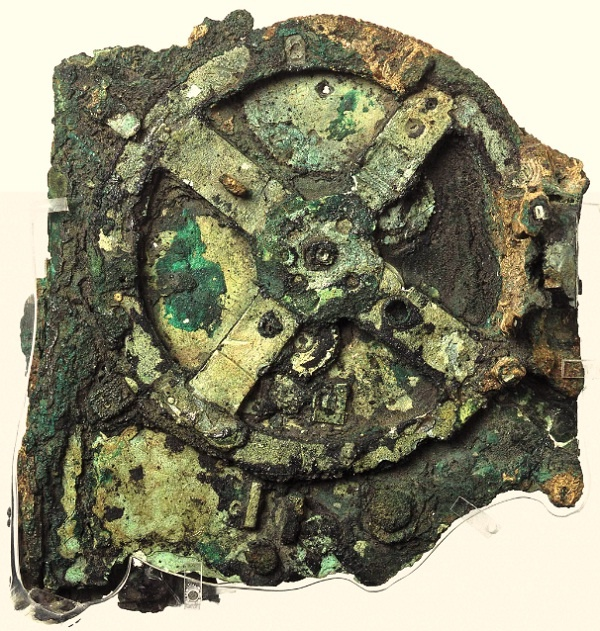
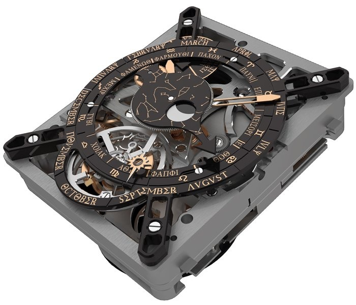
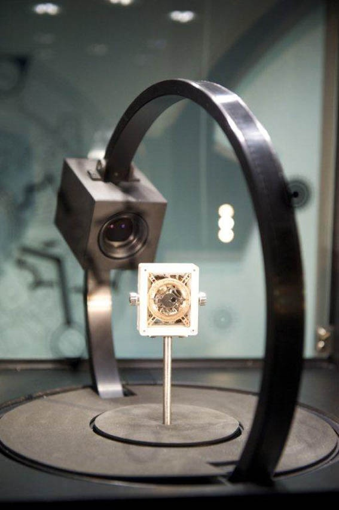

_A l'occasion de la reconstitution de la [Machine d'Anticythère](w:) par [Hublot](http://www.hublot.com) et son [exposition au musée des Arts et Métiers](http://www.arts-et-metiers.net/musee.php?P=214&id=354&lang=fra) à Paris jusqu'en juillet 2012), je voulais écrire un billet à la gloire de l'astronomie, de l'horlogerie suisse, et de la science contre l'ufologie. Puis je suis tombé sur le [communiqué de presse](http://www.hublot.com/fr/news/download/6193_61f663a48d3b11aa3492b1f5bbae5273) d'Hublot qui fait tout ça tellement bien que je me suis dit qu'un tel travail méritait d'être mieux connu, d'autant que la pub y est assez discrète. En plus ils ne feront que 3 exemplaires de leur merveille, qui ne seront pas à vendre... Bref, une fois n'est pas coutume, je vous balance le communiqué de presse intégral avec quelques ajouts de liens et images._

Le mécanisme d’Anticythère est un des objets les plus mystérieux de l’histoire des civilisations. Aujourd’hui reconnu et minutieusement étudié par la communauté scientifique, il a été  découvert en 1901, mais sans qu’on en comprenne alors l’immense intérêt historique et technique. L’idée même d’une « machine » réalisée dans l’Antiquité gréco-romaine n’entrait  pas dans le cadre de travail conceptuel des spécialistes de cette époque. Par la suite, les affirmations obscurantistes des non-scientifiques ont prétendu donner aux artefacts d’Anticythère une nature quasiment extra-terrestre¹, ce qui ne rendait pas le débat plus limpide.

### Des roues dentées rongées par la corrosion

Les fragments de cette « machine » n’ont été analysés de manière approfondie, dans un cadre pluridisciplinaire, qu’au début du XXIe siècle. Ces travaux ont permis de mieux comprendre la complexité de ce mécanisme hors du commun. On admet aujourd’hui que cet « instrument astronomique » est daté du IIe siècle avant notre ère (entre l’an 150 et 100 av. J.-C., avec une estimation récente plus précise autour de 87 avant notre ère). Il s’agissait, à l’origine, d’un « calculateur » dont les rouages de bronze étaient logés dans une caisse de bois d’environ 33 cm x 18 cm, boîtier fermé par deux plaques de bronze recouvertes d’inscriptions.

Il ne reste que 82 fragments de cette « machine », certains minuscules, tous rongés par la corrosion : ils sont à l’abri pour toujours au musée archéologique d’Athènes. Une étude tomographique (scanner à rayons X) très avancée a permis de révéler, en images exploitables scientifiquement et archéologiquement, de nombreux rouages internes, invisibles à l’œil nu, des roues dentées, ainsi que de nouvelles inscriptions cachées sous les concrétions : à peine un quart des lettres grecques archaïques de ce texte gravé sur la « machine » a pu être déchiffré, mais on considère qu’il s’agissait d’une sorte de « mode d’emploi » de ce calculateur mécanique, qu’on suppose également capable d’indiquer le mouvement de certaines planètes majeures. Les engrenages étaient entraînés par ce qu’on pense être une manivelle latérale – sans qu’on puisse exclure l’intervention possible d’un système hydraulique d’appoint.

### Sur la piste du grand Archimède...

On admet aujourd’hui que cette machine aurait pu être conçue à Rhodes où vivaient une communauté d’astronomes comme Hipparque, ainsi que des « mécaniciens » comme Poseidonios. Une nouvelle hypothèse se dessine : cette machine a probablement un rapport  étroit avec Syracuse, en Sicile, la cité du célèbre génie mathématique Archimède, qui était alors une prospère colonie corinthienne. Le mécanisme d’Anticythère aurait pu y être conçu avant son naufrage au large de l’île dont il porte aujourd’hui le nom

Dans l’état actuel des connaissances et selon les inscriptions qui ont été décodées, le mécanisme d’Anticythère pouvait indiquer différents cycles solaires et lunaires, probablement planétaires, en les rapportant aux calendriers civils de plusieurs grandes villes grecques (Corinthe, Delphes ou Olympie), en indiquant les dates des différents jeux de ces villes.... L’étude – encore très récente – du mécanisme d’Anticythère est loin d’être terminée, mais elle a relancé un vaste mouvement de réinterprétation et de reconfiguration de nos connaissances sur l’Antiquité. La réalité des savoirs mécaniques de ces savants grecs est un fantastique champ d’exploration. Il est même possible qu’on retrouve la trace, dans les textes ou dans les réserves cachées des musées, d’autres « machines » du même niveau que celle d’Anticythère.

### Des rouages mécaniques qui expriment une vision mathématique du cosmos

Le mécanisme d’Anticythère n’était pas une horloge capable de donner l’heure : les Grecs anciens ne vivaient pas le temps comme nous. Véritable cosmographe (machine à décrire le cosmos), et plus exactement sélénographe (machine à décrire les mouvements de la Lune) de très haute précision, le mécanisme d’Anticythère pouvait indiquer de multiples cycles astronomiques, comme le [cycle métonique](w:) (du nom de l’astronome grec Méton : il court sur 19 ans, soit 235 lunaisons) ou le cycle callipique (du nom de l’[astronome grec Callipe](w:Callippe_de_Cyzique) : il court sur 76 ans, soit 940 lunaisons ou quatre cycles métoniques), en les corrigeant de leurs imprécisions. Le mécanisme d’Anticythère indiquait également le cycle de [Saros](w:) (223 lunaisons sur un peu plus de 18 ans), ainsi que le cycle Exeligmos (équivalent à trois cycles de Saros, soit 54 ans) qui servaient notamment à prédire les éclipses.

Le volume des données astronomiques compilées pour créer un modèle mathématique apte à synthétiser en rouages mécaniques de tels cycles laisse rêveur sur les capacités conceptuelles des savants et des mécaniciens de l’Antiquité. Si on admet qu’un ordinateur est capable de restituer en sortie d’autres informations que celles qui lui ont été données en entrée, la « machine » d’Anticythère est bien le premier ordinateur mécanique connu de l’histoire de l’humanité. Il devance d’un bon millénaire les premières horloges astronomiques réalisées, sur une toute autre échelle, dans les grandes villes européennes du Moyen Age.

### La première montre jamais inspirée par une découverte archéologique

En 2008, la révélation par le magazine scientifique Nature \[1\] des analyses tomographiques pratiquées sur les fragments de la machine n’a pas manqué d’enflammer l’imagination de quelques horlogers un peu hardis.



Mathias Buttet, qui est aujourd’hui Directeur Fabrication et R&D à la manufacture Hublot, a voulu rendre hommage au premier chef-d‘œuvre mécanique que nous a légué l’histoire. Un hommage technique, en miniaturisant² aux dimensions d’une montre-bracelet l’ensemble de la mécanique d’Anticythère tel qu’il a été révélé par l’analyse scientifique. Un hommage horloger en ajoutant à ce calculateur astronomique une nouvelle dimension, celle d’un objet du temps à part entière, capable de donner l’heure avec précision.

C’est la première fois dans l’histoire des montres qu’un bureau de développement horloger s’inspire ainsi directement d’une mécanique « archéologique » héritée de l’Antiquité. C’est aussi la première fois qu’une équipe horlogère travaille ainsi, main dans la main, avec une équipe scientifique qui regroupe des sommités internationales de l’archéologie, de l’épigraphie et des historiens de la mécanique.

Les horlogers ont aidé les archéologues à mieux comprendre certains rouages et à valider certaines hypothèses mécaniques, tandis que les scientifiques ont révélé aux horlogers des solutions techniques oubliées depuis l’Antiquité (notamment des engrenages circulaires à cycles non linéaires).

La capacité même des mécaniciens de l’Antiquité à réaliser des rouages en bronze d’une telle efficacité ouvre de nouveaux horizons sur leurs rapports philosophiques au progrès technique et à la place des machines dans leur conception du monde – ce qui ne peut que nous questionner en retour sur notre propre relation aux machines et aux « prothèses » de la modernité...

Un respect intégral des indications astronomiques du mécanisme imaginé par les grecs Le défi de l’équipe de Mathias Buttet était d’intégrer un mouvement horloger dans une réinterprétation miniaturisée du mécanisme d’Anticythère, en respectant l’architecture de ce dernier, et notamment son double affichage recto-verso. La première performance de cette équipe a été de réaliser entre quelques centimètres cubes ce que les mécaniciens de l’Antiquité avaient développé en quelques centaines de centimètres cubes, sans rien perdre de l’esprit initial du mécanisme, ni de sa précision, ni de la lisibilité de ses indications.

Les heures et les minutes sont affichées de façon classique au centre du mouvement récréé par Hublot et présenté pour la première fois au musée des Arts et Métiers de Paris, dans le cadre de l’exposition « Anticythère, l’énigmatique machine surgie du fonds du temps ». Ce mouvement horloger est régulé par un tourbillon, tout aussi classique, dont la « cage » à 6 h fait un tour sur elle-même en une minute. Les différentes indications connues de la « machine » d’Anticythère ont été respectées sur la future montre, au recto comme au verso. Sur la première face du mouvement : le calendrier des jeux Panhelléniques (qui désignait les villes accueillant ces jeux), le calendrier égyptien (12 mois de 30 jours, avec les jours épagomènes – supplémentaires), la position du soleil dans les constellations du Zodiaque, les phases de la Lune (dans une magistrale aiguille à guichet, qui indique la position de la Lune dans le zodiaque tout au long du mois sidéral), ainsi que l’année sidérale. Au dos du mouvement horloger, on trouve le cycle Callipique, le cycle métonique, le cycle de Saros et le cycle Exeligmos.

### Un hommage de la micro-mécanique moderne aux mécaniciens de l’Antiquité

C’est la première fois dans l’histoire des objets du temps que ces cycles – hérités de l’Antiquité – sont étudiés, reproduits et affichés mécaniquement : l’équipe Hublot a dû, pour mettre au point certains de ces engrenages, développer un concept très innovant d’aiguilles télescopiques non circulaires, capables de pointer sur des disques en spirale de diamètre variable.

La montre Hublot « Anticythère », où sera logé ce mouvement d’horlogerie dont l’idée est née dans l’Antiquité, sera présentée au salon horloger de Bâle ([Baselworld](http://www.baselworld.com/))³ au printemps 2012. D’ici là, le mouvement sera présenté dans une exposition permanente que le musée des Arts et Métiers consacre au mécanisme d’Anticythère : un film 2D et 3D réalisé par Hublot y est projeté pour faire découvrir au public toute l’histoire de cette « machine » d’Anticythère, de l’Antiquité à nos jours, en créant une passerelle entre le savoir des mécaniciens de l’Antiquité et celui des horlogers du XXIe siècle.



Ce film est également à découvrir [sur YouTube](http://www.youtube.com/user/antikythera2012)

### Notes

1. la première fois que j'ai entendu parler de ce truc, ce devait être par [Jacques Bergier](w:) comme preuve de l'Atlantide...
2. la [miniaturisation](/2009/06/11/il-y-a-plein-de-place-en-bas-2/) rend les choses plus faciles, ne l'oublions pas....
3. à Paris avent Baselworld ??? Tout fout l' camp...

\[1\] Jo Marchant "[In search of lost time](http://www.nature.com/nature/journal/v444/n7119/full/444534a.html)" Nature 2006;444;534-538
