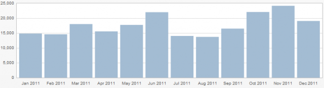

Les blogs actuels collectent des données statistiques à faire pâlir d'envie la presse écrite. Je sais ainsi que sur les 33 articles (seulement...) publiés en 2011, 4 sont déjà dans le top 10 du blog avec plus de 3000 lectures : [La véritable histoire de Livermore](/2011/10/16/la-veritable-histoire-de-lampoule-de-livermore/ "La véritable histoire de l’ampoule de Livermore"), [Pyramides et populations](/2011/02/06/pyramides-et-populations/ "Pyramides et populations"), [le Sleep sort](/2011/06/19/le-sleep-sort/ "Le « Sleep sort »") et [Qui veut de l'électricité à prix négatif ?](/2011/01/15/qui-veut-de-lelectricite-a-prix-negatif/ "Qui veut de l’électricité à prix négatif ?")

Je sais aussi que 16322 visiteurs sont arrivés sur drgoulu.com via un moteur de recherche, dont 11112  par Google et 4532 de plus par Google ImageSearch, donc des miettes pour les autres. 235 arrivées seulement via  le Bing de Microsoft... soit ce truc a un nom prédestiné, soit le site y est mal référencé (oui, voilà c'est corrigé).

Je connais même les mots recherchés et le nombre de visiteurs qu'ils ont conduits ici:

| Recherche | Visualisations |
| --- | --- |
| shazam | 4 449 |
| arcimboldo | 1 900 |
| dr goulu | 1 337 |
| mémoire eidétique | 789 |
| plenoptique | 646 |
| jeux intelligent | 624 |
| pyramide des ages france 2011 | 623 |
| galaxie | 577 |
| comment fonctionne shazam | 573 |

Et c'est vrai qu'en [cherchant Shazam sur Google](http://www.google.fr/search?q=shazam), mon article de 2009 "[Comment marche Shazam](/2009/07/11/comment-marche-shazam/ "Comment marche Shazam")" arrive en 2ème position ce qui explique que c'est toujours l'article le plus vu (sinon le plus lu...) sur ce blog cette année, avec plus de 10000 accès.

A part ça, près de 2800 visites proviennent du [C@fé des Sciences](http://www.cafe-sciences.org/), la Communauté de blogs de sciences en français dont je suis membre, et qui vient de s'équiper d'une plateforme Wordpress très chouette. Il y a eu aussi 550 visites depuis [knowtex.com](http://knowtex.com), un site proche du C@fé. Merci aussi aux membres pour les liens vers drgoulu, ça fait bien 1000 visites de plus en tout.

On trouve aussi quelques surprises qui montrent l'importance d'être lié à la toile : à elle seule [cette discussion sur le forum linuxfr.org](http://linuxfr.org/users/nicolas_gaudin/journaux/une-autre-excuse-pour-ne-pas-bosser%E2%80%A6) a amené plus de 1000 visites au "[Sleep sort](/2011/06/19/le-sleep-sort/ "Le « Sleep sort »")", [celle-ci sur MacBidouille](http://forum.macbidouille.com/index.php?showtopic=345257&st=0) plus de 500 à "[Adieu focale, bonjour plenoptique](/2010/10/07/adieu-focale/ "Adieu focale, bonjour plenoptique !")".

Il y a pile un an je me suis mis à Twitter, avec des [résultats spectaculaires](http://microclub.ch/2011/01/26/twitter-le-retour/) pour l'audience du blog sur le moment, mais pas si nets après un an : seulement 1100 visites depuis Twitter en 2011. Je n'ai pas encore dompté le petit oiseau bleu...

Pages vues / mois en 2011

Au final, environ 17000 pages de drgoulu.com sont vues chaque mois, assez pour me motiver à continuer, merci à tous !

Merci tout particulier à mes 800 fidèles abonnés au flux RSS, grâce auxquels drgoulu est encore remonté dans le [classement Wikio eBuzzing des Sciences Exactes](http://labs.ebuzzing.fr/top-blogs/sciences_exactes) (je suis quatrièmeueu ! ), et dans [le Suisse](http://labs.ebuzzing.fr/top-blogs/suisse) accessoirement.

Il y aura très bientôt le traditionnel article de début d'année avec voeux, bonnes résolutions et propriétés rigolotes du nombre 2012, mais d'ici là je vous souhaite à tous un excellent réveillon de la Saint Sylvestre !
