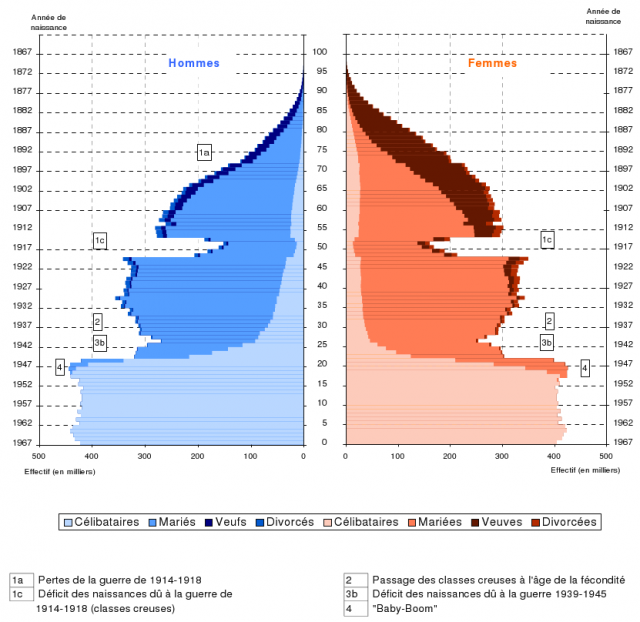

Les évènements d'Egypte me donnent l'occasion de parler de pyramides. Pas celles d'où quarante siècles nous contemplent, je veux parler des "[pyramides des âges](w:pyramide_des_âges)" qui montrent la répartition des âges et des sexes dans les populations. Celle de l'Egypte est presque aussi parfaite et instructive que celle de Kheops:



Sur 82 millions d'habitants, 60% ont moins de 30 ans, et 22% moins de 10 ans. Pas étonnant de voir des jeunes faire la révolution... Sur la pyramide, on voit qu'un "baby boom" a eu lieu il y a 30 ans, pour être précis de 1973 à 1987. En 1987, le [taux de croissance de la population](http://www.gapminder.org/world/#$majorMode=chart$is;shi=t;ly=2003;lb=f;il=t;fs=11;al=30;stl=t;st=t;nsl=t;se=t$wst;tts=C$ts;sp=5.59290322580644;ti=2008$zpv;v=1$inc_x;mmid=XCOORDS;iid=phAwcNAVuyj0XOoBL_n5tAQ;by=ind$inc_y;mmid=YCOORDS;iid=pyj6tScZqmEcl2xDWbuJ8fg;by=ind$inc_s;uniValue=8.21;iid=phAwcNAVuyj0XOoBL_n5tAQ;by=ind$inc_c;uniValue=255;gid=CATID0;by=grp$map_x;scale=lin;dataMin=6200562;dataMax=86428486$map_y;scale=lin;dataMin=0.5638;dataMax=3.455$map_s;sma=49;smi=2.65$cd;bd=0$inds=i65_t001960,,,,) à atteint 2.75%, puis a baissé rapidement jusqu'en 1994 pour se stabiliser autour de 1.8% depuis. Aujourd'hui les enfants de la génération baby boom provoquent une nouvelle augmentation rapide des naissances, malgré la baisse régulière du [nombre d'enfants par femme](http://www.gapminder.org/world/#$majorMode=chart$is;shi=t;ly=2003;lb=f;il=t;fs=11;al=30;stl=t;st=t;nsl=t;se=t$wst;tts=C$ts;sp=5.59290322580644;ti=2009$zpv;v=1$inc_x;mmid=XCOORDS;iid=phAwcNAVuyj0XOoBL_n5tAQ;by=ind$inc_y;mmid=YCOORDS;iid=phAwcNAVuyj0TAlJeCEzcGQ;by=ind$inc_s;uniValue=8.21;iid=phAwcNAVuyj0XOoBL_n5tAQ;by=ind$inc_c;uniValue=255;gid=CATID0;by=grp$map_x;scale=lin;dataMin=5793884;dataMax=85717200$map_y;scale=lin;dataMin=0.855;dataMax=8.7$map_s;sma=49;smi=2.65$cd;bd=0$inds=i65_t001954,,,,), passé en dessous de 3 en 2006. Ce nouveau baby boom est heureusement amplifié par une bonne nouvelle : en 30 ans, la [mortalité infantile](http://www.gapminder.org/world/#$majorMode=chart$is;shi=t;ly=2003;lb=f;il=t;fs=11;al=30;stl=t;st=t;nsl=t;se=t$wst;tts=C$ts;sp=5.59290322580644;ti=2008$zpv;v=1$inc_x;mmid=XCOORDS;iid=phAwcNAVuyj0XOoBL_n5tAQ;by=ind$inc_y;mmid=YCOORDS;iid=0ArfEDsV3bBwCcGhBd2NOQVZ1eWowNVpSNjl1c3lRSWc;by=ind$inc_s;uniValue=8.21;iid=phAwcNAVuyj0XOoBL_n5tAQ;by=ind$inc_c;uniValue=255;gid=CATID0;by=grp$map_x;scale=lin;dataMin=6200562;dataMax=86428486$map_y;scale=log;dataMin=1.7;dataMax=682$map_s;sma=49;smi=2.65$cd;bd=0$inds=i65_t001960,,,,) a baissé d'un facteur 7, à un niveau aujourd'hui [comparable à la Turquie, la Chine, ou la Tunisie](http://www.gapminder.org/world/#$majorMode=chart$is;shi=t;ly=2003;lb=f;il=t;fs=11;al=30;stl=t;st=t;nsl=t;se=t$wst;tts=C$ts;sp=5.59290322580644;ti=2009$zpv;v=1$inc_x;mmid=XCOORDS;iid=phAwcNAVuyj1jiMAkmq1iMg;by=ind$inc_y;mmid=YCOORDS;iid=0ArfEDsV3bBwCcGhBd2NOQVZ1eWowNVpSNjl1c3lRSWc;by=ind$inc_s;uniValue=8.21;iid=phAwcNAVuyj0XOoBL_n5tAQ;by=ind$inc_c;uniValue=255;gid=CATID0;by=grp$map_x;scale=log;dataMin=282;dataMax=119849$map_y;scale=log;dataMin=1.7;dataMax=682$map_s;sma=49;smi=2.65$cd;bd=0$inds=i65_t001954,,,,;i230_t001959,,,,) d'ailleurs...

D'après les prévisions, la population égyptienne devrait se stabiliser autour de 138 millions d'habitants en 2050 [[1]](#ref-1). Loger, instruire, soigner et donner du travail à 56 millions d'habitants de plus en 40 ans, voilà un sacré défi pour les successeurs de Moubarak...

Face à un problème similaire à la fin des années 70, la Chine a drastiquement limité les naissances par la "[politique de l'enfant unique](w:)", qui a causé et cause encore des perturbations assez brutales de la pyramide:



En principe la population de la Chine atteindra un maximum vers 2025 et décroîtra ensuite. En 2050 il y aura autant de chinois qu'aujourd'hui [[2]](#ref-2), et la pyramide chinoise ressemblera un peu à celle de la Suisse actuellement, typique d'une population vieillissante :



La pyramide des âges révèle de façon claire les épisodes douloureux d'une population, et le fait que 2 génération suffisent à les oublier. Voici par exemple la pyramide de la France en 1968 [[3]](#ref-3) (quand d'autres jeunes avaient tenté de renverser un gouvernement de vieux...)

De 1914 à 1918, le niveau des naissance a baissé de près de 50% du fait de la guerre, surtout par l'absence des pères au front, mais aussi à cause des ravages de la grippe espagnole, créant d'impressionnantes entailles dans la pyramide. 20 ans plus tard, ces "classes creuses" arrivent à maturité en même temps que la seconde guerre mondiale : les deux causes de déficit se combinent, mais ne provoquent pas un creux aussi important qu'en 14-18. Mais juste après il se passe quelque chose d'étonnant : le niveau des naissances bondit et se stabilise pendant plusieurs années consécutives. 40 ans plus tard, la pyramide française est devenue une colonne bien stable :



Avec des [tables de mortalité](w:) et des [taux de fécondité](w:), les démographes peuvent calculer assez simplement l'évolution d'une pyramide des âges et de simuler l'effet à long terme de décisions politiques comme l'âge de la retraite [[4]](#ref-4). Du haut de sa pyramide, on comprend aussi que le remplacement du président égyptien et l'élimination de la corruption ne suffiront pas à donner à ce pays magnifique la croissance économique dont sa jeune population rêve. S'ils ne veulent pas attendre 40 ans de plus, les égyptiens comme les tunisiens et bien d'autres devront probablement passer par une étape à la chinoise...

### Références:

1. [Demographic Indicators from International Data Base (IDB), U.S. Census Bureau](https://web.archive.org/web/20110429213959/http://www.census.gov/ipc/www/idb/country.php) (Pyramides des âges de tous pays et presque toutes dates)
2. Xénia Melo & Pascal Rocha da Silva "[Projection de la population chinoise 2000-2050](http://www.sinoptic.ch/textes/articles/2007/2007_Projection.population.Chine.pdf)", Cours-séminaire de Modèles et perspectives démographiques, Université de Genève, Printemps 2007
3. [la pyramide des âges de la France au premier janvier 1968](https://web.archive.org/web/20240619173720/http://www.insee.fr/fr/ppp/bases-de-donnees/irweb/sd2005/dd/pdf/sd2005_pyra1968.pdf)
4. [Evolution démographique avec Sysquake](https://web.archive.org/web/20110131103421/http://www.calerga.com/products/Sysquake/demogr-fr.html) (un peu de pub pour le génial "Matlab interactif" d'un collègue)
