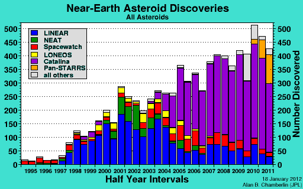
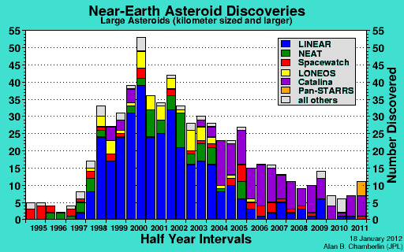

Le passage de l'[astéroïde géocroiseur](w:) [2012 BX34](w:) à moins de 60'000 km de la Terre hier est l'occasion de rassembler quelques infos sur les chutes de pierres de l'espace.

D'abord, il s'avère que l'espace est assez caillouteux. Le "[Near Earth Object Program](w:)" et le "[Minor Planets Center](w:Centre_des_planètes_mineures)" recensent des milliers de géocroiseurs de toutes tailles depuis la fin des années 1990, où la mise en place d'instruments de plus en plus  performants a permis d'augmenter progressivement le rythme des découvertes à près de 900 en 2011

Depuis l'an passé, le [Pan-STARRS](w:) et sa caméra de 1.4 Gigapixels viennent relever le [Catalina Sky Survey](w:) qui lui-même succédait au [LINEAR](w:Lincoln_Near-Earth_Asteroid_Research) dans la quête, essentiellement américaine, d'astéroïdes de plus en plus petits. Parce que pour les gros, on commence à en avoir fait le tour : en 2011 on n'a repéré "que" 19 astéroïdes de plus d'un km contre plus de 90 en 2000 :

Il n'y a donc pas énormément plus d'[objet potentiellement dangereux](w:) que les 1300 actuellement connus. Le danger représenté par chacun de ces objets est codifié depuis 1999 par l'[échelle de Turin](w:) qui attribue un niveau et une couleur en fonction de la taille de l'objet et de sa probabilité de collision:



Un objet de moins de 20m tel que 2012 BX34 n'y est pas considéré comme méritant un attention particulière même s'il était sur une trajectoire de collision certaine. Avec un peu de chance, ça en fait une attraction touristique comme à [Hoba, en Namibie](/2010/08/28/namibie/). Pour les objets plus gros, les astronomes commenceraient à les examiner avec attention dans la zone jaune, la politique commencerait à s'inquiéter quelques décennies avant une rencontre possible dans la zone orange, en essayant peut-être d'envoyer une mission spatiale pour dévier l'objet.



Dans la zone rouge, c'est le scénario catastrophe. Au niveau 8 ça va encore : tous les quelques siècles un caillou fait un cratère du genre [Meteor](w:) Crater, ratiboise une forêt comme à la [Toungouska](w:événement_de_la_Toungouska) en 1908 ou tombe à l'eau en ne tuant que quelques poissons. Sur une ville, évidemment, ça ferait des dégâts comparables à une [Tsar Bomba](w:) ... Une collision de niveau 9 se produit tous les quelques millénaires et pourrait détruire une région entière. Des centaines de milliers d'années s'écoulent en moyenne entre des collisions de niveau 10. Là c'est [Manicouagan ou Rochechouart](/2009/04/16/de-manicouagan-a-rochechouart/) par exemple : continents dévastés, voire grand reset planétaire.

Pas de panique: pour l'instant il n'y a que [2 objets classifiés "niveau 1" et aucun plus haut](http://neo.jpl.nasa.gov/risk/). Seul [Apophis](<w:(99942)_Apophis>) (250m) a été classé 2, puis 4 en 2004, avant que les astronomes n'écartent tout risque de collision pour le 13 avril 2029, mais comme ils avaient un doute sur son passage suivant en 2036 ils l'ont laissé "niveau 1" avant de le remettre au niveau 0 une fois ce risque écarté lui aussi. Déçus, les astronomes ont créé une [échelle de Palerme](w:) beaucoup plus fine que celle de Turin pour pouvoir continuer à classer les géocroiseurs par risques microscopiques.

D'un autre côté, [Bad Astronomer](http://blogs.discovermagazine.com/badastronomy/2008/10/13/death-by-meteorite/) estime que ce risque n'est pas négligeable : puisque la probabilité qu'une météorite géante détruise toute vie humaine sur Terre est de 1/100'000'000 par année sur le long terme, et comme nous sommes 7 milliards, les impacts de niveau 10 font 70 morts par année en moyenne! Et en tenant compte de la [loi de puissance](w:) qui lie la probabilité d'un impact à sa gravité, il estime statistiquement qu'une personne sur 700'000 meurt tuée par une météorite :-)

De mémoire d'homme, on est évidemment nettement en dessous de la moyenne. Seule une femme, Ann Elizabeth Hodges, a été blessée par une météorite authentifiée à [Sylacauga](w:Météorite_de_Sylacauga) en 1954. En 1992, un jeune ougandais a été touché par un fragment de météorite à [Mbale](http://dmsweb.home.xs4all.nl/meteorites/mbale/mbale.html), sans être blessé. L'histoire du [jeune allemand](w:en:Gerrit_Blank) blessé en 2009 est probablement un canular.

Mais peut-être avez-vous peur de vous brûler en ramassant une météorite fraîchement tombée du ciel , ce qui arrive  [relativement souvent](w:Liste_de_chutes_météoriques_observées) ? Pour ma part j'ai été rassuré en entendant l'an passé une [émission à la RSR](http://www.rsr.ch/#/la-1ere/programmes/impatience/?date=01-09-2011) sur la météorite de la Chervettaz, tombée [par ici](http://maps.google.ch/maps?q=46.557857,6.80028&hl=fr&num=1&gl=ch&t=h&z=15) en 1901 et [exposée avec d'autres à Lausanne jusqu'au 18 mars 2012](http://www.carionmineraux.com/Expo_meteorite_lausanne.htm). Pesant 750 grammes, elle a été ramassée peu après sa chute par des bûcherons qui l'ont trouvé juste tiède. Pourtant on pourrait se dire qu'un caillou de cette taille chauffé à blanc doit rougeoyer quelques temps au sol comme dans tout film de Superman. Et bien non. Dans le vide spatial, les météorites sont très froides, au mieux chauffées à quelques dizaines de kelvin par le Soleil. Disons autour de -200° C. En entrant dans l’atmosphère, leur surface s’échauffe très violemment pendant quelques secondes, mais la [chaleur](w:transfert_thermique) n'est pas suffisante pour élever notablement la [température](w:) de toute la masse de la météorite. En fait, une fois au sol, c'est plutôt l'intérieur resté froid qui refroidit rapidement la surface.

Ce qui fait des météorites d'excellents congélateurs : leur composition d'origine n'est que très peu altérée par leur long séjour dans l'espace et par leur rapide chute sur Terre. Ainsi la [météorite de Tissint](w:) qui vient d'être découverte au Maroc après avoir été [éjectée de Mars](w:météorite_martienne) il y a longtemps nous apporte 7 kg d'informations toutes fraîches sur notre voisine rouge, sans frais de transport. Mais peut-être avec des virus martiens ...
