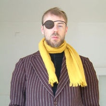

_(article soumis au concours du 500ème article de "Strange Stuff and Funky Things", qui l'a [publié dans sa série \[Freaky Friday Parasite\]](http://ssaft.com/Blog/dotclear/index.php?post/2012/02/10/%5BFreaky-Friday-Parasite%5D-Acanthamoeba))_

_(article repris dans )_

[Acanthamoeba](w:) est un genre d'amibes extrêmement communes. On en trouve partout : dans l'eau douce y compris potable, dans le sol, et même dans l'air sous forme de kystes volants. Les Acanthamoeba mangent des bactéries et contribuent ainsi aux premières étapes de la chaîne alimentaire qui transforme le carbone dissous dans l'eau en steaks, ce qui les classe définitivement dans la catégorie "animaux utiles" de mon premier cours de catéchisme.

De plus les biologistes cultivent des quantités de l'espèce A. Castellanii à raison d'environ 10¹² bestioles par kilo comme "[organisme modèle](w:)" utilisé dans toutes sortes de recherches en biochimie, biologie moléculaire etc. Catégorie "animaux inoffensifs" a priori.



Mais a_canthos_ signifiant _épineux_ en grec (à ne pas confondre avec [_echinos](w:Echinoidea)_, qui veut dire _épine_ en grec...) ,  vous vous attendez certainement à ce que ces microbes méritent leur place dans un article de ce blog en causant un problème. Gagné! En fait ils en causent même plusieurs.

Acanthamoeba ne dérange pas trop notre système digestif qui a du s'y habituer depuis le temps, mais aime bien grignoter de la bactérie bien fraîche à la surface de nos yeux. Une baignade dans un étang un peu tiède et hop, c'est quasiment sur, quelques amibes croissent et multiplient sur vos cornées. Une petite douche plus tard, elles s'en vont comme elles sont venues, dans une goutte d'eau.

Sauf si vous ne vous douchez pas, ou avec l'eau du même étang. Ou si vous mettez vos lentilles de contact. Quelques espèces d'Acanthamoeba adorent les lentilles de contact : ça les protège de l'air qui pourrait les dessécher ou de vos doigts qui pourraient les essuyer, et ça maintien un petit film humide juste à la température où les bactéries peuvent profiter de la lumière pour devenir des proies facile à lyser. Et quand il n'y a plus de bactéries ou qu'elle n'a plus faim, Acanthamoeba s'enkyste, mais comme le plastique de la lentille est un peu dur à creuser, elle préfère se planquer dans la cornée...

Au début, ça pique les yeux comme une conjonctivite, mais les collyres ne soulagent que très temporairement. Et puis on va voir un ophtalmo qui va prescrire des antibiotiques "pour voir", le temps de faire des analyses assez longues. Il ne veut pas effrayer le patient en lui parlant de "[kératite à acanthamoeba](w:Acanthamoeba#kératite_à_acanthamoeba)" tellement c'est rare. Et on perd un temps préc-yeux, parce qu'un diagnostic rapide permet de bien limiter les dégâts. Vous voulez voir à quoi ressemble un oeil infecté par des amibes au bout de quelques temps ? Vous êtes surs ?  Sinon, vous pouvez aussi scroller vite d'une page vers le bas, c'est permis. Prêt ? alors voilà:



Bon, là c'est le stade irréversible qui nécessite une [énucléation](w:). En osant cliquer sur l'image vous verrez des stades moins avancés où un traitement médicamenteux est encore possible, et si ça ne marche pas seule une greffe de cornée permet de sauver l'oeil, à condition que l'oeil n'ait pas produit trop de vaisseaux sanguins dans la cornée pour essayer d'y amener plus de globules blancs à la rescousse. On se tient les pouces pour Caroline qui attend une cornée depuis plusieurs mois, et on remercie (d'avance...) tous les futurs donneurs d'organes, y compris les yeux.

Après ça ai-je encore besoin d'insister sur l'importance de l'hygiène pour les porteurs de lentilles de contact ? Non ? Vous avez compris le message ? Je coupe/colle quand même les recommandations du Syndicat National des Ophtalmologistes de France  (SNOF), on ne sait jamais:

> - Bien se laver les mains et les sécher convenablement avant toute manipulation de lentilles
> - Utiliser un oxydant pour nettoyer les lentilles souples
> - Nettoyer régulièrement le boîtier des lentilles avec le liquide de conservation des lentilles, l'essuyer et le laisser sécher ouvert. Le changer fréquemment
> - Ne pas mettre de lentilles sous une douche, dans les piscines ou en eau douce (jacuzzi, lac...)
> - Ne jamais nettoyer des lentilles avec l'eau du robinet
> - En cas de gêne ou de douleur (même augmentant au dépôt des lentilles):ôter les lentilles , consulter un ophtalmologiste en urgence
> - Toujours posséder une paire de lunettes correctrices adaptée en complément des lentilles

Regardez encore cette vidéo (supprimée...) [page](http://imomus.com/matt.html) qui explique pourquoi [Momus](w:Momus_(artiste)) a désormais un look de pirate, et on pourra passer à la suite...

Il arrive que certaines amibes parviennent par un mécanisme encore pas très bien compris jusqu'à notre cerveau. C'est extrêmement rare, quelques dizaines cas par an dans le monde, mais le résultat est très bien documenté : la mort en quelques jours. L'[encéphalite amibienne granulomateuse](w:Acanthamoeba#encéphalite_amibienne_granulomateuse)  causées par  Acanthamoeba   étant [très similaire](w:Fichier:Free-living_amebic_infections.png) à la [MEAP](w:Méningo-encéphalite_amibienne_primitive) due à [Naegleria fowleri](w:) dont [Taupo a récemment  causé avec brio, compétence et images dégoutantes](http://ssaft.com/Blog/dotclear/index.php?post/2012/01/13/%5BFreaky-Friday-Parasite%5D-L-attaque-des-amibes-cerebrophages), on n'en dira pas plus ici à ce sujet.

Reste encore une belle épine que les Acanthamoeba nous plantent bien profond par un mécanisme bien tortueux. Depuis 1994 on sait que [Legionella pneumophila](https://fr.wikipedia.org/wiki/Legionella pneumophila) se propage en utilisant Acanthamoeba castellanii et en 2006 une équipe de l'Université de Bath a démontré que les "MRSA" plus connus sous le nom de [Staphylocoques dorés résistants aux antibiotiques](w:Staphylococcus_aureus_résistant_à_la_méticilline) arrivent à survivre à l'intérieur d' Acanthamoeba polyphaga et à s'y reproduire pendant que ces amibes omniprésentes leur servent d'omnibus entre les chambres d’hôpital.



Plus embêtant encore : comme les amibes essaient de transformer ces bactéries en miam-miam à l'aide de substances qui sont par définition des [antibiotiques](w:), les bactéries que Dame Evolution préserve des dites substances (dont Elle essaie plein de combinaisons par ailleurs...) en ressortent plus résistantes encore. Ces bactéries sont donc nietzschéistes : "ce qui ne nous tue pas nous rend plus fort", mais pour nous c'est la variante "ce qui les rend plus fort nous tue" qu'on a favorisé en récurant nos hôpitaux avec des antibiotiques.

Maintenant qu'on a compris, on va aussi viser ces sales bêtes nuisibles d'amibes. Mais juste dans les hopitaux, hein ? Et à la rigueur dans les étangs, parce que dans le sol je les aime bien, moi, les Acanthamoeba faiseuses de steaks.

## Références

1. [Amibes et lentilles cornéennes](http://www.snof.org/maladies/amibes.html) sur le site du SNOF
2. 
3. [Greffe de cornée](http://www.snof.org/encyclopedie/la-greffe-de-corn%C3%A9e-k%C3%A9ratoplastie-transfixiante) (kératoplastie transfixiante) sur le site du SNOF
4. S. Carrette et al "[A propos d'un cas de kératite à Acanthamoeba](http://www.ophthalmologia.be/download.php?dof_id=42)", Bull. Soc. belge Ophtalmol., 275, 49-53, 2000.
5. Cirillo JD, Falkow S, Tompkins LS "Growth of Legionella pneumophila in Acanthamoeba castellanii enhances invasion." Infect Immun. 1994 Aug;62(8):3254-61.
6. [MRSA use amoeba to spread, sidestepping hospital protection measures](http://www.bath.ac.uk/news/articles/releases/mrsaamoeba280206.html), University of Bath,Press Release - 28 February 2006
7. [Pathogenic Noms for Acanthamoeba polyphaga](http://eukaryoticmicrobe.blogspot.com/2011/12/pathogenic-noms-for-acanthamoeba.html) sur le blog "Travelling small with a nucleus"
