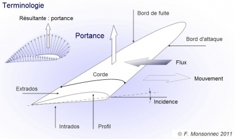
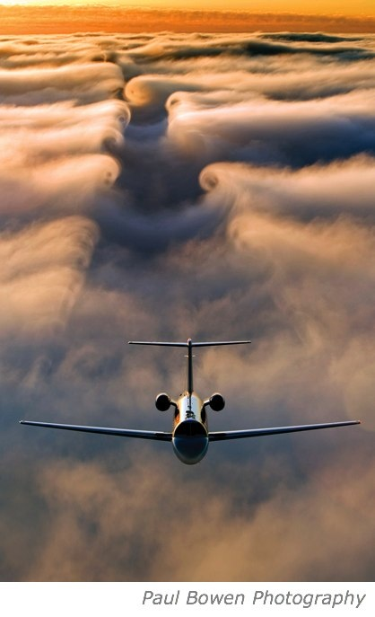
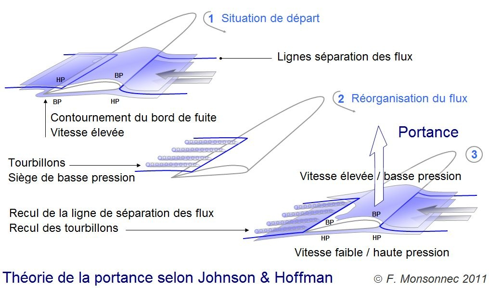

Grâce à elle les oiseaux et les avions volent, les voiliers naviguent, les turbines turbinent et pourtant elle reste plus mystérieuse qu'on ne l'imagine. Frédéric Monsonnec (Fred) vient de signer pas [un](http://foils.wordpress.com/2011/12/07/portance-13/), ni [deux](http://foils.wordpress.com/2012/01/18/portance-23-2/), mais bien [trois](http://foils.wordpress.com/2012/02/09/portance-33/) articles passionnants et magnifiquement illustrés sur la [portance](https://fr.wikipedia.org/wiki/Portance_(mécanique_des_fluides)), où il montre qu'il n'y a toujours pas d'explication 100% satisfaisante de cette force à ce jour.

Surprise. Pour ma part je pensais que la cause était entendue : l'air passant sur l'extrados d'une aile doit parcourir un chemin plus grand que celui passant sous l'intrados, donc il doit aller plus vite et selon le [théorème de Bernoulli](https://fr.wikipedia.org/wiki/théorème_de_Bernoulli) (un suisse) sa pression s'abaisse et l'aile est "aspirée" vers le haut par la différence de pression. C'est d'ailleurs [l'explication sur la wikipédia francophone](https://fr.wikipedia.org/wiki/Portance_(mécanique_des_fluides)#Généralités). Mais elle est fausse, comme [le dit la version anglaise](https://en.wikipedia.org/wiki/Lift_(force)#.22Popular.22_explanation_based_on_equal_transit-time) et le montre une [petite applet sur le site de la NASA](http://www.grc.nasa.gov/WWW/K-12/airplane/wrong1.html). En fait on s'en doute un peu : d'une part il existe des profils d'ailes symétriques qui génèrent une portance grâce à leur angle d'incidence alors que les chemins parcourus par le fluide sont égaux des deux côtés de l'aile, et d'autre part une voile en tissu produit également une portance avec une différence de parcours très faible entre les deux faces du tissu.

Invoquer l'[effet Venturi](https://fr.wikipedia.org/wiki/effet_Venturi) (un italien) ne résout [rien](http://www.grc.nasa.gov/WWW/K-12/airplane/wrong3.html), et l'[effet Coanda](https://fr.wikipedia.org/wiki/Effet_Coand%C4%83) (un roumain) pas mieux : aucune de ces théories ne permet d'expliquer pourquoi une simple planche plate peut servir de (mauvaise) aile. Ceci turlupinait d'ailleurs les théoriciens depuis 1749 déjà, lorsque d'Alembert (un français) conclut ses travaux sur la mécanique des fluides par un [paradoxe](https://en.wikipedia.org/wiki/D'Alembert's_paradox) : mathématiquement, aucune force ne devrait s'exercer sur un corps en mouvement rectiligne uniforme dans un fluide...

Ce n'est qu'au début du XXème siècle que Kutta (un allemand) et Jukowski (un russe) levèrent indépendamment le  paradoxe en introduisant la notion de "circulation" dans ce qui est connu désormais comme le [théorème de Kutta-Jukowski](https://fr.wikipedia.org/wiki/théorème_de_Kutta-Jukowski). Selon cette théorie, l'important est que le profil ait un bord de fuite tranchant. Initialement, le fluide passant par le côté de l'aile le plus court (en principe l'intrados) doit franchir le bord de fuite à haute vitesse et remonter le flux pour "rejoindre" le fluide qui emprunte le chemin le plus long. Un bord de fuite tranchant force la formation d'un "tourbillon initiateur" qui entraîne par viscosité la création d'un autre tourbillon attaché à l'aile, mais tournant en sens inverse. Fred a même reproduit ce phénomène dans sa baignoire :



Selon Kutta et Jukowski, ce tourbillon produit la différence de vitesses entre les deux faces du profil jusqu'à ce que la "circulation" autour de l'aile s'annule comme le prévoit le [théorème de la circulation de Lord Kelvin](https://en.wikipedia.org/wiki/Kelvin's_circulation_theorem) (un anglais). Mais pour qu'une portance se crée, il faut que la [condition de Kutta](https://en.wikipedia.org/wiki/Kutta_condition) soit satisfaite, comme l'illustre cette [vidéo du génial Paul Nylander](http://nylander.wordpress.com/2007/11/08/joukowski-airfoil/) (alias [Bugman](http://drgoulu.local/2008/01/12/bugman-bientot-blogifie/), un américain), qui montre le flux et la dépression (en rouge) créée lorsqu'on varie la valeur de cette fameuse "circulation":



En prime, Jukowski nous a aussi laissé sa [tranformation conforme](https://fr.wikipedia.org/wiki/Transformation_de_Joukovsky) qui permettait de générer facilement de jolis profils d'ailes. Maintenant on peut l'utiliser en [faisant joujou avec un curseur](http://www.diam.unige.it/~irro/java/conformi1_0.html), ou utiliser des moyens de calcul beaucoup plus puissants pour obtenir des profils bien meilleurs.

Tout ça est très séduisant, mais la signification physique de la "circulation" n'est pas claire pour tout le monde. Certains relèvement même qu'on a jamais vu de fluide remonter le flux après avoir passé le bord de fuite (tiens, idée : essayer à [très faible Reynolds](http://drgoulu.local/2011/03/13/la-vie-a-bas-reynold/)). De plus cette théorie n'est pas très satisfaisante pour les profils qui ont un bord d'attaque également tranchant.

Une autre théorie "moderne" est celle de "l'écope de Newton" [[2]](#ref-2). Elle consiste à dire que le fluide est dévié vers le bas non seulement par l'intrados comme dans un bête effet ricochet, mais aussi par l'extrados. Ce "[downwash](https://en.wikipedia.org/wiki/Downwash)" est très visible à proximité d'un hélicoptère, mais aussi sur de belles photos comme celle ci contre. La portance serait simplement la force de réaction générée par la déviation de la masse de fluide. Cette théorie tout simple est considérée comme [correcte à la NASA](http://www.grc.nasa.gov/WWW/K-12/airplane/right2.html) et aussi par certains physiciens de la voile [[3]](#ref-3), [[4]](#ref-4), mais n'explique pas vraiment comment une extrados dévie l'air vers le bas, ni ne fournit de moyens de calcul ou de simulation...

La troisième partie de l'article fleuve de Fred introduit la théorie plus récente de [Hoffman](http://www.csc.kth.se/~jhoffman/Johan_Hoffman_KTH/Home.html) et [Johnson](http://www.csc.kth.se/~cgjoh/) (deux suédois) basée sur les [équations de Navier-Stokes](https://fr.wikipedia.org/wiki/équations_de_Navier-Stokes) (un autre français et un autre anglais) [et d'Euler](https://fr.wikipedia.org/wiki/équations_d'Euler) (un autre suisse) appliquées en 3D plutôt que sur une coupe 2D du profil comme toutes les autres. Selon Hoffman et Johnson, les petits tourbillons qui se créent dans l'axe du flux accentuent la dépression sur l'extrados et y "collent" le flux d'air qui est ainsi dévié vers le bas, créant l'effet d'écope.

Cette théorie fait l'objet de [vives](http://www.eng-tips.com/viewthread.cfm?qid=279414) controverses sur le web, car d'un côté Hoffman et Johnson (H&J) considèrent qu'ils réfutent complètement la notion de "circulation" de Kutta-Jukowski (K-J), alors que de l'autre, les tenants de K-J prétendent qu'H&J utilisent des méthodes numériques qui utilisent implicitement la circulation, donc que leurs travaux ne sont au mieux qu'une reformulation de K-J. Un grand bravo à Fred qui a échangé quelques emails avec H&J et plusieurs autres auteurs pour présenter les divers points de vue avec une remarquable neutralité.

Il faut dire qu'à ce niveau, tout le monde fait preuve d'une certaine humilité, car la mécanique des fluides est loin d'être un sujet clos. Par exemple, on ne sait même pas aujourd'hui dans quelle mesure la résolution (numérique) des équations de Navier-Stokes correspond à la réalité physique [[6]](#ref-6). Une avancée vers une réponse claire à cette question sera récompensée par un million de dollars dans le cadre des "problèmes du millénaire" de la fondation Clay [[7]](#ref-7), donc ce n'est pas une petite affaire.

La fin de la troisième partie revient sur les applications nautiques de la portance. Parce que si vous ne l'aviez jamais réalisé, un bateau à voile peut aller beaucoup plus vite que le vent grâce à la portance générée par sa voile, mais s'il peut naviguer dans (presque) n'importe quelle direction, c'est grâce à la portance de sa quille et des autres éléments immergés, qui crée une force dans une direction différente de celle du vent.

Si ce court résumé vous a intéressé, ne manquez pas de lire les 3 articles complets de Fred (le breton) sur Foilers! Pour vous y encourager, je ferme exceptionnellement les commentaires sur le présent article pour ne pas disperser la discussion sur ce sujet passionnant. Si vous avez quelque chose à dire, ou une question à poser, faites-le sur Foilers!

### Références:

1. Frédéric Monsonnec "Portance" [partie 1](http://foils.wordpress.com/2011/12/07/portance-13/), [partie 2](http://foils.wordpress.com/2012/01/18/portance-23-2/), [partie 3](http://foils.wordpress.com/2012/02/09/portance-33/) sur [Foilers! le blog des bateaux volants](http://foils.wordpress.com/)
2. David Anderson et Scott Eberhardt "[Comment volent les avions :](http://pierre.rondel.free.fr/portance.htm) [Une Description Physique de la Portance](http://pierre.rondel.free.fr/portance.htm)" sur Planet Soaring
3. Anderson, B. D. (2008). [The physics of sailing](http://blog.everydayscientist.com/wp-content/uploads/physics-sailing.pdf). Physics Today.
4. Luc Armand "[L'aile d'eau](http://www.scribd.com/doc/80011829/ailedeau)" ( voir aussi l'[article consacré sur Foilers!](http://foils.wordpress.com/2008/01/13/laile-deau/))
5. Johan Hoffman, Johan Jansson, Claes Johnson, "[The Secret of Flight](http://www.e-booksdirectory.com/details.php?ebook=3134)", 2008 ([pdf](http://www.nada.kth.se/~cgjoh/ambsflying.pdf))
6. Sonar, T. (2011). [Turbulences sur les équations des fluides](https://www.pourlascience.fr/sd/mathematiques/turbulences-sur-les-equations-des-fluides-3772.php). Pour la Science, (403)
7. Carlson, J., Jaffe, A., & Wiles, A. (2006)."[The Millennium Prize Problems](http://www.claymath.org/library/monographs/MPPc.pdf)". Clay Mathematics Institute + American Mathematical Society
8. (ajout 26/9/2016) Hoffman, J., Jansson, J. & Johnson, C. "New Theory of Flight" J. Math. Fluid Mech. (2016) 18: 219. [doi:10.1007/s00021-015-0220-y](http://dx.doi.org/10.1007/s00021-015-0220-y)

Ces références, plus certaines apparaissant à la fin de l'article de Fred, plus d'autres encore sont regroupées dans le groupe [Aero-hydro](http://www.mendeley.com/groups/493051/aero-hydro/papers/) sur Mendeley. Je vous causerai de cette chose très bientôt.
