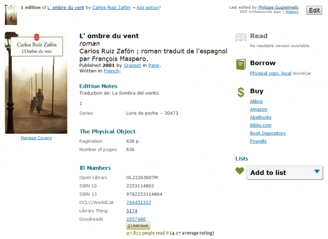

Périodiquement je me repose la même question : comment garder trace de tous mes bouquins, plus ceux qu'on m'a prêtés ou recommandés? Et je voudrais aussi me souvenir à qui j'ai prêté les miens, immortaliser mes notes de lectures, copier une référence d'un seul coup de copier/coller, en particulier vers ce blog, et que tout ça soit accessible et synchronisé au boulot, à la maison et sur mon smartphone, qui pourrait au passage scanner les code barres du dos des bouquins pour aller plus vite. Tout ça. S'il vous plaît. Et voici ma réponse en 2012. De rien.

### d'Amazon à Goodreads

A la fin du XXème siècle, [Amazon](w:Amazon.com) est devenu un site incontournable des bibliophiles grâce à la multitude de notes, de mots-clés et de commentaires ajoutées par les lecteurs, mais aussi d'autres informations apportées par les clients sans le savoir. J'utilise souvent les rubriques  "_Les clients ayant acheté cet article ont également acheté_" pour naviguer parmi les livres sur un sujet donné. Par contre Amazon ne permet pas véritablement de gérer sa propre bibliothèque. On peut juste créer des listes personnelles de livres, mais [je les trouve très limitées](http://www.amazon.fr/gp/richpub/listmania/byauthor/A2V6G25AZNUZE). De plus, le business d'Amazon étant de vendre des livres on n'y trouve logiquement pas de liens sortant vers d'autres sites utiles, ni vieux livres épuisés.

Mais il y a plus grand, plus complet, et plus discret : [WorldCat.org](http://www.worldcat.org/). Depuis 1971, l'[OCLC](w:Online_Computer_Library_Center) maintenait le catalogue de livres le plus complet à ce jour pour les bibliothèques du monde entier. Probablement "encouragés" par Amazon et Google, cette base de données accessible gratuitement au public en 2006 via le site WorldCat.org.  Comme sur Amazon, on peut créer [un profil](http://www.worldcat.org/account/?page=myProfile) sur WorldCat, y noter et commenter des livres et y maintenir des [listes](http://www.worldcat.org/profiles/Goulu/lists) de livres, mais ce n'est pas vraiment le but ni la force du site. Les avantages de WorldCat sont:

1. La possibilité d'exporter la référence du livre dans quelques formats cut&pastables dans d'autres documents :
    
    
2. Des liens vers quelques librairies en ligne, dont Amazon, où acheter le bouquin
3. Mais l'intérêt principal  de WorldCat, c'est de vous indiquer les bibliothèques près de chez vous où vous pouvez emprunter un livre donné. Si vous êtes un rat de bibliothèque, WorldCat sera votre fromage.

En 2004, Amazon domine le marché de la vente de bouquins sur internet et WorldCat celui du prêt. Comment diable [Google Books](http://books.google.fr/) peut-il se différencier ? En scannant des milliers de livres et en les rendant en tout ou partie disponibles sous forme numérisée, pardi ! Les aspects légaux de ce [colossal projet](w:Google_Livres) ne sont pas encore réglés, mais ça n'empêche pas Google de le poursuivre en collaboration avec de très grandes bibliothèques publiques. On ne sera donc pas surpris de trouver des liens "Trouver ce livre dans une bibliothèque" vers WorldCat  mais l'intérêt du Géant réside clairement dans les liens publicitaires vers les distributeurs de livres.





Cela dit, Google Books est une solution web crédible pour gérer une [bibliothèque personnelle](http://books.google.fr/books?uid=110447539257954874457) : plutôt que par listes, Google Books gère les livres sur des "étagères" qui ne sont rien d'autre que des tags. C'est surtout l'existence de l'application Android [Book Mobile](http://www.androidfreeware.net/download-book-mobile.html) (tiens, elle a disparu du Market...) qui m'a poussé vers Google Books il y a deux ans : grâce à elle, j'ai pu créer ma bibliothèque numérique en scannant mes livres avec mon téléphone, aussi vite qu'une une caissière de la FNAC.

Mais désormais, [j'utilise](http://www.goodreads.com/goulu) et conseille [Goodreads.com](http://www.goodreads.com). Même si le site est en anglais, les livres en français y sont très bien référencés, et le site étant assez intelligent pour combiner les informations des lecteurs des différentes éditions. En plus des fonctionnalités habituelles et d'une excellente [application Android](https://play.google.com/store/apps/details?id=com.goodreads&hl=fr) (avec scanner de codes barres évidemment), Goodreads est un véritable réseau social de bibliophiles, qui y créent une bonne partie du contenu. Contrairement aux sites sus-mentionnés, Goodreads autorise ses membres à [ajouter des livres](http://www.goodreads.com/book/new) eux-mêmes à la base, et à modifier celle-ci après avoir demandé une autorisation, un peu comme sur un wiki.

### OpenLibrary et les blogs

Reste un problème pour les puristes : toutes ces bases de données sont "propriétaires", et même si Amazon, Google, WorldCat, Goodreads et bien d'autres s'ouvrent au maximum pour attirer des visiteurs, ils peuvent changer d'avis à loisir en fonction de l'évolution rapide du marché. De plus, même si l'[ISBN](w:International_Standard_Book_Number) a été introduit comme identificateur unique des livres en 1972, il y fallu inventer des codes adaptés aux livres plus anciens, et chacun y a mis du sien pour indexer sa base de données différemment, ce qui ne simplifie pas les échanges. Voilà par exemple le même livre sur tous ces sites:

- seul Amazon a gardé l'ISBN dans ses URL : [http://www.amazon.fr/dp/2253114863](http://www.amazon.fr/dp/2253114863)
- WorldCat utilise un "code OCLC" : [http://www.worldcat.org/oclc/764431352](http://www.worldcat.org/oclc/764431352)
- Google Books utilise un autre code maison : [http://books.google.ch/books?id=QEYFHAAACAAJ](http://books.google.ch/books?id=QEYFHAAACAAJ)
- Goodreads a le sien : [http://www.goodreads.com/book/show/1057486](http://www.goodreads.com/book/show/1057486)
- et il en existe des tas d'autres. Sur le web, tout standard ne fait pas long feu...

Donc il y a [OpenLibrary.org](http://openlibrary.org), la base "open" et publique de la fondation [InternetArchive](http://www.archive.org/), qui fait appel au public pour référencer beaucoup de bouquins, en spécifiant les "identificateurs uniques" des autres afin de lier les bases de données. Mais évidemment, pour rester libre il fallait inventer un code de plus, [http://openlibrary.org/works/OL6036829W](http://openlibrary.org/works/OL6036829W) dans l'exemple, qui mène vers cette page :

OpenLibrary n'est malheureusement pas assez développé pour y gérer sa bibliothèque, mais offre un petit bouton bien utile pour ajouter une référence sur Goodreads d'un seul click. Sinon, OpenLibrary est surtout utile aux gens qui publient du contenu sur le web car on peut:

1. exporter des références au format [citation Wikipedia](w:en:Template:Citation), ce qui est drôlement pratique
2. utiliser l'[extension OpenBook Book Data](http://wordpress.org/extend/plugins/openbook-book-data/) pour WordPress. Et ça c'est génial. Par exemple si je veux citer le fameux bouquin sur ce blog, il me suffit de taper \[ openbook booknumber="OLID:OL22263607M" templatenumber="5"\]  et hop, sous vos yeux émerveillés apparait :  , avec les liens vers les sites référençant le livre parmi ceux que j'ai choisis, et la disposition "no 5" qui n'incorpore pas d'image de la couverture, mais j'aurais pu.

Bref, depuis que j'ai découvert cette extension, j'ai mis à jour tous [les articles de ce blog qui mentionnent des livres](/tags/livres/), en ajoutant les éventuelles références inconnues sur OpenLibrary

Dans un prochain article, je vous causerai des solutions modernes pour maintenir une bibliographie d'articles scientifiques ou similaires. Pour les impatients, c'est [Zotero](http://www.zotero.org/) ou [Mendeley](http://www.mendeley.com/), au choix.
