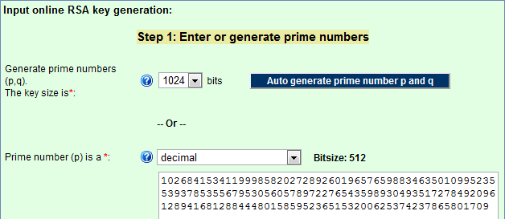

Les [nombres premiers](https://fr.wikipedia.org/wiki/Nombre_premier) ont beau être étudiés depuis au moins 2300 ans, ils n'ont jamais été aussi mystérieux ni utiles qu'aujourd'hui.

Mystérieux, car la démonstration de l'[hypothèse de Riemann](https://fr.wikipedia.org/wiki/hypothèse_de_Riemann), qui permettrait de définir la répartition des nombres premiers, attend toujours son  [futur millionnaire](https://fr.wikipedia.org/wiki/Problèmes_du_prix_du_millénaire).

Utiles, car nos cartes à puces, téléphones et ordinateurs consomment des quantités industrielles de "grands" nombres premiers, en particulier pour le cryptage [RSA](https://fr.wikipedia.org/wiki/Rivest_Shamir_Adleman). La sécurité de cette méthode "[asymétrique](https://fr.wikipedia.org/wiki/Cryptographie_asymétrique)" repose sur le fait que la [factorisation entière en nombres premiers](https://fr.wikipedia.org/wiki/factorisation_entière_en_nombres_premiers) de grands nombres demande un temps prohibitivement long, alors qu'il est très rapide de trouver de grands nombres premiers.

## Comment trouver de petits nombres premiers

Ceci parait surprenant de prime abord, puisqu'on apprend à l'école à déterminer si n est premier en tentant de le diviser par les nombres premiers déjà connus inférieurs à √n, ce qui n'est autre qu'une factorisation. On découvre à l'école aussi le [crible d'Eratosthène](https://fr.wikipedia.org/wiki/crible_d'Eratosthène), qui fournit depuis 2000 ans les nombres premiers les uns après les autres à tous les heureux possesseurs de feuilles quadrillées ou de mémoires informatiques:

[")](http://fr.wikipedia.org/wiki/Crible_d'%C3%89ratosth%C3%A8ne)

 

Cette méthode n'a été légèrement améliorée qu'en 1999 avec le [crible d'Atkin](https://fr.wikipedia.org/wiki/crible_d'Atkin) et reste excellente pour créer des listes de nombres premiers consécutifs. Ainsi le site [www.bigprimes.net](http://www.bigprimes.net/archive/prime/14000000/) les fournit tous jusqu'à  32 416 187 567 \*

Mais alors, comment le célèbre [Pierre de Fermat](https://fr.wikipedia.org/wiki/Pierre_de_Fermat) a-t-il pu répondre en 1643 à un certain [Marin Mersenne](https://fr.wikipedia.org/wiki/Marin_Mersenne) (dont nous reparlerons plus bas):

> Vous me demandez si le nombre 100 895 598 169 est premier ou non, et une méthode pour découvrir, dans l'espace d'un jour, s'il est premier ou composé. À cette question, je réponds que ce nombre est composé et se fait du produit de ces deux : 898423 et 112303, qui sont premiers.

Et bien parce que 3 ans plus tôt il avait pondu et démontré lui-même son ["petit" théorème](https://fr.wikipedia.org/wiki/petit_théorème_de_Fermat), qui constitue en même temps [le premier](https://fr.wikipedia.org/wiki/Test_de_primalité_de_Fermat) [test de primalité](https://fr.wikipedia.org/wiki/test_de_primalité) probabiliste. Grâce à cela,  il a su "rapidement" que 100895598169 n'est pas premier. Par contre, comment il a effectué les opérations et factorisé le nombre avec un papier et un crayon en un seul jour, ça je n'en ai avais aucune idée \*\*

Et je ne sais pas non plus comment Mersenne a généré 898423 et 112303 parce que bizarrement, ce ne sont pas des nombres de Mersenne, dont nous parlerons plus bas... En fait, ô surprise, 898423 = 112303 x 23\-1, donc Mersenne a généré le grand premier à partir du petit, lequel a d'ailleurs la même forme : 112303 = 7019 x 24\-1.

## Comment trouver de très grands nombres premiers

Il existe donc des méthodes pour générer des nombres premiers. Aucune ne produit des nombres premiers "à tous les coups" ( ce serait le Graal que certains recherchent encore mais qui n'existe probablement pas ), mais ces méthodes fournissent des grands nombres qui ont une probabilité d'être premiers nettement plus élevée que des nombres de même taille choisis au hasard.

Au IXème siècle déjà, [Thābit ibn Qurra](https://fr.wikipedia.org/wiki/Thābit_ibn_Qurra) avait remarqué que pas mal de petits nombres premiers ont la forme "321" p = 3×2n\-1 . Les [nombres de Thebit](https://fr.wikipedia.org/wiki/nombres_de_Thebit) sont listés dans [A002235](http://oeis.org/A002235). Le plus grand connu actuellement est 3×24235414−1 mais aussi 3×27033641+1 qui n'est pas strictement un Thabit à cause du +1 au lieu du -1 final.

Les  [nombres de Mersenne](https://fr.wikipedia.org/wiki/Nombre_premier_de_Mersenne) ont une forme encore plus simple : p = 2n\-1 où n est premier. Et Mersenne ne les a pas découverts : [Euclide](https://fr.wikipedia.org/wiki/Euclide) connaissait déjà les plus petits ( 3, 7, 31 et 127 ) en 300 avant J.C. Mersenne en a juste fait une [liste](https://fr.wikipedia.org/wiki/Nombre_premier_de_Mersenne#Liste) en ajoutant 8191 découvert par Ibn Fallus au XIIIème siècle et 131071 et 524287 découverts par [Pietro Cataldi](https://fr.wikipedia.org/wiki/Pietro_Cataldi) en 1588. Et puis il s'est planté magistralement : sa liste incluait les nombres  267\-1 et 2257\-1 qui ne sont pas premiers et omettait 231\-1, 261\-1, 289\-1 et 2107\-1 qui le sont. C'est dommage, car Mersenne n'a ainsi jamais détenu le record du plus grand nombre premier qui a [presque toujours été](http://primes.utm.edu/notes/by_year.html) un nombre de Mersenne. Depuis 2009, le record est 243112609\-1 , qui compte 12 837 064 chiffres, trouvé grâce au programme [GIMPS](https://fr.wikipedia.org/wiki/Great_Internet_Mersenne_Prime_Search). Le rôle de ce logiciel est surtout de faire passer le génial [test de primalité de Lucas-Lehmer](https://fr.wikipedia.org/wiki/test_de_primalité_de_Lucas-Lehmer) qui est déterministe (non probabiliste) mais ne marche qu'avec les Mersenne.

Bref, aucun nombre de Mersenne n'est de Mersenne et si je n'avais pas autant de lecteurs en République Française, je proposerais de les rebaptiser "[repunits premiers](https://fr.wikipedia.org/wiki/Repunits)" pour souligner leur beauté en binaire. En effet, 2n\-1 s'écrit simplement avec une suite de n "1" en binaire. Par exemple 127= 27\-1 s'écrit 1111111 en binaire.

Il existe plusieurs autres formules fournissant des candidats premiers :

- Les [nombres de Fermat](https://fr.wikipedia.org/wiki/nombres_de_Fermat) de la forme 22n + 1. Fermat pensait qu'ils étaient tous premiers, mais c'est faux : seuls les 5 premiers le sont, les 28 suivants ne le sont pas, et les autres sont trop grands pour être testés.
- Les [premiers de Proth](https://en.wikipedia.org/wiki/Proth_prime) sont de la forme k·2n+1 ( [A080075](http://oeis.org/A080075) , record 659×2617815+1 )
- [Ceux de Woodall](https://fr.wikipedia.org/wiki/Nombre_de_Woodall) : n·2n-\-1 ( [A003261](http://oeis.org/A003261), 3752948 × 23752948 − 1)
- [Ceux de Cullen](https://fr.wikipedia.org/wiki/Nombre_de_Cullen) : n·2n+1 ( [A005849](http://oeis.org/A005849 "oeis:A005849"), 6679881 · 26679881 + 1)
- les "Cullen généralisés" : n·bn+1,où n+2 > b ( record 427194 × 113427194 + 1)

on voit qu'elles sont toutes des généralisations ou cas particuliers des autres, et que les repunits y jouent un  rôle important. Les [nombres premiers de Sophie Germain](https://fr.wikipedia.org/wiki/nombres_premiers_de_Sophie_Germain) (PSG) sont des nombres p tels que 2p+1 est aussi premier ([A005384](http://oeis.org/A005384)). Ce "générateur" fournit des nombres moins grands que les autres, mais soulève plein de questions intéressantes : quelle est la longueur maximale d'une [chaîne de Cunningham](https://fr.wikipedia.org/wiki/chaîne_de_Cunningham) formée par des PSG, y'a-t-il une infinité de PSG etc. Et de plus, le [théorème de Sophie Germain](https://fr.wikipedia.org/wiki/théorème_de_Sophie_Germain) établit un lien entre le "petit " théorème de Fermat susmentionné et [le grand](https://fr.wikipedia.org/wiki/Dernier_théorème_de_Fermat) qui a obsédé les matheux jusqu'en 1994. Et comme je n'ai pas compris grand chose à sa démonstration, je suis plein d'admiration pour cette dame autodidacte qui étonna les mâlethématiciens d'il y a 200 ans.

Si vous voulez vous aussi devenir célèbre, mais facilement, participez à [PrimeGrid](http://www.primegrid.com/), une application de la plateforme de calcul distribuée BOINC qui chasse les records de grands nombres premiers. Avec un peu de chance le prochain grand nombre premier sera découvert sur votre ordinateur tout en [vous chauffant pous la science](/2007/11/17/radiateurs-a-teraflops/).

## Comment trouver des nombres premiers d'une longueur donnée

Fin 2009, une équipe internationale a cracké un code [RSA-768](https://fr.wikipedia.org/wiki/RSA-768), en factorisant le produit de deux nombres premiers de 120 chiffres à l'aide de l'[algorithme de factorisation par crible sur les corps de nombres](https://fr.wikipedia.org/wiki/algorithme_de_factorisation_par_crible_sur_les_corps_de_nombres) et de beaucoup d’ordinateurs. Cet exploit signifie qu'une clé RSA nécessite aujourd'hui des nombres premiers d'au moins 512 bits, soit 154 chiffres décimaux pour être indécryptable.

Nous avons vu plus haut comment obtenir tous les nombres premiers nettement plus courts, ou quelques nombres premiers nettement plus longs, mais pour RSA, nous avons besoin d'obtenir en quelques secondes des nombres premiers de 154 chiffres, avec un seul petit processeur enfermé dans le boitier d'un routeur par exemple, et sans que le nombre transite par un réseau où il pourrait être intercepté. De plus, le nombre ne doit pas être stocké dans une table dont un pirate pourrait essayer les combinaisons : il doit être généré aléatoirement.

Mais au fait, existe-t-il beaucoup de nombres premiers de 154 chiffres ? Oh que oui : la densité des nombres premiers autour de n est de 1/ln(n), or [1/ln(10154)](http://www.wolframalpha.com/input/?i=1%2Fln%2810%5E154%29) donne environ 0.3% : environ 3 nombres de 154 chiffres sur 1000 sont premiers, donc il y en a des giga milliards de floppées. Donc tout ce que notre petit routeur a à faire de temps en temps c'est:

1. générer un nombre aléatoire de 154 chiffres en tirant au hasard 511 bits à pile ou face, et en ajoutant un 512ème bit = 1 pour faire un nombre impair. facile et ultra rapide.
2. vérifier si le nombre est premier à l'aide d'un  [test de primalité probabiliste](https://fr.wikipedia.org/wiki/test_de_primalité#Tests_probabilistes) plus  moderne que celui de Fermat comme celui de [Miller-Rabin](https://fr.wikipedia.org/wiki/Test_de_primalité_de_Miller-Rabin).
3. si le test dit que le nombre n'est pas premier, ajouter 2 au nombre aléatoire pour obtenir le nombre impair suivant et recommencer l'opération 2. Il faudra  répéter ceci en moyenne 300 fois avant que Miller et Rabin disent "probablement premier"

Pour vous faire une idée de la vitesse de ceci, allez au milieu de [cette page](http://www.mobilefish.com/services/rsa_key_generation/rsa_key_generation.php) et cliquez le bouton "auto generate prime number p and q" : vous obtiendrez 2 nombres premier de 512 bits pour le prix d'un seul click.

Oui mais, me direz vous, les tests probabilistes ne garantissent pas absolument que les nombres soient premiers. Il y a un risque qu'on encode le message avec une clé foireuse, et donc qu'il soit "facile" à décoder. Effectivement, mais on admet généralement que la probabilité qu'un nombre de cette taille soit [pseudopremier](https://fr.wikipedia.org/wiki/Nombre_pseudopremier) est de l'ordre d'une sur 1030. Et si votre message est si précieux que vous n'êtes pas prêt à courir ce risque, réfléchissez à [ceci](http://stackoverflow.com/questions/4159333/rsa-and-prime-generator-algorithms) : le risque qu'un rayon cosmique change un bit du nombre pendant un test de primalité déterministe est un million de fois plus élevé ! J'aime bien cette idée qu'un algorithme probabiliste soit plus fiable qu'une machine considérée comme déterministe, pas vous ?

Notes :

\* 32'416'187'567 est tellement proche de 8\*2^32 que j'ai une petite idée de la mémoire utilisée par le crible...

\*\* ajout du 18 mai 2014 : Blogdemaths a éclairé ma lanterne à ce sujet dans un article intitulé "[Savez vous factoriser à la mode de Fermat ?](http://blogdemaths.wordpress.com/2014/05/18/savez-vous-factoriser-a-la-mode-de-fermat/)"

## Pour en savoir plus

1. [L'algorithme RSA](http://www.siteduzero.com/tutoriel-3-2320-l-algorithme-rsa.html?all=1) sur le Site du Zéro
2. 
3. [nzmath.prime](http://tnt.math.se.tmu.ac.jp/nzmath/) : une librairie Python avec les fonctions qu'il faut
