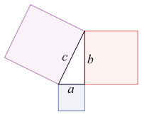

Je donne des cours depuis longtemps, avec plus ou moins de succès. Parfois mes élèves se sont endormis, parfois ils n'ont pas osé parce que leurs patrons payaient très cher leur formation. Une fois, 300 gaillards ont quitté l'amphi à la cloche sans me lancer de tomates. Une autre fois, une très jolie fille à qui je donnais des cours d'appui en maths a préféré m'épouser... Sans ressentir de véritable vocation d'enseignant, j'aime bien "transmettre mon savoir", alors à quoi bon la pédagogie ?

Actuellement je passe environ 10% de mon temps de travail à former des collaborateurs, et comme mon employeur dispose d'un centre de formation pour ses 270 apprentis et la formation continue de son personnel, j'ai bénéficié d'une "formation de formateur" de trois jours, une excellente introduction à la [pédagogie](w:). Révélation. On a pris des baffes, mais c'était salutaire. Avis à presque tous mes anciens élèves : je ne donnerai plus de cours comme avant, promis !

En tournant autour du [triangle pédagogique](w:), un participant a mentionné la démonstration du [Théorème de Pythagore](w:) comme exemple type du truc asséné par la [pédagogie traditionnelle](w:) et qu'on ne retient pas, parce que ce n'est pas "3U" : utile + utilisable + utilisé.  Comme chaque participant devait élaborer une petite formation de 20 minutes, l'[objectif pédagogique](w:pédagogie_par_objectifs) de la mienne était tout trouvé :

### "Réconciliez-vous avec Pythagore au point d'être capables de démontrer son Théorème à vos enfants avec du papier et des ciseaux."

Pour ça j'ai pondu ce [matériel/support de cours \[pdf\]](/wp-content/uploads/2012/04/Formateur-Dem-Pythagore.pdf)  et le petit [scénario pédagogique suivant](https://fr.wikipedia.org/wiki/scénario_pédagogique suivant), expérimenté sur mes collègues/cobayes :

1. 2 mins : méthode interrogative "qui se souvient du théorème de Pythagore ?". Faire dire aux participants qu'il concerne les triangles rectangles, qu'il s'agit de la relation entre la longueur des côtés. Faire dire la relation, ou au moins qu'elle concerne les carrés. Lequel des côtés est appelé hypothénuse ? (là surprise : un participant se souvient que l' autre s'appelle "[cathète](w:)", ce que j'avais oublié, car inutile :-) )
2. 3 mins : méthode explicative : il y a environ 2500 ans, [Pythagore](w:) a eu l'idée géniale que la relation entre les côtés des triangles rectangles impliquait les carrés. Dessin de la figure de l'interprétation géométrique. Comment a-t-il eu cette idée ? Personnellement je pense que c'est peut-être en découvrant le [triplet pythagoricien](w:) (3,4,5) et en remarquant que 3²=9, 4²= 16, 9+16=25=5². _Ajout du 5.5.12 : c'est bien ça ! je viens de découvrir la [corde à treize noeuds](w:) des égyptiens grâce à la [vidéo d'AlgoRythmes](http://algorythmes.blogspot.com/2012/05/video-histoires-de-science-pythagore.html) !_ Mais l'existence des triplets comme (3,4,5) ne constitue pas une "démonstration". Pour démontrer Pythagore, il faut montrer que la relation a²+b²=c² est vraie pour tout triangle rectangle. Une démonstration géométrique se base sur un dessin avec un triangle quelconque, mais peut être répétée quel que soit le triangle.
3. 5 mins : méthode découverte : donner la page A du [matériel](/wp-content/uploads/2012/04/Formateur-Dem-Pythagore.pdf) (j'avais prédécoupé les triangles pour gagner du temps). L'idée est que les participants retrouvent par eux-mêmes  l'une des méthodes suivantes:
    - le puzzle de [Henry Perigal](w:) animé [en GeoGebra ici](http://www.geogebra.org/m/20380) et en video: 
    - le réarrangement 
4. 5 mins : si on a le temps (on ne l'a pas eu parce que le point ci-dessus prend 10 mins au lieu de 5), voir cette [autre démonstration en vidéo](http://www.palais-decouverte.fr/uploads/media/pythagore_5.swf) et la reproduire à l'aide de la page B du [matériel](/wp-content/uploads/2012/04/Formateur-Dem-Pythagore.pdf) et de carrés a² et b² à découper :
    
    
5. 6 mins ( 1 min par participant) : évaluation : chacun reproduit la démonstration sans aide.

Au debriefieng, le retour des participants est assez bon, ils ont apprécié mais font remarquer que je n'ai pas parlé de l'utilité du théorème de Pythagore. Et c'est vrai. J'y avais pensé mais je ne voulais pas trop digresser sur la norme euclidienne dans un espace à 3 dimensions et ses applications dans les jeux vidéo (on ne se refait pas...) lorsqu'un participant à mentionné la longueur de la rampe d'un escalier. Effectivement, c'est simple, parlant et je n'y avais pas songé...

Malgré ça j'étais assez content de moi, persuadé que toute l'assistance allait passer la soirée en famille avec mes petits triangles de papier lorsque le formateur me dit : "j'ai rien compris". Voyant mon air catastrophé il ajoute aussitôt : "par contre j'ai réalisé un truc aujourd'hui, à 59 ans : quand on dit 3 au carré, ça correspond à la surface d'un carré de 3 par 3." Réalisant que j'étais sorti de sa [zone proximale de développement](w:), je lui ai dit que ce qu'il avait compris était beaucoup plus important que le théorème de Pythagore, et que j'étais très content.

Et je l'étais vraiment, mais la vraie raison pour laquelle j'avais mis sur pied cette formation continuait à me turlupiner : peut-on vraiment enseigner (= transmettre des compétences )  des notions demandant un certain degré d'abstraction (comme les maths) par des méthodes très interactives ? Et même si oui, en quoi découper et bouger des petits triangles en papier serait-il plus pédagogique que tracer des symboles mathématiques sur du papier ? Ou n'est-ce qu'un problème de prérequis ? Quand on "ne sait plus qu'on sait" , la phrase qui tue "mais c'est évident, voyons" n'est pas loin...

En pensant à ça et à l'escalier, je me demande si le problème de l'apprentissage ne réside pas dans la hauteur des marches ? Pour une même pente d'apprentissage, il y a peut être des domaines (lecture, écriture, sciences humaines ?) dans lesquelles l'escalier est formée de nombreuses marches très petites, formant presque une rampe continue alors que lees maths et les sciences "dures" m’apparaissent comme de vraies marches, parfois hautes, correspondant à des notions qu'il faut intégrer, appliquer, digérer avant d'attaquer la marche suivante.

Tout ça m'a aussi donné une idée à propos des [extraterrestres à qui on a envoyé le théorème de Pythagore](/2011/09/25/comment-comptent-les-extraterrestres/) : peut-être qu'ils ne nous répondent pas parce que leur société est dirigée par des pédagogues et que leurs mathématiciens, génétiquement incapables de transmettre leur science d'une manière accessible à tous, sont relégués dans une basse caste...

Ensuite j'ai du me concentrer parce qu'un autre participant nous a appris à faire une mayonnaise et je ne voulais pas rater la mienne. Parce qu'une mayonnaise, ça se mange !

### Quelques liens:

1. [Animations de démonstrations géométriques au Palais de la Découverte](http://www.palais-decouverte.fr/index.php?id=858)
2. [D'autres animation autour de Pythagore](http://www.ies.co.jp/math/java/geo/pythagoras.html)
3. [Histoire du théorème de Pythagore](http://www.mediamaths.net/article-histoire-du-theoreme-de-pythagore-63742847.html "Histoire du théorème de Pythagore") sur MediaMaths
4.  (un [livre énumérant 370 démonstrations](http://www.scribd.com/doc/91620284) !)
