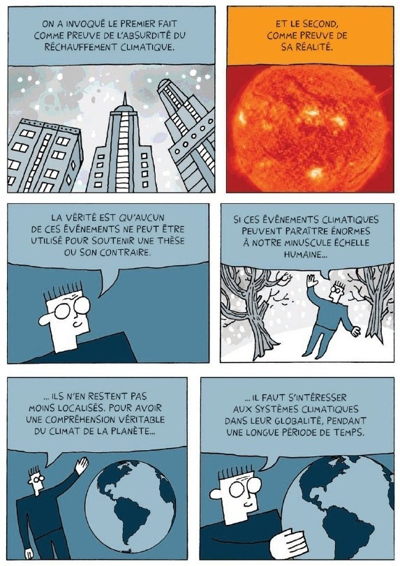

Découvert par hasard hier, dévoré avec passion aujourd'hui et chaleureusement recommandé ici même instantanément :  .

Cette "BD documentaire" regroupe 7 démystifications parues initialement sur [le blog de Darryl Cunningham](http://darryl-cunningham.blogspot.ch/) sur:

1. L'homéopathie
2. l'affaire du docteur [Andrew Wakefield](w:), le fraudeur qui a lié l'autisme au vaccin contre la rougeole
3. le canular lunaire (selon lequel les images des missions Apollo ont été tournées sur Terre)
4. le réchauffement climatique (ou plus exactement la contestation du ...)
5. l'évolution (ou plutôt le cré(a)ti(o)nisme )
6. la chiropraxie
7. le déni de la science.

Le dessin et la mise en page sont très sobres : 6 cases par page, une seule couleur et une seule bulle de texte par case. Parfois un graphique ou une photo décolorée remplace le dessin comme sur cette planche d'exemple:

En fait, le dessin ne sert que de support au texte, le rendant peut-être plus lisible pour les lecteurs réfractaires à la prose scientifique, fut-elle vulgarisée. Et c'est bien l'objectif de ce livre, que l'on peut prêter à sa tante Juliette adepte d'homéopathie, ou au petit voisin qui ne croit pas que j'aie vu des hommes gambader sur la Lune pour de vrai. La première de couverture contient même la docte sentence à prononcer dans ces cas là:

> "Chacun est en droit d'avoir sa propre opinion, mais les faits sont les mêmes pour tous" ([Michael Specter](w:en))

Pour ma part, j'ai aussi appris plein de choses dans ce livre bien documenté (il y a même une liste de références à la fin... une première en BD ? ). Voici quelques faits que j'ignorais, et que vous ne pouvez ne pas lire si vous voulez préserver la surprise de la lecture:

- [James Randi](/2010/04/25/james-randi-au-ted/) a participé à la vérification des travaux de [Jacques Benveniste](w:) sur la mémoire de l'eau
- l'homéopathie propose un traitement préventif contre la malaria...
- la recherche frauduleuse de Wakefield était [motivée et financée par un avocat](http://briandeer.com/mmr/lancet-summary.htm) qui souhaitait déposer une plainte collective contre les fabricants de vaccins
- Dans notre atmosphère, la flamme d'une fusée est maintenue dans un cône par la pression atmosphérique, mais dans le vide les gaz expulsés partent dans toutes les directions. C'est pour cela que le LEM n'a expulsé qu'un peu de poussière en alunissant au lieu de créer un cralune.
- Les Mythbusters ont tenté de reproduire le "moon hoax" et vous pouvez maintenant voir cet épisode fantastique complet et légalement ici : \[embed\]https://www.dailymotion.com/video/x2m7k1z\[/embed\]
- L'existence des [canaux inguinaux](w:canal_inguinal) prouve que Dieu n'existe pas. J'adore ce passage !
- J'ai découvert le [mélanisme industriel de la phalène du bouleau](w:phalène_du_bouleau) , mais bonne nouvelle, ma fille l'avait appris en cours de biologie. Tout n'est pas perdu !
- Je ne connaissais ni l'historique ni les "théories" à la base de la [chiropratique](w:), mais maintenant je sais où la classer : pseudo-médecine inefficace, voire dangereuse.
- [Manto Tshabalala-Msimang](w:), ministre de la santé d'Afrique du Sud de 1999 à 2008 a proposé de traiter le SIDA avec de l'ail et des patates douces. Bilan : 300'000 morts de plus.

Le dernier chapitre, "le déni de la science", se distingue un peu des autres. Il décrit la démarche scientifique et l'oppose résolument au mécanisme de la croyance. L'auteur y défend aussi, peut être un peu naïvement,  la controverse constructive résultant de la "revue par les pairs". Il fustige les débats publics entre savants d'une part et croyants soutenus par d'obscurs intérêts économiques d'autre part., arbitrés par des journalistes comme s'il s'agissait de débats politiques dans lesquels deux opinions se valent.

Bien que j'adhère à 100% à ce point de vue, il me semble que Darryl Cunningham ne parvient hélas pas à éviter de présenter la science comme un brin élitiste, fonctionnant selon des principes bien distincts de ceux de l'économie ou de la démocratie, et donc en définitive peu compréhensible. Mais peut-être devrais-je relire ce chapitre à tête plus reposée, car cet excellent ouvrage ne devrait pas se lire d'une traite.
