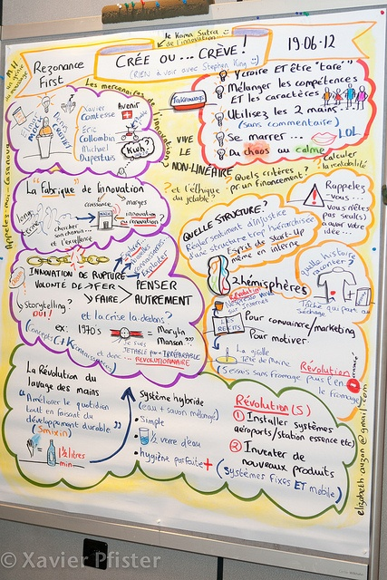

---
aliases:
  - /2012/07/01/innovation/
title: "Crée ou crève : l'innovation de rupture"
date: 2012-06-30
draft: false
tags:
  - horlogerie
  - innovation
  - suisse
categories:
  - Combien
  - Comment
  - Pourquoi
slug: innovation
coverImage: ./images/328f7398c97abb8dc01a010269c6b96c.jpg
---



Assisté l'autre jour à la conférence "[Crée ou crève! : Inutile d'être génial ou savant pour être innovant!](http://www.rezonance.ch/rezo/classes/ft-first-tuesday/geneve/2012-06-19/)" d'Elmar Mock consacrée à l' "innovation de rupture".

Elmar Mock est l'un des inventeurs de la [Swatch](w:Swatch_\(marque\)) [[1]](#ref-1), une montre en rupture totale avec l'horlogerie suisse des années 1980. Comme il l'explique dans [la vidéo](https://vimeo.com/44659294) par une analogie assez grivoise pour capter l'attention (autour de 10:00), cette rupture a plutôt été la conséquence d'une avalanche de problèmes que le résultat d'une [vision géniale](/2007/05/15/montre-mecanique-contre-quartz/).

Assez marqué par cette expérience pour en parler encore avec émotion 30 ans plus tard, Elmar Mock est devenu un "serial innovateur" et a fondé l'entreprise [Creaholic](http://creaholic.com/) pour aider les entreprises (suisses) sur le dur chemin de l'innovation (où elles sont plutôt bien placées [[2]](#ref-2))

Mock distingue clairement l'innovation (de rupture) de ce qu'il appelle la "rénovation" :

- **l'innovation** consiste à partir  d'un rêve ou d'une intuition pour amener sur le marché un produit dont on ne sait pas encore qu'on en a besoin.
- la "**rénovation**" consiste ensuite à améliorer itérativement le produit pour l'adapter à la demande du marché.
- la rénovation est basée sur **l'exploitation** des connaissances
- l'innovation est un processus **d'exploration**

Selon Mock, l'innovation est essentielle pour préserver l'emploi, car le processus de rénovation fait diminuer les marges au cours du temps. Quelques citations:

> - l'innovation est (...)  le seul chemin vers la croissance
> - l'innovation ne fait de sens que quand elle apparaît sur le marché. Un produit qui n'arrive pas sur le marché a peut-être été une invention, ou une bonne idée, mais en tout cas pas une innovation
> - vous n'innovez pas sans le boss : les sociétés sont organisées pour la rénovation, pas pour l'innovation

Comme le suggère le titre de son nouveau livre [[3]](#ref-3), Mock pense que l'innovation peut être répétée, en développant une culture d'entreprise de l'innovation, en favorisant l'émulation, et en utilisant des outils tels que la [théorie C-K](w:en:C-K_theory) [[4]](#ref-4) un formalisme développé à l'Ecole des Mines pour favoriser la combinaison des concepts et des connaissances.

Si vous vous intéressez à la naissance de la Swatch, consacrez une demi-heure à regarder [la vidéo](https://vimeo.com/44659294), sinon parcourez au moins les slides de Mock, presque aussi minimalistes que ceux de Steve Jobs, mais beaucoup plus provocateurs :

<iframe src="https://www.slideshare.net/slideshow/embed_code/key/I6wExQ3gFE1JzC" width="510" height="420"frameborder="0" marginwidth="0" marginheight="0" scrolling="no"style="border: var(--border-1) solid #CCC; border-width:1px; margin-bottom:5px; max-width:100%;"allowfullscreen></iframe>
<strong><a href="https://www.slideshare.net/slideshow/elmar-mock-creaholic-la-fabrique-de-linnovation/14681791" title="elmar-mock-creaholic-la-fabrique-de-linnovation" target="_blank">elmar-mock-creaholic-la-fabrique-de-linnovation</a></strong>from <strong><a href="https://www.slideshare.net/Rezonance" target="_blank">Rezonance</a></strong>

(paragraphe ajouté le 3.6.12 :)  Elizabeth Auzan  de [http://www.thinkingpartner.ch](http://www.thinkingpartner.ch/) a réalisé en temps réel un poster de la présentation. Il est ici :

### Quelques notes personnelles sur l'innovation

Certains ressentent que l'économie "crée de nouveaux besoins", ce que Galbraith a appelé [la "filière inversée"](w:John_Kenneth_Galbraith#La_fili.C3.A8re_invers.C3.A9e). Je me demande si ce n'est pas un effet de l'innovation (on se souvient tous de l'iPad), alors que la "rénovation" pourtant beaucoup plus fréquente passe quasi inaperçue (déjà l'iPad 4...)

> "Si j’avais demandé à mes clients ce qu’ils auraient voulu, ils auraient dit : un cheval plus rapide." ([Henry Ford](w:))

Finalement, où est la "rupture" de la Swatch ? le prix ? l'irréparabilité ? C'est plus probablement le fait de le positionner comme un article de mode. Mais alors, Mock a-t-il créé cette rupture, ou ne l'a-t-il pas plutôt provoquée en inventant une montre invendable ?

N'est-il pas plus "facile" d'innover dans une entreprise, voire une industrie en train de couler que dans une qui va bien ?



Le mot "innovation" évoque pour moi encore une chaîne de ["grands magasins" de Suisse Romande](http://www.notrehistoire.ch/group/nos-grands-magasins/), aujourd'hui disparue. Dès 1935, le mot "innovation" trônait en lettres majuscules au centre de plusieurs villes. Mes parents appelait même "Sainte Innovation" un certain jour férié dans notre Valais catholique et consacré aux gros achats annuels chez nos voisins protestants.

A l'époque, les enseignes affichaient "tailleur", "cordonnier" ou "fruits et légumes", et depuis peu "Coop" ou "[Migros](w:)", et voilà des magasins qui vendaient de l' innovation, un pur produit du XXème siècle. Quel nom de chaîne de magasins caractérise le mieux le XXIème ?  "magasin de pommes Apple Store" ? "eBay"  ?

\* En fait, le jour de la Sainte Innovation n'était autre que l' Immaculée Conception. Tout un symbole :-)

### Références

1. "[Elmar Mock](http://www.worldtempus.com/fr/encyclopedie/index-encyclopedique/histoire-de-lhorlogerie/le-phenomene-swatch/les-hommes-dans-le-mouvement-swatch/elmar-mock/)" sur l'encyclopédie WorldTempus
2. "[Innovation Indicator 2011](http://www.telekom-stiftung.de/dtag/cms/contentblob/Telekom-Stiftung/de/1720812/blobBinary/Innovationsindikator+2011.pdf)", Deutsche Telekom Stiftung
3. 
4. [L'équipement des français en biens durables fin 1968](http://www.persee.fr/web/revues/home/prescript/article/estat_0336-1454_1969_num_3_1_1875), Economie et statistique, 1969, Vol.3, No 3, pp. 65-68
