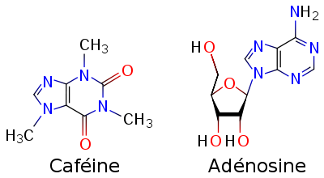

_(article repris dans )_

Caféine, je t'aime. Comme l'a dit [Alfred Rényi](w:) (et pas [Paul Erdös](w:)), tu es une matière première des mathématiques :

> "Un mathématicien est une machine qui transforme le café en théorèmes."

mais aussi des informaticiens, ingénieurs et autres penseurs. Et tu es si belle:



Cette image obtenue par microscopie électronique à balayage montre environ 40 microns de la pointe de tes cristaux, en fausses couleurs. Elle vient de remporter un [concours de photographies scientifiques](http://www.wellcomeimageawards.org/#)

Je savais que tu étais une molécule assez simple et qu'on t'appelle aussi théine, mais j'ignorais que tu pouvais cristalliser. J'ai découvert comment le faire sur le [wiki de scienceamusante.net](http://scienceamusante.net/wiki/index.php?title=La_caf%C3%A9ine) et plein d'autres choses intéressantes sur [toi sur wikipedia](w:caféine). Par exemple qu'un café contenant environ 80 milligrammes de toi, je devrais en  boire environ 200 en [quelques heures](w:Caféine#Métabolisme_et_demi-vie) avant que tu ne me tues.

Car certains te traitent d'[alcaloïde toxique](https://fr.wikipedia.org/wiki/alcaloïde toxique), mais tu es plutôt une [xanthine](w:). Les biologistes pensent que les plantes te synthétisent pour éloigner les insectes et les araignées, qui ne t'aiment pas du tout, et aussi que ta présence dans les graines empêchent les autres graines proches de germer.

[Dans mon cerveau](w:Caféine#Mode_d'action), tu es un "inhibiteur compétitif" de l'[adénosine](w:), à laquelle les chimistes disent que tu ressemble assez pour te fixer sur les récepteurs cellulaires de l'adénosine, mais sans les activer.

Or l'adénosine ralentit mon activité cérébrale lorsque je suis stressé, et en limitant son action tu me permets de rester concentré. De plus, mon organisme réagit à ton antagonisme en produisant de l'adrénaline et de la dopamine, tu es donc indirectement un psychostimulant : mon cerveau travaille plus vite et mieux. Merci !

Evidemment que tu empêches de dormir ! Mais comme [ta demi-vie](w:Caféine#Métabolisme_et_demi-vie) dans un corps humain n'est que de quelques heures, on peut aussi t'utiliser comme le préconise [Alphonse Allais](w:):

> "Le café est un breuvage qui fait dormir quand on n’en prend pas."

Tu accélères aussi le rythme cardiaque et améliore les échanges gazeux et l'oxygénation des muscles, ce qui intéresse particulièrement mes amis sportifs. Plusieurs études ont montré que les cyclistes pédalaient mieux après quelques cafés ou boissons au [guarana](w:), la plante qui te contient en plus grande quantité, mais qui a un goût de chiottes, je trouve...

D'ailleurs à ce propos, tu es aussi très diurétique, ce qui peut être un avantage ou un inconvénient, ça dépend.  J'avais lu quelque part que certaines armées disposent de pilules te contenant à forte dose pour éviter à leurs soldats de dormir, mais que certains, comme les pilotes de chasse, n'apprécient pas trop tes conséquences liquides...

Evidemment, tu as aussi de vrais inconvénients. D'abord, ton nom chimique est affreux :  "3,7-dihydro-1,3,7-trimethyl-1H-purine-2,6-dione". Ensuite, je m'[accoutume](w:Caféine#Accoutumance,_dépendance_et_sevrage). Je le constate très bien : j'ai besoin de plus en plus de cafés pour que tu me fasse le même effet jour après jour. D'après les études, cette accoutumance est complète lorsqu'on absorbe environ 1000 mg de toi, soit plus de 10 cafés par jour pendant 18 jours. Après ça tu peux causer une dépendance car l'organisme produit un excès de récepteurs de l'adénosine et réduit les récepteurs de dopamine pour s'adapter à ta présence, et si on ne te prends plus tu nous provoques une vraie crise de manque. Honoré de Balzac était l'une des personnes que tu as ainsi rendus caféinomanes.

Mais pas moi, car je t'aime trop pour abuser de toi. Chaque week-end je ne te consomme qu'occasionnellement, et en vacances plus du tout, sauf éventuellement dans une bonne glace. Alors prépare toi à quelques semaines de séparation.
