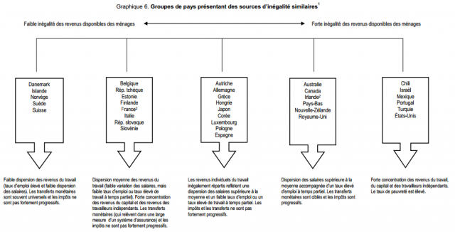
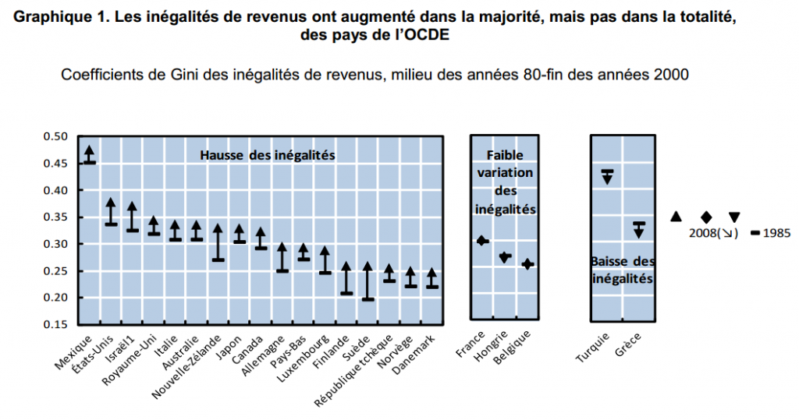
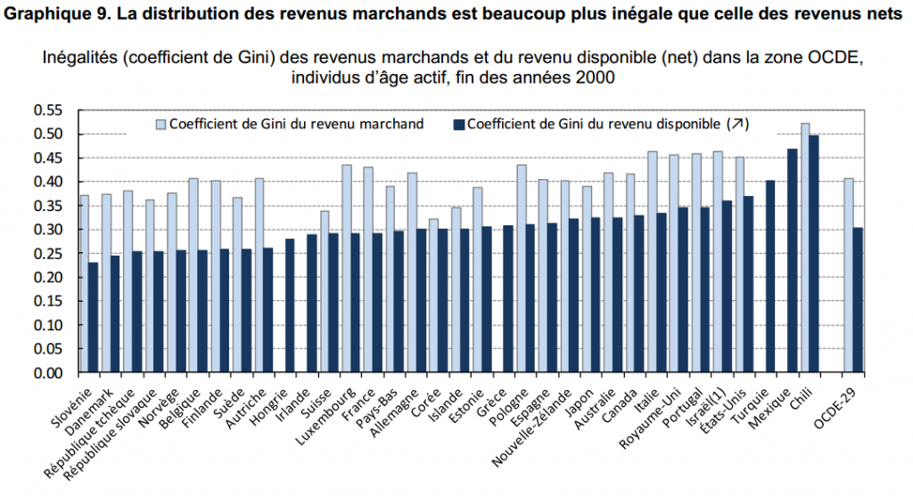

Hier soir, lors d'un [débat à la radio Suisse entre Guillaume Mathelier et Beat Kappeler](http://www.rts.ch/la-1ere/programmes/forum/4118859-forum-du-12-07-2012.html), ce dernier a prétendu (après 09:22) que "La Suisse a la répartition des revenus la plus égalitaire en Europe continentale, aussi égalitaire qu'en Scandinavie", ce à quoi le maire PS d'Ambilly (Haute-Savoie) répond "on ne doit pas tout-à-fait voir la même Suisse". Qui a raison ?

Ca tombe bien, deux nouveaux rapports de l'OCDE viennent mettre à jour les [données datant de 2008 dont j'avais causé ici](http://drgoulu.local/2009/03/21/combien-dinegalite/), et qui montraient déjà que les revenus bruts des suisses étaient les plus équilibrés de l'OCDE, et qu'après impôts les inégalités se situent au même niveau que celles de la France, un peu au dessus des modèles sociaux nordiques.

Dans  "[Inégalités de revenus et croissance : le rôle des impôts et des transferts](http://www.oecd.org/dataoecd/28/27/49446673.pdf)" [[1]](#ref-1) on trouve cette phrase page 9:

> "Les pays nordiques et la Suisse se caractérisent par une inégalité des revenus disponibles inférieure à la moyenne grâce à une faible disparité des salaires, en particulier au sommet de l’échelle..."

et ce graphique page 11 :

> 

la Suisse est bien dans le groupe de gauche (...) avec quelques pays nordiques, la France à sa droite avec l'Italie, la Belgique et des pays de l'Est Européen. C'est donc bien [Beat Kappeler](http://www.beatkappeler.info/) qui avait raison. Pas parce qu'il est économiste comme Guillaume Mathelier l'a rappelé plusieurs fois sur un ton moqueur, mais parce qu'il connait les faits.

L'autre document [[2]](#ref-2) analyse l'augmentation des inégalités, réelle dans beaucoup de pays de l'OCDE, mais pas tous. Voici le graphique disponible dans \[2.A\] \*

La Suisse n'y est pas représentée (je ne sais pas pourquoi), mais les [données](https://docs.google.com/viewer?url=http%3A%2F%2Fwww.oecd.org%2Fdataoecd%2F39%2F45%2F49170007.xls) montrent qu'elle se situerait avec la France, dans le groupe des pays où les inégalités n'ont PAS notablement augmenté en plus de 20 ans.

Les pages suivantes montrent que, comme je l'avais remarqué dans un précédent article, le coefficient de Gini varie assez rapidement et donc que l'image ci-dessus doit être nuancée : plusieurs pays ont vu leurs inégalité diminuer ces dernières années. A croire que les crises économiques touchent plus les riches ... Et en y réfléchissant c'est bien le cas : ni le SMIC ni la plupart des salaires n'ont baissé, alors que les actionnaires ou top managers rétribués à coups de bonus enregistrent des baisses de revenu qui peuvent atteindre 100%... Tout comme les chômeurs arrivant en fin de droits, je vous l'accorde...

Le document \[2.A\] relève aussi plus loin que :

> Dans tous les pays de l’OCDE, les transferts publics en espèces ainsi que l’imposition du revenu et les cotisations sociales ont joué un rôle majeur dans la réduction des inégalités de revenus marchands. (...) Cet effet redistributif a été plus marqué dans les pays nordiques, en Belgique et en Allemagne, mais inférieur à la moyenne au Chili, en Corée, aux États-Unis, en Islande et en Suisse (graphique 9).

Le fameux "graphique 9" montre exactement ce que j'avais découvert en 2008 sur "[l'effet des impôts](http://drgoulu.local/2009/03/21/combien-dinegalite/)": les revenus bruts suisses étant très égalitaires, l'impôt n'a pas besoin d'être très redistributif:

Ce document \[2.A\] contient une analyse poussée des effets sociaux de la fiscalité qui me paraît très intéressante. Je vais la lire en détail et y revenir le cas échéant. En attendant, je prépare ci-dessous une citation que je n'aurai plus qu'à copier-coller pour répondre à certains commentaires:

> "Chacun peut avoir sa propre opinion, mais les faits sont les mêmes pour tous." (Michael Specter)

**Note \* :** _(précision ajoutée le 14.7.12)_ : L'OCDE et d'autres organisations mesurent les inégalités par le [coefficient de Gini](https://fr.wikipedia.org/wiki/coefficient_de_Gini), une mesure qui tient compte de tous les revenus. D'autres utilisent les "rapports inter-déciles", comme par exemple sur la page Wikipédia "[inégalités de revenu en France](https://fr.wikipedia.org/wiki/inégalités_de_revenu_en_France)", qui ne comparent que les 10% de revenus les plus élevés aux 10% les moins élevés, ignorant 80% de la population. Ceci explique certaines différences entre études.

### Références

1. OCDE 2012, « [Inégalités de revenus et croissance : le rôle des impôts et des transferts](http://www.oecd.org/fr/eco/finances-publiques/49446673.pdf) », OCDE Département des Affaires Économiques, Note de politique économique, no 9, janvier 2012.
2. \[openbook booknumber="ISBN:9789264119550" templatenumber="5"\]
    1. "[Tour d’horizon des inégalités croissantes de revenus dans les pays de l’OCDE : principaux constats](http://www.oecd.org/fr/social/soc/49177707.pdf)" annexe pdf publique
    2. [Feuille Excel des données](https://docs.google.com/viewer?url=http%3A%2F%2Fwww.oecd.org%2Fdataoecd%2F39%2F45%2F49170007.xls)
