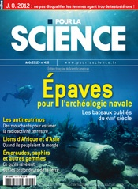

Billet vite fait en forme de pot-pourri de découvertes estivales.

### Les Seychelles

Ce pays est bien plus qu'une destination de vacances de rêve. L'archipel est un "micro-continent" granitique peuplé d'espèces endémiques surprenantes, préservées de toute présence humaine jusque vers 1750. Actuellement, ce micro-état de 90'000 habitants seulement traverse des crises importantes mais m'a semblé sur la bonne voie pour les résoudre : bon niveau de formation, ouverture, dialogue social et politique, conscience écologique.



On trouve aux Seychelles des [tortues géantes](https://fr.wikipedia.org/wiki/tortue_géante_des_Seychelles), "Aldabrachelys gigantea", plus grosses que celles des Galapagos. Charles Darwin était d'ailleurs intervenu en faveur de leur protection, car elles étaient menacées à la fin du XIXème siècle. Les autorités avaient alors eu une excellente idée pour tenir les braconniers à l'écart de Curieuse, une île affectionnée par les tortues : y construire une léproserie!

Il y a le [cocotier de mer](https://fr.wikipedia.org/wiki/cocotier_de_mer) "Lodoicea maldivica" qui n'est ni de mer, ni des Maldives mais produit bien les plus grosses graines du monde, les magnifiques "coco fesses". De la même [famille](https://fr.wikipedia.org/wiki/Arecaceae) que "[Cocos nucifera](https://fr.wikipedia.org/wiki/Cocos_nucifera)", il n'est de loin pas autant répandu puisqu'il n'en existe que quelques milliers d'arbres, pour la plupart à la [Vallée de Mai](http://whc.unesco.org/fr/list/261/) sur l'ile de Praslin. [Certains](http://salem.blog.24heures.ch/archive/2007/12/06/cucul-la-praline.html) prétendent d'ailleurs que la "coco de Praslin" a donné l'expression "[cucul la praline](http://www.expressio.fr/expressions/cucul-la-praline.php)", mais c'est douteux. Pour ma part, je me demande toujours quel est l'[avantage sélectif](https://fr.wikipedia.org/wiki/avantage_sélectif) de produire si peu de graines si grosses qu'il leur faut 7 ans pour mûrir.

A part ça, les "fruit bats" des Seychelles sont de  [grosses chauve-souris](https://fr.wikipedia.org/wiki/Pteropodidae) "[[Pteropus seychellensis comorensis](https://fr.wikipedia.org/wiki/Pteropus_seychellensis_comorensis "Pteropus seychellensis comorensis")](https://fr.wikipedia.org/wiki/[Pteropus_seychellensis_comorensis](https://fr.wikipedia.org/wiki/Pteropus_seychellensis_comorensis_"Pteropus_seychellensis_comorensis"))" qui se nourrissent exclusivement de fruits. J'ai été étonné par leur vol en ligne droite, de jour, mais je ne les ai pas trouvées aussi goûteuses que vantées par les Seychellois...

### 

Ayant découvert ce livre grâce à [Traqueur Stellaire](http://www.traqueur-stellaire.net/2012/06/tau-zero-poul-anderson/), je l'ai dévoré en me demandant comment j'avais pu ignorer son existence pendant 42 ans.  Il faut dire que "Tau Zéro" est bien mieux que ma nouvelle "[Accélération](/2004/08/09/acceleration/)" sur le même thème...

Ce roman de "hard science fiction" raconte un voyage interstellaire à vitesse relativiste d'une manière très précise et bien documentée, tout en maintenant un suspense par plusieurs rebondissements. Je l'ai trouvé excellent car j'y ai retrouvé l'optimisme de la conquête spatiale des années 1970 et la liberté des moeurs de cette époque bénie de ma jeunesse ;-) J'ai un peu moins aimé la fin, mais cette lecture reste un must pour les amateurs de s-f.

### "C'est maintenant" et l'île de Pâques

Par contre je n'ai pas aimé du tout  Ou plutôt j'ai été très déçu par ce pamphlet politique commis par Alain Grandjean, économiste simpliste, et Jean-Marc Jancovici dont je pense pourtant toujours beaucoup de bien depuis que j'ai découvert son site [Manicore](/2009/02/15/manicore/).

Comme ma critique de ce bouquin prend de la place, je vais y consacrer un prochain article. Ici je ne m'attaquerai  qu'à l'allégorie utilisée par les auteurs tout au long de leur argumentation : l'[écocide](https://fr.wikipedia.org/wiki/écocide) de l'[île de Pâques](https://fr.wikipedia.org/wiki/île_de_Pâques). Selon l'hypothèse du [syndrôme de l'île de Pâques](https://fr.wikipedia.org/wiki/syndrôme_de_l'île_de_Pâques) développée entre autres par [Jared Diamond](https://fr.wikipedia.org/wiki/Jared_Diamond) dans "[Effondrement](https://fr.wikipedia.org/wiki/Effondrement_(livre))", cette île initialement paradisiaque aurait été déforestée par ses habitants sous l'influence des monarques obsédés par l'édification des fameux [Moaï](https://fr.wikipedia.org/wiki/Moaï), au point de la rendre quasi inhabitable.

Or ceci apparaît de plus en plus comme une [éco fable](http://fabiusmaximus.com/2010/02/04/easter/). En particulier, après avoir montré en 2006 que la colonisation de l'île de Pâques était bien plus tardive qu'on ne l'imaginait [[1]](#ref-1), Hunt et Lipo viennent de prouver que les moaïs pouvaient être déplacés sans nécessiter de bois, en marchant !



### Le "Pour la Science" d'Août

Deux articles au moins justifient l'achat de ce numéro

D'abord un article très complet sur les neutrinos [[2]](#ref-2). Vous savez, ces particules qui ne vont pas plus vite que la lumière... Emis en grand nombre par les [supernova](/2012/03/24/supernova_m95/), ils sont également produits par les réactions nucléaires du Soleil et celles, naturelles ou artificielles sur Terre. De nouveaux détecteurs comme [KamLAND](http://kamland.lbl.gov/) sont désormais assez sensibles pour mesurer ces derniers. On peut par exemple détecter lorsque le combustible nucléaire est rechargé dans un réacteur. Et si c'est fait souvent, c'est un signe de production militaire... Et on peut aussi mieux quantifier le fonctionnement du réacteur nucléaire sur lequel nous vivons : La radioactivité naturelle est due à 20% au [potassium 40](https://fr.wikipedia.org/wiki/potassium_40), à 40% au [thorium](https://fr.wikipedia.org/wiki/thorium) et à 40% à l'[uranium](https://fr.wikipedia.org/wiki/uranium) 238 dont la quantité estimée dans le manteau et la croûte terrestre est estimée à 8.1016 kg, soit 80'000 milliards de tonnes. ( Et on a peur d'en manquer ou de polluer en [extrayant](https://fr.wikipedia.org/wiki/extraction_de_l'uranium) chaque année un milliardième de ce stock...)

Ensuite , Jean-Paul Delahaye nous explique comment combiner des pertes pour gagner [[3]](#ref-3). En effet, selon le très contre-intuitif [paradoxe de Parrondo](https://fr.wikipedia.org/wiki/paradoxe_de_Parrondo) il est possible d'élaborer une stratégie gagnante en combinant des jeux dans lesquels on est statistiquement perdants ! Mais attention, on ne peut hélas pas jouer à "qui perd gagne" avec une roulette et un black-jack : les deux jeux doivent être en interaction d'une manière bien précise. Donc ça intéresse plutôt nos amis traders. Un [prix Nobel d'économie](https://fr.wikipedia.org/wiki/prix_Nobel_d'économie) de plus pour la  [théorie des jeux](https://fr.wikipedia.org/wiki/théorie_des_jeux) en vue ?

Sinon, mes collègues C@fetiers de [http://blog.idphys.fr/](http://blog.idphys.fr/) expliquent pourquoi le ciel n'est pas bleu [[4]](#ref-4), et leurs articles dans Pour la Science sont vraiment bien. Vas-y Jean-Michel, donne-nous en plus en ligne !

### Références :

1.  Terry L. Hunt et Carl P. Lipo, "Late Colonization of Easter Island", 2006, Science, Vol. 311 no. 5767 pp. 1603-1606 , [DOI: 10.1126/science.1121879](http://www.sciencemag.org/content/311/5767/1603)
2. William McDonough, John Learned et Stephen Dye, "[Des neutrinos pour sonder l'intérieur de la Terre](http://www.pourlascience.fr/ewb_pages/f/fiche-article-des-neutrinos-pour-sonder-l-interieur-de-la-terre-30196.php)", Pour la Science, N°418, août 2012, p 42-49
3. Jean-Paul Delahaye, "[Combiner des pertes pour gagner](http://www.pourlascience.fr/ewb_pages/f/fiche-article-combiner-des-pertes-pour-gagner-30211.php)", Pour la Science, N°418, août 2012, p 82-87
4. Jean-Michel Courty et Eduard Kierlik "[Pourquoi le ciel n'est pas bleu](http://www.pourlascience.fr/ewb_pages/f/fiche-article-pourquoi-le-ciel-n-est-pas-bleu-30214.php)", Pour la Science, N°418, août 2012, p 90-91
