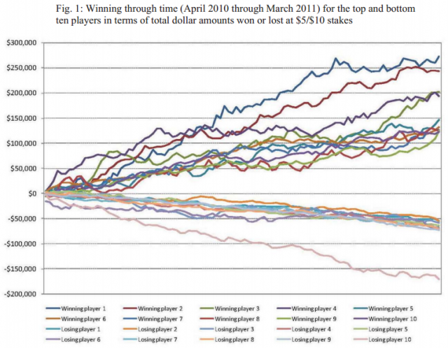
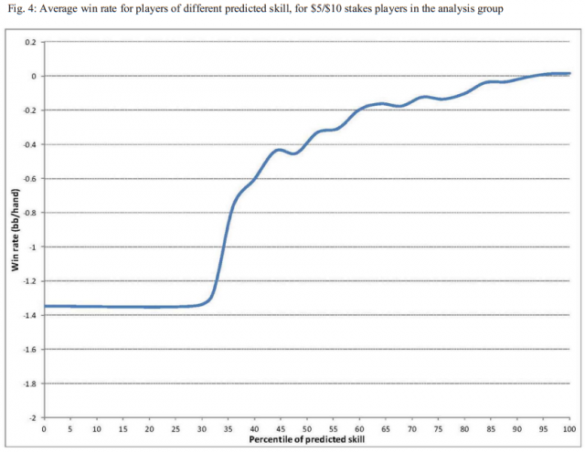
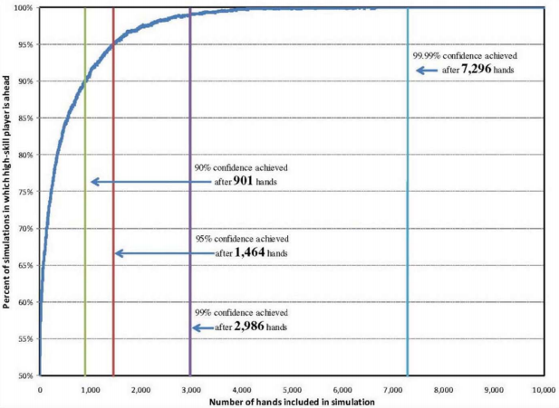



Chip Raptor m'avait demandé il y a longtemps d'écrire sur son jeu préféré. Ce n'était pas gagné d'avance : pour moi le poker c'est le jeu où on gagne si on a une [quinte flush royale](w:Main_au_poker#Quinte_flush), on perd si on n'a pas de [paire](w:Main_au_poker#Paire), sauf si on bluffe, et c'est à peu près tout.

Mais un fait récent me fournit un peu de matière à réflexion : un tribunal américain vient de juger que le poker n'était pas un jeu de hasard [[1]](#ref-1). Un organisateur de tournois clandestins poursuivi par la justice a fait appel à [Randal D. Heeb](http://www.bateswhite.com/professionals.php?PeopleID=29), un expert statisticien qui a réussi à convaincre la cour que la compétence\* du joueur prédominait sur la chance, du moins dans la variante [Texas\_hold'em](w:Texas_hold'em) [no limit](w:No_limit_(poker)). Les considérants de la cour [[2]](#ref-2) font 120 pages, dont une bonne vingtaine retranscrivent l'étude de Heeb. Et ça c'est intéressant.

Heeb a obtenu les données de 415 millions de mains de poker jouées en ligne sur le site PokerStars et les a analysées. Il commence par montrer que les 10 meilleurs joueurs du site gagnaient systématiquement pendant une année, alors que les 10 plus mauvais y perdaient systématiquement (jusqu'à $170'000 ...):

Vous êtes déjà convaincu qu'il y a des forts et des faibles ? Moi pas. Parce que s'il y a suffisamment de joueurs, on obtient le même phénomène avec un [jeu de hasard pur](w:Jeu_de_hasard) comme "pile ou face". J'ai pondu vite fait un petit programme Python qui simule 138333 joueurs jouant 3000 fois chacun à pile ou face, pour obtenir 415 millions d'événements comme dans l'étude de Heeb, qui mentionne qu'un champion de poker joue environ 3000 mains par an en championnat. Il produit ce graphique\*\*:



Mais on remarque aussi dans le graphique de Heeb que les gagnants au poker gagnent plus que ce que les perdants perdent, alors que le "pile ou face" est un jeu symétrique. Pourtant dans les deux cas la somme des gains est égale à la somme des mises : il n'y a pas d'argent statistiquement perdu comme à la roulette (~3%) ou aux loteries (30% et plus). Mais le poker est il un jeu aussi "équitable" que pile ou face, qui l'est au sens mathématique puisque son  [espérance mathématique](w:) est nulle ?

Heeb a extrait des 415 millions de mains analysées celles contenant des cartes précises, par exemple une dame et un valet en suite (de la même couleur) et montré que sur ces mains données, les joueurs compétents\* ("skilled") gagnaient statistiquement plus, ou perdaient moins, que les joueurs débutants. Il obtient ainsi une courbe liant le niveau de compétence à l'espérance, mesurée ici en proportion de la [grande blinde](w:Blind_(jeux))\*\*\* gagnée à chaque main:

Sur la base de ce modèle, Heeb a obtenu la courbe suivante par simulation de parties entre deux joueurs, l'un "compétent" (de niveau >50%) et l'autre débutant (< 50%). Elle lie la probabilité de gain au nombre de mains jouées :

On y voit qu'une partie de quelques centaines de mains laisse une probabilité de l'ordre de 10% à un débutant chanceux de repartir avec la paie de ses futurs anciens copains, mais qu'il n'a qu' 1% de chances de battre un champion sur 3000 mains.

Pour Heeb, ces résultats basés sur l'analyse d'une grande quantité de données corroborent des travaux déjà publiés selon lesquels au poker, la compétence prédomine sur la chance, et il en a convaincu la justice, qui a conclu que le poker n'étant pas un jeu de hasard, le tripot de DiCristina ne tombait pas sous le coup de la loi sur les jeux de hasard.

Mais je dois dire que je ne suis que partiellement convaincu. Selon la wikipédia, le poker est un [jeu de hasard raisonné](w:) comme le [backgammon](w:), jeu beaucoup plus simple que le poker et surtout totalement "ouvert" puisque aucune information n'est cachée aux joueurs. Pourtant le backgammon est basé (comme le poker?) sur une faiblesse humaine : nous ne savons pas évaluer rapidement et correctement des probabilités. Autant nous sommes bons aux jeux de stratégie déterministes comme les échecs, autant les ordinateurs nous battent à plate couture au backgammon depuis les années 1980 [[3]](#ref-3) et sont depuis peu aussi bons que des professionnels humains du poker, du moins en "un contre un" [[4]](#ref-4). Je me demande si la "compétence" humaine qui s'acquiert par la pratique du jeu n'incorpore pas, en particulier, l'évaluation d'un système complexe de probabilités.

Donc j'admets volontiers que " la compétence prédomine sur la chance" entre joueurs de compétences fortement inégales. Mais entre joueurs de compétences à peu près égales, au poker comme au backgammon, le hasard reprend ses droits.

### Notes:

- \* : le mot anglais "skill" est traduit par "adresse" dans [[2]](#ref-2), mais il me semble difficile de ranger le poker dans les "[jeu d'adresse](w:Catégorie:Jeu_d'adresse)". Parmi les [traductions de "skill"](http://www.mediadico.com/dictionnaire/anglais-francais/skill) il me semble que "compétence" correspond mieux au discours de Heeb.
- \*\* mon graphique ressemble comme deux gouttes d'eau à celui présenté au tribunal par [David DeRosa](http://www.derosa-research.com/), l'expert de l'accusation, mais je ne l'ai vu qu'après...
- \*\*\* les "blind" sont les mises constantes à chaque partie, alors que le "pot" formé des enchères des joueurs est variable.

### Références

1. "[USA v. DiCristina et al](http://archive.org/details/gov.uscourts.nyed.318466)", United States District Court, Eastern District of New-York, Case 11 CR 14, 21 août 2012 [pdf 120 pages](http://ia601201.us.archive.org/17/items/gov.uscourts.nyed.318466/gov.uscourts.nyed.318466.109.0.pdf)
2. "[Le débat interminable sur le statut du poker! Entre chance, adresse et hasard...](http://poker-leaders.com/news/business/3709-le-debat-interminable-sur-le-statut-du-poker-entre-chance-adresse-et-hasard)" sur Poker Leaders
3. Hans J. Berliner, "Backgammon computer program beats world champion", Artificial Intelligence Volume 14, Issue 2, September 1980, Pages 205–220, 
4. Chris Wilson, "[Le poker, prochain défi des superordinateurs](http://www.slate.fr/story/34505/watson-poker-superordinateur)", Slate.fr, fev. 2011
