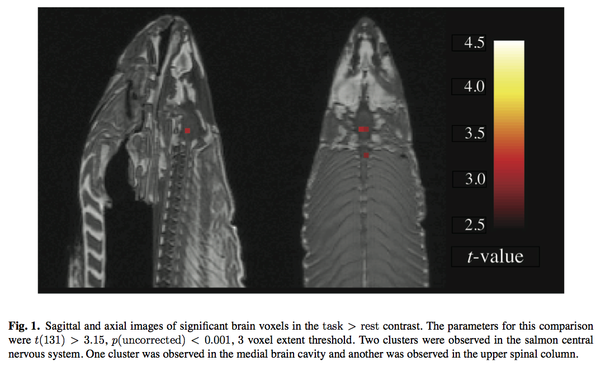

Comme chaque année, l'éditeur des "[Annals of Improbable Research](http://www.improbable.com/magazine/)" a décerné ses [prix ig Nobel](w:) aux recherches scientifiques les plus désopilantes, et 2012 est un bon cru :

Le prix de psychologie va à une équipe hollandaise qui a montré que la tour Eiffel parait plus petite lorsqu'elle est représentée inclinée vers la gauche [[1]](#ref-1)

Un prix d'acoustique est décerné aux jeunes inventeurs japonais du "SpeechJammer" [[2]](#ref-2), un appareil qui embrouille les orateurs pénibles. Ils auraient aussi mérité le prix de publicité:



Une équipe américaine reçoit le prix de neurosciences pour avoir détecté, à l'aide d'instruments très sophistiqués, une activité dans le cerveau d'un saumon mort [[3]](#ref-3):

Johan Pettersson reçoit le prix de chimie pour avoir expliqué pourquoi certains habitants du village suédois de [Anderslöv](w:en) ont les cheveux verts. C'est à cause du cuivre présent dans l'eau chaude en raison de la mauvaise qualité de la plomberie ! [[4]](#ref-4)

Le prix de littérature est attribué au bureau de la comptabilité générale du gouvernement états-unien pour le rapport intitulé "Actions nécessaires pour évaluer l'impact des efforts pour estimer les coûts des rapports et études" [[5]](#ref-5). C'est mérité, mais je suis sur qu'une autre administration peut faire mieux...

Quatre physiciens anglo-saxons se partagent le prix de physique pour leur contributions à la compréhension des complexes mouvements dynamiques des queues de cheval humaines [[6]](#ref-6), [[7]](#ref-7)

Une étude internationale d'importance au moins équivalente est récompensée d'un prix de mécanique des fluides : pourquoi le café déborde-t-il lorsqu'on marche en tenant une tasse, et comment l'éviter [[8]](#ref-8)



Le prix d'anatomie est décerné à l'équipe hollando-américaine qui a prouvé que les chimpanzés se reconnaissent entre eux tout aussi bien en s'observant la face que l'arrière train [[9]](#ref-9)

Sinon, le prix igNobel de la paix va à l'entreprise russe SKN qui produit des diamants en utilisant de vieilles munitions [[10]](#ref-10). Ils auraient presque mérité le vrai Nobel, non ?

Mais ce sont les travaux de chercheurs français récompensés par le prix de médecine qui m'ont causé un fou rire irrépressible. Emmanuel Ben-Soussan et ses collègues ont rendu la [coloscopie](w:) plus sûre par des méthodes réduisant le risque de d'[explosion colique](w:) [[11]](#ref-11), [[12]](#ref-12). Je ne sais pas pourquoi ça me fait rigoler, parce que c'est très dangereux, voire mortel.

Et trop rire, [ça peut être mortel ?](http://www.allodocteurs.fr/actualite-sante-peut-on-vraiment-mourir-de-rire--2642.asp?1=1)

## Références:

avec les liens qui font toutes la différence entre cet article et les articles cutandpastés :

1. Anita Eerland, Tulio M. Guadalupe and Rolf A. Zwaan, "Leaning to the Left Makes the Eiffel Tower Seem Smaller: Posture-Modulated Estimation"  Psychological Science, vol. 22 no. 12, December 2011, pp. 1511-14. 
2. Kazutaka Kurihara, Koji Tsukada, "[SpeechJammer: A System Utilizing Artificial Speech Disturbance with Delayed Auditory Feedback](http://arxiv.org/vc/arxiv/papers/1202/1202.6106v1.pdf)", February 28, 2012. 
3. Craig M. Bennett, Abigail A. Baird, Michael B. Miller, and George L. Wolford, "[Neural correlates of interspecies perspective taking in the post-mortem Atlantic Salmon](http://www.jsur.org/ar/jsur_ben102010.pdf): An argument for multiple comparisons correction" [Journal of Serendipitous and Unexpected Results](http://www.jsur.org/), vol. 1, no. 1, 2010, pp. 1-5.
4. "[New homes turn Swedes' hair green](http://www.thelocal.se/37994/20111217/)", 17 décembre 2011, The Local
5. "[Actions Needed to Evaluate the Impact of Efforts to Estimate Costs of Reports and Studies](http://gao.gov/products/GAO-12-480R)" US Government General Accountability Office report GAO-12-480R, May 10, 2012.
6. Raymond E. Goldstein, Patrick B. Warren, and Robin C. Ball "[Shape of a Ponytail and the Statistical Physics of Hair Fiber Bundles](http://www.damtp.cam.ac.uk/user/gold/pdfs/ponytail_prl.pdf)." , Physical Review Letters, vol. 198, no. 7, 2012. 
7. Joseph B. Keller, "Ponytail Motion" , SIAM \[Society for Industrial and Applied Mathematics\] Journal of Applied Mathematics, vol. 70, no. 7, 2010, pp. 2667–72 
8. Hans C. Mayer and Rouslan Krechetnikov "Walking With Coffee: Why Does It Spill?" Physical Review E, vol. 85, 2012.  ([slides d'une présentation au format pdf](http://www.ifuap.buap.mx/workshop12/documents/talks/Talk_Krechetnikov.pdf))
9. Frans B.M. de Waal and Jennifer J. Pokorny "[Faces and Behinds: Chimpanzee Sex Perception](http://www.emory.edu/LIVING_LINKS/pdf_attachments/FacesBehinds2008.pdf)", Advanced Science Letters, vol. 1, 99–103, 2008.
10. page "[nano diamonds](http://www.skn-nd.ru/index_en.html)" sur le site de SKN
11. Spiros D Ladas, George Karamanolis, Emmanuel Ben-Soussan, "Colonic Gas Explosion During Therapeutic Colonoscopy with Electrocautery," , World Journal of Gastroenterology, vol. 13, no. 40, October 2007, pp. 5295–8. 
12. E. Ben-Soussan, M. Antonietti, G. Savoye, S. Herve, P. Ducrotté, and E. Lerebours "Argon Plasma Coagulation in the Treatment of Hemorrhagic Radiation Proctitis is Efficient But Requires a Perfect Colonic Cleansing to Be Safe" European Journal of Gastroenterology & Hepatology, vol. 16, no. 12, December 2004, pp 1315-8.
